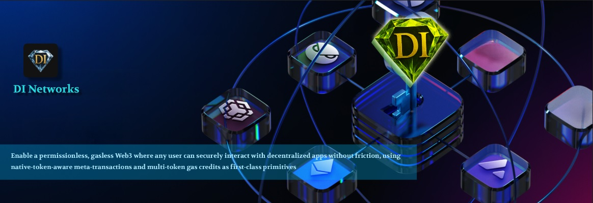

# MetaTx-Contracts Documentation

## 🚀 Gasless Meta-Transaction System with Native Token Support

Welcome to the comprehensive documentation for MetaTx-Contracts - a cutting-edge smart contract system that enables gasless user experiences through meta-transactions with built-in native token handling and multi-token gas credit management.

## What is MetaTx-Contracts?

MetaTx-Contracts is a production-ready system that allows users to interact with blockchain applications without paying gas fees directly. Instead, relayers execute transactions on behalf of users, while the system ensures proper validation, security, and financial protection.

### Key Features

* **🔄 Gasless Transactions**: Users can interact with dApps without holding native tokens for gas
* **💰 Native Token Support**: Built-in validation and automatic refunds for exact value requirements
* **🏦 Multi-Token Credits**: Accept various ERC20 tokens for gas credit payments
* **🔒 Enterprise Security**: EIP-712 signatures, replay protection, and comprehensive validation
* **📈 Scalable Architecture**: Batch processing for optimal gas efficiency
* **🔧 Developer Friendly**: Comprehensive APIs and integration utilities

## Core Components

### MetaTxGateway v1.0.0

The enhanced meta-transaction execution gateway that handles:
- Native token validation and automatic refunds
- Batch transaction processing
- EIP-712 signature verification
- Comprehensive logging and monitoring
- UUPS upgradeable architecture

### GasCreditVault

A sophisticated gas credit management system featuring:
- Multi-token support (USDT, USDC, BUSD, etc.)
- Chainlink price feed integration
- Credit deposit, withdrawal, and transfer
- Automated owner fee collection
- Emergency controls and safety mechanisms

## Why Choose MetaTx-Contracts?

### For Users
- **Zero Gas Fees**: Interact with dApps without holding native tokens
- **Multiple Payment Options**: Pay for gas using stablecoins or project tokens
- **Enhanced Security**: Advanced protection mechanisms ensure transaction safety

### For Developers
- **Easy Integration**: Clean APIs and comprehensive documentation
- **Production Ready**: Battle-tested contracts with extensive security features
- **Flexible Architecture**: Supports various use cases and business models

### For Projects
- **Better UX**: Remove friction from user onboarding and interactions
- **Revenue Opportunities**: Collect fees through the gas credit system
- **Scalable Solution**: Handle high transaction volumes efficiently

## Getting Started

Ready to integrate gasless transactions into your project? Here's how to get started:

1. **[Quick Start Guide](getting-started/quick-start.md)** - Get up and running in minutes
2. **[Installation](getting-started/installation.md)** - Set up your development environment
3. **[Contract Overview](contracts/overview.md)** - Understand the core components
4. **[Deployment Guide](deployment/deployment-guide.md)** - Deploy to your preferred network

## Architecture Overview

```
┌─────────────────┐    ┌─────────────────┐    ┌─────────────────┐
│     Frontend    │    │     Relayer     │    │   Smart         │
│   Application   │    │    Service      │    │  Contracts      │
│                 │    │                 │    │                 │
│ ┌─────────────┐ │    │ ┌─────────────┐ │    │ ┌─────────────┐ │
│ │ User Signs  │ │───▶│ │ Validates   │ │───▶│ │MetaTxGateway│ │
│ │ Meta-Tx     │ │    │ │ & Executes  │ │    │ │             │ │
│ └─────────────┘ │    │ └─────────────┘ │    │ └─────────────┘ │
│                 │    │                 │    │                 │
│ ┌─────────────┐ │    │ ┌─────────────┐ │    │ ┌─────────────┐ │
│ │ Gas Credit  │ │───▶│ │ Credit      │ │───▶│ │GasCreditVault│ │
│ │ Management  │ │    │ │ Validation  │ │    │ │             │ │
│ └─────────────┘ │    │ └─────────────┘ │    │ └─────────────┘ │
└─────────────────┘    └─────────────────┘    └─────────────────┘
```

## Security & Auditing

MetaTx-Contracts implements industry-leading security practices:

- **Multi-layered Validation**: Input validation, signature verification, and business logic checks
- **Financial Safety**: Automatic refunds and credit protection mechanisms
- **Access Controls**: Role-based permissions and emergency controls
- **Upgrade Safety**: UUPS proxy pattern with storage layout protection
- **Oracle Security**: Chainlink integration with staleness protection

## Community & Support

- **GitHub Repository**: [MetaTx-Contracts](https://github.com/DINetworks/MetaTx-Contracts)
- **Issues & Bugs**: Submit issues on GitHub
- **Documentation**: This comprehensive guide
- **License**: MIT License for open-source adoption

## Quick Links

- [Quick Start →](getting-started/quick-start.md)
- [Smart Contracts →](contracts/overview.md)
- [API Reference →](api/overview.md)
- [Resources →](resources/faq.md)

---

**Ready to eliminate gas fees from your dApp? Let's get started!** 🚀
