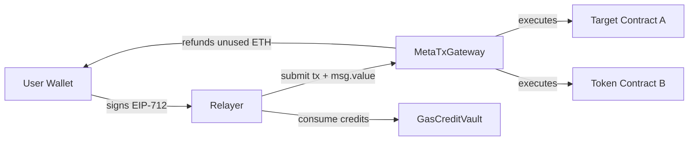

# Architecture Design

This document explains the high-level architecture of MetaTx-Contracts, the main components and how they interact.

## Components

- MetaTxGateway  
  - Gateway that receives signed meta-transaction batches from users (via relayers). Verifies EIP-712 signatures, enforces nonces/deadlines, executes batched calls, validates native token amounts and issues refunds.

- GasCreditVault  
  - Optional component for relayer credit management. Users or services deposit credits (multi-token) which relayers can consume to cover gas costs.

- DI Token & Token Ecosystem  
  - ERC20-based DI token, staking, presale, allocation contracts. Used for governance, staking rewards and incentives.

- Relayers  
  - Off-chain services that collect signed meta-transaction batches and submit transactions to MetaTxGateway. Relayers must be authorized by the gateway owner.

- Frontend / Wallets  
  - User interfaces and wallets produce EIP-712 signatures for batch payloads and interact with relayers.

## Data Flow (simplified)

## Design principles

- Security-first: signature, nonce and deadline checks, reentrancy protection, owner controls for relayers and upgrades.
- Minimal on-chain complexity: heavy work (batch building, retries) is performed off-chain by relayers.
- Composability: any contract can be the target of meta-transactions.
- Gas efficiency: batch execution reduces overall cost per action.

## Deployment and Upgrade Patterns

- Use UUPS proxy for upgradability (see Upgrade Strategies).
- Keep logic contract minimal and move complex state/migration logic to dedicated modules when needed.
- Always include migration tests and verification steps when upgrading.

## Operational notes

- Monitor authorized relayers list and pause gateway in emergencies.
- Keep treasury/guard contracts funded to support refunds and emergency operations.
