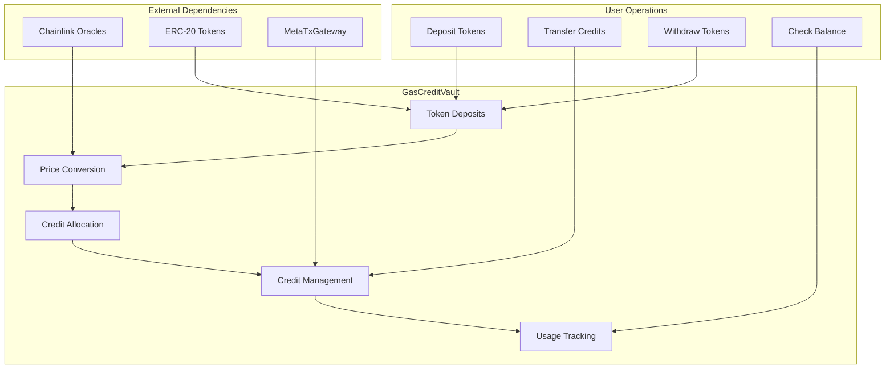

# GasCreditVault Contract

The GasCreditVault is a core component of the MetaTx-Contracts system that manages gas credits backed by ERC-20 tokens. It allows users to deposit supported tokens and receive credits that can be used to pay for meta-transaction fees, eliminating the need to hold native tokens for gas.

## Overview

The GasCreditVault contract serves as a secure vault for managing user deposits and converting them into gas credits that can be used across the MetaTx ecosystem. It integrates with Chainlink price feeds to ensure fair and accurate conversion rates between different tokens and gas costs.

### Key Features

- **Multi-Token Support**: Accept multiple ERC-20 tokens as collateral
- **Chainlink Integration**: Real-time price feeds for accurate conversions  
- **Credit Management**: Flexible credit allocation, transfer, and usage tracking
- **Security**: Comprehensive access controls and safety mechanisms
- **Upgradeable**: UUPS proxy pattern for future improvements

## Architecture



## Contract Interface

### Core Functions

```solidity
interface IGasCreditVault {
    // Deposit Operations
    function depositCredits(address token, uint256 amount) external;
    function depositCreditsFor(address user, address token, uint256 amount) external;
    
    // Credit Management
    function transferCredits(address to, uint256 amount) external;
    function useCredits(address user, uint256 amount) external;
    
    // Withdrawal Operations
    function withdrawTokens(address token, uint256 amount) external;
    function emergencyWithdraw(address token) external;
    
    // View Functions
    function getCreditBalance(address user) external view returns (uint256);
    function getTokenBalance(address user, address token) external view returns (uint256);
    function getSupportedTokens() external view returns (address[] memory);
    function getTokenPrice(address token) external view returns (uint256);
    
    // Administrative Functions
    function addSupportedToken(address token, address priceFeed) external;
    function removeSupportedToken(address token) external;
    function updateTokenPriceFeed(address token, address priceFeed) external;
    function setPriceSlippageTolerance(uint256 tolerance) external;
}
```

## Token Support

### Supported Tokens

The vault supports multiple ERC-20 tokens with Chainlink price feeds:

```solidity
// Example supported tokens on BSC
struct SupportedToken {
    address token;           // Token contract address
    address priceFeed;      // Chainlink price feed
    uint8 decimals;         // Token decimals
    bool active;            // Whether deposits are active
    uint256 maxDeposit;     // Maximum deposit amount
    uint256 minDeposit;     // Minimum deposit amount
}

mapping(address => SupportedToken) public supportedTokens;
```

### Adding New Tokens

Only administrators can add new supported tokens:

```solidity
function addSupportedToken(
    address token,
    address priceFeed,
    uint256 maxDeposit,
    uint256 minDeposit
) external onlyRole(ADMIN_ROLE) {
    require(token != address(0), "Invalid token");
    require(priceFeed != address(0), "Invalid price feed");
    
    supportedTokens[token] = SupportedToken({
        token: token,
        priceFeed: priceFeed,
        decimals: IERC20Metadata(token).decimals(),
        active: true,
        maxDeposit: maxDeposit,
        minDeposit: minDeposit
    });
    
    emit TokenAdded(token, priceFeed);
}
```

## Credit Conversion

### Price Calculation

Credits are calculated based on real-time token prices from Chainlink:

```solidity
function calculateCredits(address token, uint256 amount) 
    public view returns (uint256 credits) {
    
    SupportedToken memory tokenInfo = supportedTokens[token];
    require(tokenInfo.active, "Token not supported");
    
    // Get latest price from Chainlink
    (, int256 price, , uint256 updatedAt, ) = 
        AggregatorV3Interface(tokenInfo.priceFeed).latestRoundData();
    
    require(price > 0, "Invalid price");
    require(block.timestamp - updatedAt <= priceStaleThreshold, "Price too old");
    
    // Convert token amount to USD value
    uint256 usdValue = (amount * uint256(price) * 1e18) / 
        (10 ** (tokenInfo.decimals + 8)); // Chainlink uses 8 decimals
    
    // Convert USD to credits (1 credit = 1 USD cent)
    credits = usdValue / 1e16; // 1e18 / 1e2
}
```

### Price Staleness Protection

```solidity
uint256 public constant PRICE_STALE_THRESHOLD = 3600; // 1 hour

modifier validPrice(address token) {
    SupportedToken memory tokenInfo = supportedTokens[token];
    (, , , uint256 updatedAt, ) = 
        AggregatorV3Interface(tokenInfo.priceFeed).latestRoundData();
    
    require(
        block.timestamp - updatedAt <= PRICE_STALE_THRESHOLD,
        "Price feed stale"
    );
    _;
}
```

## Deposit Operations

### Basic Deposit

```solidity
function depositCredits(address token, uint256 amount) 
    external 
    nonReentrant 
    validPrice(token) {
    
    require(amount > 0, "Amount must be positive");
    SupportedToken memory tokenInfo = supportedTokens[token];
    require(tokenInfo.active, "Token not supported");
    require(amount >= tokenInfo.minDeposit, "Below minimum deposit");
    require(amount <= tokenInfo.maxDeposit, "Exceeds maximum deposit");
    
    // Transfer tokens from user
    IERC20(token).safeTransferFrom(msg.sender, address(this), amount);
    
    // Calculate credits
    uint256 credits = calculateCredits(token, amount);
    
    // Update balances
    userCredits[msg.sender] += credits;
    userTokenBalances[msg.sender][token] += amount;
    totalCredits += credits;
    
    emit CreditsDeposited(msg.sender, token, amount, credits);
}
```

### Deposit for Another User

```solidity
function depositCreditsFor(address user, address token, uint256 amount) 
    external 
    nonReentrant 
    validPrice(token) {
    
    require(user != address(0), "Invalid user");
    require(amount > 0, "Amount must be positive");
    
    SupportedToken memory tokenInfo = supportedTokens[token];
    require(tokenInfo.active, "Token not supported");
    
    // Transfer tokens from sender
    IERC20(token).safeTransferFrom(msg.sender, address(this), amount);
    
    // Calculate credits
    uint256 credits = calculateCredits(token, amount);
    
    // Update balances for target user
    userCredits[user] += credits;
    userTokenBalances[user][token] += amount;
    totalCredits += credits;
    
    emit CreditsDepositedFor(msg.sender, user, token, amount, credits);
}
```

## Credit Management

### Credit Transfer

```solidity
function transferCredits(address to, uint256 amount) 
    external 
    nonReentrant {
    
    require(to != address(0), "Invalid recipient");
    require(amount > 0, "Amount must be positive");
    require(userCredits[msg.sender] >= amount, "Insufficient credits");
    
    userCredits[msg.sender] -= amount;
    userCredits[to] += amount;
    
    emit CreditsTransferred(msg.sender, to, amount);
}
```

### Credit Usage

```solidity
function useCredits(address user, uint256 amount) 
    external 
    onlyRole(GATEWAY_ROLE) 
    nonReentrant {
    
    require(amount > 0, "Amount must be positive");
    require(userCredits[user] >= amount, "Insufficient credits");
    
    userCredits[user] -= amount;
    totalCreditsUsed += amount;
    
    emit CreditsUsed(user, amount);
}
```

## Withdrawal Operations

### Token Withdrawal

```solidity
function withdrawTokens(address token, uint256 amount) 
    external 
    nonReentrant {
    
    require(amount > 0, "Amount must be positive");
    require(
        userTokenBalances[msg.sender][token] >= amount,
        "Insufficient token balance"
    );
    
    // Calculate credits to deduct
    uint256 creditsToDeduct = calculateCredits(token, amount);
    require(
        userCredits[msg.sender] >= creditsToDeduct,
        "Insufficient credits for withdrawal"
    );
    
    // Update balances
    userTokenBalances[msg.sender][token] -= amount;
    userCredits[msg.sender] -= creditsToDeduct;
    totalCredits -= creditsToDeduct;
    
    // Transfer tokens
    IERC20(token).safeTransfer(msg.sender, amount);
    
    emit TokensWithdrawn(msg.sender, token, amount, creditsToDeduct);
}
```

### Emergency Withdrawal

```solidity
function emergencyWithdraw(address token) 
    external 
    nonReentrant 
    whenPaused {
    
    uint256 amount = userTokenBalances[msg.sender][token];
    require(amount > 0, "No tokens to withdraw");
    
    // Clear balances without credit calculation
    userTokenBalances[msg.sender][token] = 0;
    userCredits[msg.sender] = 0;
    
    // Transfer tokens
    IERC20(token).safeTransfer(msg.sender, amount);
    
    emit EmergencyWithdrawal(msg.sender, token, amount);
}
```

## Security Features

### Access Control

```solidity
bytes32 public constant ADMIN_ROLE = keccak256("ADMIN_ROLE");
bytes32 public constant GATEWAY_ROLE = keccak256("GATEWAY_ROLE");
bytes32 public constant OPERATOR_ROLE = keccak256("OPERATOR_ROLE");

modifier onlyAdmin() {
    require(hasRole(ADMIN_ROLE, msg.sender), "Not admin");
    _;
}

modifier onlyGateway() {
    require(hasRole(GATEWAY_ROLE, msg.sender), "Not gateway");
    _;
}
```

### Circuit Breaker

```solidity
contract GasCreditVault is Pausable {
    uint256 public constant MAX_DAILY_WITHDRAWAL = 100000e18; // $100k
    mapping(uint256 => uint256) public dailyWithdrawals;
    
    modifier withdrawalLimit(uint256 amount) {
        uint256 today = block.timestamp / 1 days;
        require(
            dailyWithdrawals[today] + amount <= MAX_DAILY_WITHDRAWAL,
            "Daily withdrawal limit exceeded"
        );
        dailyWithdrawals[today] += amount;
        _;
    }
    
    function pause() external onlyRole(ADMIN_ROLE) {
        _pause();
    }
    
    function unpause() external onlyRole(ADMIN_ROLE) {
        _unpause();
    }
}
```

### Reentrancy Protection

```solidity
import "@openzeppelin/contracts/security/ReentrancyGuard.sol";

contract GasCreditVault is ReentrancyGuard {
    // All state-changing functions use nonReentrant modifier
}
```

## Events

```solidity
event CreditsDeposited(
    address indexed user,
    address indexed token,
    uint256 amount,
    uint256 credits
);

event CreditsDepositedFor(
    address indexed depositor,
    address indexed user,
    address indexed token,
    uint256 amount,
    uint256 credits
);

event CreditsTransferred(
    address indexed from,
    address indexed to,
    uint256 amount
);

event CreditsUsed(
    address indexed user,
    uint256 amount
);

event TokensWithdrawn(
    address indexed user,
    address indexed token,
    uint256 amount,
    uint256 creditsDeducted
);

event EmergencyWithdrawal(
    address indexed user,
    address indexed token,
    uint256 amount
);

event TokenAdded(
    address indexed token,
    address indexed priceFeed
);

event TokenRemoved(
    address indexed token
);

event PriceFeedUpdated(
    address indexed token,
    address indexed oldFeed,
    address indexed newFeed
);
```

## Error Handling

```solidity
error InsufficientCredits(uint256 required, uint256 available);
error TokenNotSupported(address token);
error PriceFeedStale(address token, uint256 lastUpdate);
error InvalidAmount(uint256 amount);
error ExceedsMaxDeposit(uint256 amount, uint256 maxDeposit);
error BelowMinDeposit(uint256 amount, uint256 minDeposit);
error WithdrawalLimitExceeded(uint256 amount, uint256 limit);
```

## Gas Optimization

### Batch Operations

```solidity
function batchDepositCredits(
    address[] calldata tokens,
    uint256[] calldata amounts
) external nonReentrant {
    require(tokens.length == amounts.length, "Array length mismatch");
    require(tokens.length <= 10, "Too many tokens");
    
    uint256 totalCredits = 0;
    
    for (uint256 i = 0; i < tokens.length; i++) {
        address token = tokens[i];
        uint256 amount = amounts[i];
        
        require(amount > 0, "Invalid amount");
        require(supportedTokens[token].active, "Token not supported");
        
        // Transfer tokens
        IERC20(token).safeTransferFrom(msg.sender, address(this), amount);
        
        // Calculate credits
        uint256 credits = calculateCredits(token, amount);
        totalCredits += credits;
        
        // Update token balance
        userTokenBalances[msg.sender][token] += amount;
        
        emit CreditsDeposited(msg.sender, token, amount, credits);
    }
    
    // Update total credits once
    userCredits[msg.sender] += totalCredits;
    totalCredits += totalCredits;
}
```

### Storage Optimization

```solidity
// Pack related data into structs to save storage slots
struct UserData {
    uint128 totalCredits;    // 16 bytes
    uint128 lastActivity;    // 16 bytes
}

mapping(address => UserData) public userData;
```

## Integration Examples

### Frontend Integration

```javascript
import { ethers } from 'ethers';

class GasCreditVaultClient {
    constructor(contractAddress, provider) {
        this.contract = new ethers.Contract(
            contractAddress,
            GasCreditVaultABI,
            provider
        );
    }
    
    async depositCredits(token, amount, signer) {
        const contract = this.contract.connect(signer);
        
        // First approve the vault to spend tokens
        const tokenContract = new ethers.Contract(token, ERC20_ABI, signer);
        const approveTx = await tokenContract.approve(
            this.contract.address,
            amount
        );
        await approveTx.wait();
        
        // Then deposit
        const depositTx = await contract.depositCredits(token, amount);
        return await depositTx.wait();
    }
    
    async getCreditBalance(user) {
        return await this.contract.getCreditBalance(user);
    }
    
    async getSupportedTokens() {
        return await this.contract.getSupportedTokens();
    }
}
```

## Best Practices

### For Developers

1. **Always check return values** from external calls
2. **Use SafeERC20** for token transfers
3. **Implement proper access controls** for administrative functions
4. **Add circuit breakers** for emergency situations
5. **Monitor price feed staleness** to prevent oracle attacks

### For Users

1. **Start with small deposits** to test the system
2. **Monitor your credit balance** regularly
3. **Be aware of price volatility** affecting credit values
4. **Keep some buffer credits** for unexpected gas spikes
5. **Use batch operations** when depositing multiple tokens

## Deployed Address

- BSC: 0x0A4467D2D63dB133eC34162Ca0f738948d40A28c

---

**Next Steps**: 
- Learn about [Multi-Token Support](gascreditvault/multi-token-support.md)
- Understand [Chainlink Integration](gascreditvault/chainlink-integration.md)  
- Explore [Credit Management](gascreditvault/credit-management.md)

**Related Contracts**:
- [MetaTxGateway](metatxgateway.md) - Uses credits for gas payments
- [Overview](overview.md) - System architecture overview
