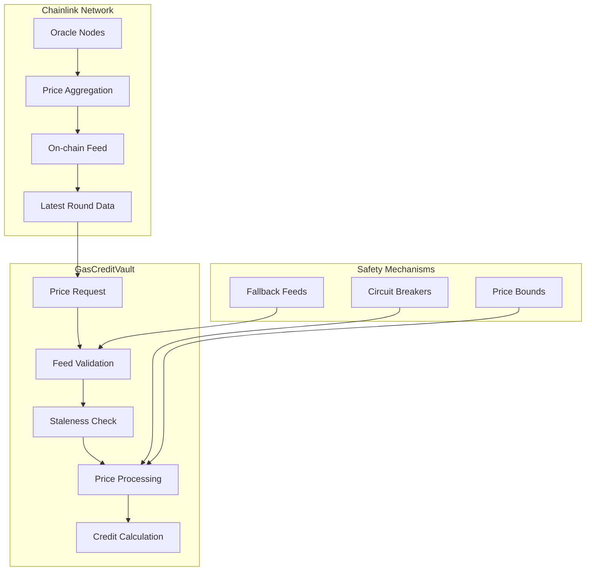

# Chainlink Integration

The GasCreditVault contract integrates with Chainlink's decentralized oracle network to provide reliable, real-time price feeds for accurate token-to-credit conversions. This integration ensures fair pricing, prevents oracle manipulation attacks, and maintains system integrity across volatile market conditions.

## Overview

Chainlink integration in GasCreditVault provides:
- **Real-time price feeds** from decentralized oracles
- **Multiple aggregation sources** for price accuracy
- **Staleness protection** against outdated data
- **Fallback mechanisms** for oracle failures
- **Circuit breakers** for extreme price movements

## Architecture



## Price Feed Interface

### Chainlink Aggregator Integration

```solidity
import "@chainlink/contracts/src/v0.8/interfaces/AggregatorV3Interface.sol";

contract ChainlinkPriceManager {
    struct PriceFeed {
        AggregatorV3Interface aggregator;  // Primary feed
        AggregatorV3Interface fallback;    // Backup feed
        uint8 decimals;                    // Feed decimals (usually 8)
        uint256 heartbeat;                 // Expected update frequency
        uint256 maxDeviation;              // Max price deviation %
        bool active;                       // Feed status
    }
    
    mapping(address => PriceFeed) public priceFeeds;
    
    // Price staleness threshold (default: 1 hour)
    uint256 public constant PRICE_STALE_THRESHOLD = 3600;
    
    // Maximum allowed price deviation (5%)
    uint256 public constant MAX_PRICE_DEVIATION = 500; // basis points
}
```

### Feed Registration

```solidity
function addPriceFeed(
    address token,
    address primaryFeed,
    address fallbackFeed,
    uint256 heartbeat,
    uint256 maxDeviation
) external onlyRole(ADMIN_ROLE) {
    
    require(token != address(0), "Invalid token");
    require(primaryFeed != address(0), "Invalid primary feed");
    require(maxDeviation <= 1000, "Deviation too high"); // Max 10%
    
    // Validate primary feed
    AggregatorV3Interface primary = AggregatorV3Interface(primaryFeed);
    _validatePriceFeed(primary);
    
    // Validate fallback feed if provided
    AggregatorV3Interface fallback;
    if (fallbackFeed != address(0)) {
        fallback = AggregatorV3Interface(fallbackFeed);
        _validatePriceFeed(fallback);
    }
    
    priceFeeds[token] = PriceFeed({
        aggregator: primary,
        fallback: fallback,
        decimals: primary.decimals(),
        heartbeat: heartbeat,
        maxDeviation: maxDeviation,
        active: true
    });
    
    emit PriceFeedAdded(token, primaryFeed, fallbackFeed);
}

function _validatePriceFeed(AggregatorV3Interface feed) internal view {
    try feed.latestRoundData() returns (
        uint80 roundId,
        int256 price,
        uint256 startedAt,
        uint256 updatedAt,
        uint80 answeredInRound
    ) {
        require(price > 0, "Invalid price");
        require(updatedAt > 0, "Invalid timestamp");
        require(roundId > 0, "Invalid round");
        require(answeredInRound >= roundId, "Invalid round data");
    } catch {
        revert("Feed validation failed");
    }
}
```

## Price Retrieval

### Primary Price Feed

```solidity
function getLatestPrice(address token) 
    public view 
    returns (
        uint256 price,
        uint256 timestamp,
        uint80 roundId
    ) {
    
    PriceFeed memory feed = priceFeeds[token];
    require(feed.active, "Price feed inactive");
    
    try feed.aggregator.latestRoundData() returns (
        uint80 _roundId,
        int256 _price,
        uint256 startedAt,
        uint256 updatedAt,
        uint80 answeredInRound
    ) {
        require(_price > 0, "Invalid price");
        require(updatedAt > 0, "Invalid timestamp");
        
        // Check staleness
        if (block.timestamp - updatedAt > PRICE_STALE_THRESHOLD) {
            return _getFallbackPrice(token);
        }
        
        return (uint256(_price), updatedAt, _roundId);
        
    } catch {
        return _getFallbackPrice(token);
    }
}
```

### Fallback Price Feed

```solidity
function _getFallbackPrice(address token) 
    internal view 
    returns (
        uint256 price,
        uint256 timestamp,
        uint80 roundId
    ) {
    
    PriceFeed memory feed = priceFeeds[token];
    
    if (address(feed.fallback) == address(0)) {
        revert("No fallback feed available");
    }
    
    try feed.fallback.latestRoundData() returns (
        uint80 _roundId,
        int256 _price,
        uint256 startedAt,
        uint256 updatedAt,
        uint80 answeredInRound
    ) {
        require(_price > 0, "Invalid fallback price");
        require(updatedAt > 0, "Invalid fallback timestamp");
        
        // Check fallback staleness
        require(
            block.timestamp - updatedAt <= PRICE_STALE_THRESHOLD,
            "Fallback feed stale"
        );
        
        return (uint256(_price), updatedAt, _roundId);
        
    } catch {
        revert("All price feeds failed");
    }
}
```

### Price Validation

```solidity
function getValidatedPrice(address token) 
    public view 
    returns (uint256 price, uint256 timestamp) {
    
    (uint256 primaryPrice, uint256 primaryTimestamp, ) = getLatestPrice(token);
    
    PriceFeed memory feed = priceFeeds[token];
    
    // If no fallback, return primary
    if (address(feed.fallback) == address(0)) {
        return (primaryPrice, primaryTimestamp);
    }
    
    // Get fallback price for comparison
    try feed.fallback.latestRoundData() returns (
        uint80,
        int256 fallbackPrice,
        uint256,
        uint256 fallbackTimestamp,
        uint80
    ) {
        // Check if fallback is fresher and valid
        if (fallbackTimestamp > primaryTimestamp && 
            fallbackPrice > 0 &&
            block.timestamp - fallbackTimestamp <= PRICE_STALE_THRESHOLD) {
            
            // Compare prices for deviation
            uint256 deviation = _calculateDeviation(
                primaryPrice, 
                uint256(fallbackPrice)
            );
            
            if (deviation <= feed.maxDeviation) {
                // Prices agree, use more recent one
                return fallbackTimestamp > primaryTimestamp
                    ? (uint256(fallbackPrice), fallbackTimestamp)
                    : (primaryPrice, primaryTimestamp);
            } else {
                // Prices disagree significantly
                emit PriceDeviation(token, primaryPrice, uint256(fallbackPrice), deviation);
                
                // Use primary feed by default, but could implement other logic
                return (primaryPrice, primaryTimestamp);
            }
        }
    } catch {
        // Fallback failed, use primary
    }
    
    return (primaryPrice, primaryTimestamp);
}

function _calculateDeviation(uint256 price1, uint256 price2) 
    internal pure 
    returns (uint256) {
    
    uint256 higher = price1 > price2 ? price1 : price2;
    uint256 lower = price1 > price2 ? price2 : price1;
    
    return ((higher - lower) * 10000) / lower; // basis points
}
```

## Circuit Breakers

### Price Movement Protection

```solidity
contract PriceCircuitBreaker {
    struct PriceHistory {
        uint256 price;
        uint256 timestamp;
        bool isValid;
    }
    
    mapping(address => PriceHistory[]) public priceHistory;
    mapping(address => uint256) public lastValidPrice;
    
    uint256 public constant MAX_PRICE_CHANGE = 1000; // 10% max change
    uint256 public constant PRICE_HISTORY_LENGTH = 24; // 24 hours
    
    function checkPriceMovement(address token, uint256 newPrice) 
        internal 
        returns (bool isValid) {
        
        uint256 lastPrice = lastValidPrice[token];
        
        if (lastPrice == 0) {
            // First price, accept it
            lastValidPrice[token] = newPrice;
            _addToPriceHistory(token, newPrice, true);
            return true;
        }
        
        uint256 priceChange = _calculateDeviation(lastPrice, newPrice);
        
        if (priceChange > MAX_PRICE_CHANGE) {
            // Price change too large, reject
            _addToPriceHistory(token, newPrice, false);
            emit PriceRejected(token, newPrice, lastPrice, priceChange);
            return false;
        }
        
        // Price change acceptable
        lastValidPrice[token] = newPrice;
        _addToPriceHistory(token, newPrice, true);
        return true;
    }
    
    function _addToPriceHistory(address token, uint256 price, bool isValid) internal {
        PriceHistory[] storage history = priceHistory[token];
        
        history.push(PriceHistory({
            price: price,
            timestamp: block.timestamp,
            isValid: isValid
        }));
        
        // Keep only recent history
        if (history.length > PRICE_HISTORY_LENGTH) {
            // Remove oldest entry
            for (uint256 i = 0; i < history.length - 1; i++) {
                history[i] = history[i + 1];
            }
            history.pop();
        }
    }
}
```

### Emergency Price Override

```solidity
contract EmergencyPriceManager {
    struct EmergencyPrice {
        uint256 price;
        uint256 timestamp;
        uint256 validUntil;
        address setter;
        bool active;
    }
    
    mapping(address => EmergencyPrice) public emergencyPrices;
    
    event EmergencyPriceSet(
        address indexed token,
        uint256 price,
        uint256 validUntil,
        address setter
    );
    
    function setEmergencyPrice(
        address token,
        uint256 price,
        uint256 validDuration
    ) external onlyRole(EMERGENCY_ROLE) {
        
        require(price > 0, "Invalid price");
        require(validDuration > 0 && validDuration <= 86400, "Invalid duration");
        
        emergencyPrices[token] = EmergencyPrice({
            price: price,
            timestamp: block.timestamp,
            validUntil: block.timestamp + validDuration,
            setter: msg.sender,
            active: true
        });
        
        emit EmergencyPriceSet(token, price, block.timestamp + validDuration, msg.sender);
    }
    
    function getEmergencyPrice(address token) 
        public view 
        returns (bool hasPrice, uint256 price, uint256 timestamp) {
        
        EmergencyPrice memory emergency = emergencyPrices[token];
        
        if (!emergency.active || block.timestamp > emergency.validUntil) {
            return (false, 0, 0);
        }
        
        return (true, emergency.price, emergency.timestamp);
    }
    
    function clearEmergencyPrice(address token) external onlyRole(ADMIN_ROLE) {
        emergencyPrices[token].active = false;
    }
}
```

## Advanced Features

### Time-Weighted Average Price (TWAP)

```solidity
contract TWAPPriceManager {
    struct TWAPData {
        uint256 priceSum;
        uint256 priceCount;
        uint256 windowStart;
        uint256 windowDuration;
    }
    
    mapping(address => TWAPData) public twapData;
    
    uint256 public constant DEFAULT_TWAP_WINDOW = 3600; // 1 hour
    
    function updateTWAP(address token) external {
        (uint256 currentPrice, uint256 timestamp, ) = getLatestPrice(token);
        
        TWAPData storage twap = twapData[token];
        
        // Initialize if first update
        if (twap.windowStart == 0) {
            twap.windowStart = timestamp;
            twap.windowDuration = DEFAULT_TWAP_WINDOW;
        }
        
        // Check if window has passed
        if (timestamp >= twap.windowStart + twap.windowDuration) {
            // Reset window
            twap.priceSum = currentPrice;
            twap.priceCount = 1;
            twap.windowStart = timestamp;
        } else {
            // Add to current window
            twap.priceSum += currentPrice;
            twap.priceCount++;
        }
    }
    
    function getTWAPPrice(address token) 
        public view 
        returns (uint256 twapPrice, bool isValid) {
        
        TWAPData memory twap = twapData[token];
        
        if (twap.priceCount == 0) {
            return (0, false);
        }
        
        // Check if TWAP is recent enough
        if (block.timestamp > twap.windowStart + twap.windowDuration * 2) {
            return (0, false);
        }
        
        twapPrice = twap.priceSum / twap.priceCount;
        return (twapPrice, true);
    }
}
```

### Price Feed Monitoring

```solidity
contract PriceFeedMonitor {
    struct FeedHealth {
        uint256 lastUpdate;
        uint256 consecutiveFailures;
        uint256 totalRequests;
        uint256 successfulRequests;
        bool isHealthy;
    }
    
    mapping(address => FeedHealth) public feedHealth;
    
    uint256 public constant MAX_CONSECUTIVE_FAILURES = 3;
    uint256 public constant HEALTH_CHECK_INTERVAL = 300; // 5 minutes
    
    function checkFeedHealth(address token) external view returns (bool) {
        FeedHealth memory health = feedHealth[token];
        
        // Check recent activity
        if (block.timestamp - health.lastUpdate > HEALTH_CHECK_INTERVAL * 3) {
            return false;
        }
        
        // Check failure rate
        if (health.consecutiveFailures >= MAX_CONSECUTIVE_FAILURES) {
            return false;
        }
        
        // Check success rate
        uint256 successRate = (health.successfulRequests * 100) / health.totalRequests;
        if (successRate < 90) { // 90% success rate required
            return false;
        }
        
        return true;
    }
    
    function _recordFeedResult(address token, bool success) internal {
        FeedHealth storage health = feedHealth[token];
        
        health.lastUpdate = block.timestamp;
        health.totalRequests++;
        
        if (success) {
            health.successfulRequests++;
            health.consecutiveFailures = 0;
            health.isHealthy = true;
        } else {
            health.consecutiveFailures++;
            if (health.consecutiveFailures >= MAX_CONSECUTIVE_FAILURES) {
                health.isHealthy = false;
                emit FeedUnhealthy(token, health.consecutiveFailures);
            }
        }
    }
    
    event FeedUnhealthy(address indexed token, uint256 consecutiveFailures);
}
```

## Integration Examples

### Price Feed Client

```javascript
class ChainlinkPriceClient {
    constructor(provider, vaultAddress) {
        this.provider = provider;
        this.vault = new ethers.Contract(vaultAddress, VaultABI, provider);
        this.priceCache = new Map();
        this.cacheTimeout = 60000; // 1 minute
    }
    
    async getTokenPrice(tokenAddress, useCache = true) {
        if (useCache && this.priceCache.has(tokenAddress)) {
            const cached = this.priceCache.get(tokenAddress);
            if (Date.now() - cached.timestamp < this.cacheTimeout) {
                return cached.price;
            }
        }
        
        try {
            const [price, timestamp, roundId] = await this.vault.getLatestPrice(tokenAddress);
            
            const priceData = {
                price: ethers.utils.formatUnits(price, 8),
                timestamp: new Date(timestamp.toNumber() * 1000),
                roundId: roundId.toString(),
                isStale: Date.now() - (timestamp.toNumber() * 1000) > 3600000
            };
            
            this.priceCache.set(tokenAddress, {
                price: priceData,
                timestamp: Date.now()
            });
            
            return priceData;
            
        } catch (error) {
            console.error('Error fetching price:', error);
            throw new Error(`Failed to get price for token ${tokenAddress}`);
        }
    }
    
    async validatePrice(tokenAddress) {
        try {
            const [price, timestamp] = await this.vault.getValidatedPrice(tokenAddress);
            
            return {
                price: ethers.utils.formatUnits(price, 8),
                timestamp: new Date(timestamp.toNumber() * 1000),
                isValid: true
            };
        } catch (error) {
            return {
                price: null,
                timestamp: null,
                isValid: false,
                error: error.message
            };
        }
    }
    
    async monitorPriceFeeds(tokens, callback) {
        const checkPrices = async () => {
            for (const token of tokens) {
                try {
                    const priceData = await this.getTokenPrice(token, false);
                    callback(token, priceData, null);
                } catch (error) {
                    callback(token, null, error);
                }
            }
        };
        
        // Initial check
        await checkPrices();
        
        // Set up interval
        return setInterval(checkPrices, 30000); // Check every 30 seconds
    }
}
```

### Price Alert System

```javascript
class PriceAlertSystem {
    constructor(priceClient) {
        this.priceClient = priceClient;
        this.alerts = new Map();
        this.isMonitoring = false;
    }
    
    addAlert(tokenAddress, condition, threshold, callback) {
        const alertId = `${tokenAddress}_${Date.now()}`;
        
        this.alerts.set(alertId, {
            tokenAddress,
            condition, // 'above', 'below', 'change'
            threshold,
            callback,
            lastPrice: null,
            triggered: false
        });
        
        if (!this.isMonitoring) {
            this.startMonitoring();
        }
        
        return alertId;
    }
    
    removeAlert(alertId) {
        this.alerts.delete(alertId);
        
        if (this.alerts.size === 0) {
            this.stopMonitoring();
        }
    }
    
    async startMonitoring() {
        this.isMonitoring = true;
        
        this.monitoringInterval = setInterval(async () => {
            for (const [alertId, alert] of this.alerts) {
                if (alert.triggered) continue;
                
                try {
                    const priceData = await this.priceClient.getTokenPrice(alert.tokenAddress);
                    const currentPrice = parseFloat(priceData.price);
                    
                    let shouldTrigger = false;
                    
                    switch (alert.condition) {
                        case 'above':
                            shouldTrigger = currentPrice > alert.threshold;
                            break;
                        case 'below':
                            shouldTrigger = currentPrice < alert.threshold;
                            break;
                        case 'change':
                            if (alert.lastPrice !== null) {
                                const changePercent = Math.abs(
                                    (currentPrice - alert.lastPrice) / alert.lastPrice * 100
                                );
                                shouldTrigger = changePercent > alert.threshold;
                            }
                            break;
                    }
                    
                    if (shouldTrigger) {
                        alert.triggered = true;
                        alert.callback({
                            alertId,
                            tokenAddress: alert.tokenAddress,
                            currentPrice,
                            threshold: alert.threshold,
                            condition: alert.condition,
                            priceData
                        });
                    }
                    
                    alert.lastPrice = currentPrice;
                    
                } catch (error) {
                    console.error(`Error checking price for alert ${alertId}:`, error);
                }
            }
        }, 10000); // Check every 10 seconds
    }
    
    stopMonitoring() {
        this.isMonitoring = false;
        if (this.monitoringInterval) {
            clearInterval(this.monitoringInterval);
        }
    }
}
```

## Testing Chainlink Integration

```javascript
describe('Chainlink Integration', function() {
    let vault, mockAggregator, fallbackAggregator, token;
    
    beforeEach(async function() {
        // Deploy mock aggregators
        const MockAggregator = await ethers.getContractFactory('MockAggregatorV3');
        mockAggregator = await MockAggregator.deploy(8, 100000000); // $1.00
        fallbackAggregator = await MockAggregator.deploy(8, 100000000);
        
        // Deploy vault
        vault = await deployVault();
        
        // Deploy test token
        const TestToken = await ethers.getContractFactory('TestERC20');
        token = await TestToken.deploy('Test Token', 'TEST', 18);
        
        // Add price feed
        await vault.addPriceFeed(
            token.address,
            mockAggregator.address,
            fallbackAggregator.address,
            3600, // 1 hour heartbeat
            500   // 5% max deviation
        );
    });
    
    it('Should get latest price from Chainlink', async function() {
        const [price, timestamp, roundId] = await vault.getLatestPrice(token.address);
        
        expect(price).to.equal(100000000); // $1.00 with 8 decimals
        expect(timestamp).to.be.gt(0);
        expect(roundId).to.be.gt(0);
    });
    
    it('Should handle stale price feeds', async function() {
        // Set old timestamp (2 hours ago)
        const oldTimestamp = Math.floor(Date.now() / 1000) - 7200;
        await mockAggregator.updateRoundData(
            1,
            100000000,
            oldTimestamp,
            oldTimestamp,
            1
        );
        
        // Should fall back to secondary feed
        const [price, timestamp] = await vault.getLatestPrice(token.address);
        
        // Should get price from fallback (which has current timestamp)
        expect(timestamp).to.be.gt(oldTimestamp);
    });
    
    it('Should validate price deviation between feeds', async function() {
        // Set different prices in feeds
        await mockAggregator.updateRoundData(1, 100000000, Math.floor(Date.now() / 1000), Math.floor(Date.now() / 1000), 1); // $1.00
        await fallbackAggregator.updateRoundData(1, 110000000, Math.floor(Date.now() / 1000), Math.floor(Date.now() / 1000), 1); // $1.10
        
        const [price, timestamp] = await vault.getValidatedPrice(token.address);
        
        // Should handle price deviation appropriately
        expect(price).to.be.oneOf([100000000, 110000000]);
    });
    
    it('Should reject prices with too much deviation', async function() {
        // Set very different prices (>50% difference)
        await mockAggregator.updateRoundData(1, 100000000, Math.floor(Date.now() / 1000), Math.floor(Date.now() / 1000), 1); // $1.00
        await fallbackAggregator.updateRoundData(1, 200000000, Math.floor(Date.now() / 1000), Math.floor(Date.now() / 1000), 1); // $2.00
        
        // Should emit deviation event and use primary feed
        const tx = await vault.getValidatedPrice(token.address);
        
        // Check for price deviation event
        // In a real test, you'd check for the PriceDeviation event
    });
    
    it('Should handle complete feed failures', async function() {
        // Deploy vault without fallback
        await vault.addPriceFeed(
            token.address,
            mockAggregator.address,
            ethers.constants.AddressZero, // No fallback
            3600,
            500
        );
        
        // Make the aggregator revert
        await mockAggregator.setShouldRevert(true);
        
        await expect(
            vault.getLatestPrice(token.address)
        ).to.be.revertedWith('All price feeds failed');
    });
});
```

## Best Practices

### For Administrators

1. **Use multiple price feeds** for critical tokens
2. **Set appropriate heartbeats** based on token volatility
3. **Monitor feed health** regularly
4. **Have emergency procedures** for feed failures
5. **Test price feeds** thoroughly before deployment

### For Developers

1. **Handle price feed failures** gracefully
2. **Implement proper staleness checks**
3. **Use fallback mechanisms** for reliability
4. **Cache prices appropriately** to reduce calls
5. **Monitor price deviations** for anomalies

### For Integration

1. **Validate price data** before using
2. **Handle network delays** and timeouts
3. **Implement retry logic** for failed requests
4. **Use websockets** for real-time price updates
5. **Monitor gas costs** of price operations

---

**Related Topics**:
- [Multi-Token Support](multi-token-support.md) - Token configuration with price feeds
- [Credit Management](credit-management.md) - Using prices for credit calculations
- [GasCreditVault Overview](../gascreditvault.md) - Main contract documentation
