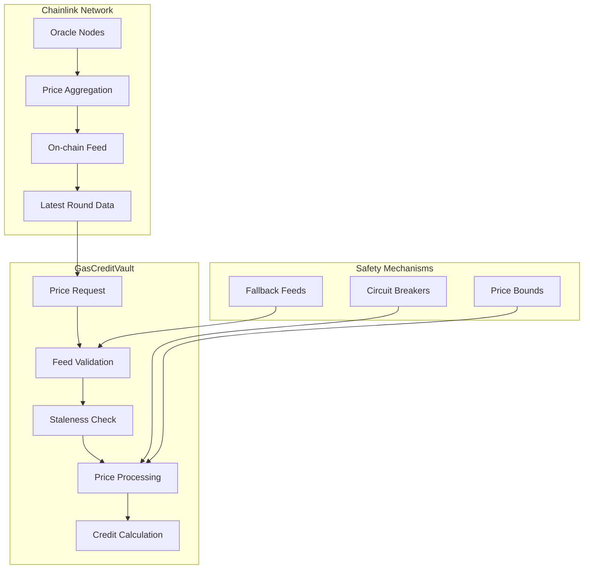

# Chainlink Integration

The GasCreditVault contract integrates with Chainlink's decentralized oracle network to provide reliable, real-time price feeds for accurate token-to-credit conversions. This integration ensures fair pricing, prevents oracle manipulation attacks, and maintains system integrity across volatile market conditions.

## Overview

Chainlink integration in GasCreditVault provides:
- **Real-time price feeds** from decentralized oracles
- **Multiple aggregation sources** for price accuracy
- **Staleness protection** against outdated data

## Architecture



## Price Feed Interface

### Chainlink Aggregator Integration

```solidity
TokenInfo memory info = tokenInfo[token];
uint8 tokenDecimals = IERC20Metadata(token).decimals();

if (info.isStablecoin) {
    return convertDecimals(creditAmount, creditDecimals, tokenDecimals);
}

(uint80 roundId, int256 price, , uint256 updatedAt, uint80 answeredInRound) = info.priceFeed.latestRoundData();
```

## Best Practices

### For Administrators

1. **Use multiple price feeds** for critical tokens
2. **Set appropriate heartbeats** based on token volatility
3. **Monitor feed health** regularly
4. **Have emergency procedures** for feed failures
5. **Test price feeds** thoroughly before deployment

### For Developers

1. **Handle price feed failures** gracefully
2. **Implement proper staleness checks**
3. **Use fallback mechanisms** for reliability
4. **Cache prices appropriately** to reduce calls
5. **Monitor price deviations** for anomalies

### For Integration

1. **Validate price data** before using
2. **Handle network delays** and timeouts
3. **Implement retry logic** for failed requests
4. **Use websockets** for real-time price updates
5. **Monitor gas costs** of price operations

---

**Related Topics**:
- [Multi-Token Support](multi-token-support.md) - Token configuration with price feeds
- [Credit Management](credit-management.md) - Using prices for credit calculations
- [GasCreditVault Overview](../gascreditvault.md) - Main contract documentation
