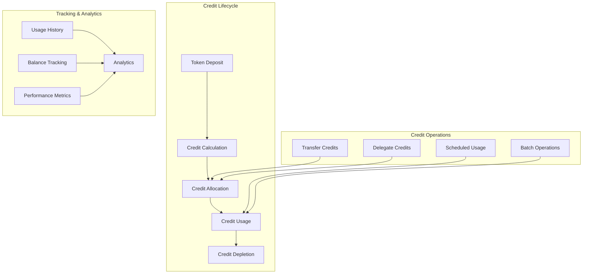

# Credit Management

The GasCreditVault implements a comprehensive credit management system that handles the entire lifecycle of gas credits - from deposit and allocation to usage and withdrawal. This system provides flexible credit operations while maintaining strict accounting and security controls.

## Overview

Credit management in GasCreditVault encompasses:
- **Credit lifecycle management** from creation to consumption
- **Flexible transfer mechanisms** between users
- **Usage tracking and analytics** for optimization
- **Credit allocation strategies** for different use cases
- **Advanced features** like delegation and scheduled operations

## Architecture



## Core Data Structures

### Credit Account Structure

```solidity
struct CreditAccount {
    uint256 balance;                    // Current credit balance
    uint256 reserved;                   // Credits reserved for pending operations
    uint256 totalDeposited;            // Total credits ever deposited
    uint256 totalUsed;                  // Total credits ever used
    uint256 lastActivity;               // Timestamp of last activity
    mapping(address => uint256) allowances; // Credit allowances for other addresses
    bool frozen;                        // Whether account is frozen
}

// Main storage
mapping(address => CreditAccount) internal creditAccounts;
```

### Usage Tracking

```solidity
struct UsageRecord {
    address user;                       // User who used credits
    uint256 amount;                     // Amount of credits used
    address spender;                    // Who initiated the usage (user or delegate)
    bytes32 purpose;                    // Encoded purpose/category
    uint256 gasPrice;                   // Gas price at time of usage
    uint256 timestamp;                  // When credits were used
    bytes32 transactionHash;            // Associated transaction hash
}

struct UsageStats {
    uint256 totalUsage;                 // Total credits used
    uint256 avgDailyUsage;             // Average daily usage
    uint256 peakDailyUsage;            // Peak daily usage
    uint256 lastUpdateTime;            // Last stats update
    mapping(bytes32 => uint256) categoryUsage; // Usage by category
}

// Storage
UsageRecord[] public usageHistory;
mapping(address => UsageStats) public userStats;
mapping(uint256 => uint256) public dailyUsage; // day => total usage
```

## Credit Operations

### Credit Allocation

```solidity
function allocateCredits(address user, uint256 amount, bytes32 source) 
    internal {
    
    require(user != address(0), "Invalid user");
    require(amount > 0, "Amount must be positive");
    
    CreditAccount storage account = creditAccounts[user];
    
    // Update balance
    account.balance += amount;
    account.totalDeposited += amount;
    account.lastActivity = block.timestamp;
    
    // Update global stats
    totalCredits += amount;
    
    emit CreditsAllocated(user, amount, source);
}

function reserveCredits(address user, uint256 amount) 
    external 
    onlyRole(GATEWAY_ROLE) 
    returns (bool) {
    
    CreditAccount storage account = creditAccounts[user];
    
    // Check available balance
    uint256 available = account.balance - account.reserved;
    if (available < amount) {
        return false;
    }
    
    // Reserve credits
    account.reserved += amount;
    account.lastActivity = block.timestamp;
    
    emit CreditsReserved(user, amount);
    return true;
}

function unreserveCredits(address user, uint256 amount) 
    external 
    onlyRole(GATEWAY_ROLE) {
    
    CreditAccount storage account = creditAccounts[user];
    require(account.reserved >= amount, "Insufficient reserved credits");
    
    account.reserved -= amount;
    
    emit CreditsUnreserved(user, amount);
}
```

### Credit Usage

```solidity
function useCredits(
    address user, 
    uint256 amount, 
    bytes32 purpose,
    bytes32 transactionHash
) external onlyRole(GATEWAY_ROLE) {
    
    require(amount > 0, "Amount must be positive");
    
    CreditAccount storage account = creditAccounts[user];
    
    // Check if using reserved credits first
    if (account.reserved >= amount) {
        account.reserved -= amount;
    } else {
        // Use from available balance
        uint256 fromReserved = account.reserved;
        uint256 fromBalance = amount - fromReserved;
        
        require(account.balance >= fromBalance, "Insufficient credits");
        
        account.reserved = 0;
        account.balance -= fromBalance;
    }
    
    // Update usage stats
    account.totalUsed += amount;
    account.lastActivity = block.timestamp;
    
    // Update global stats
    totalCreditsUsed += amount;
    
    // Record usage
    _recordUsage(user, amount, msg.sender, purpose, transactionHash);
    
    emit CreditsUsed(user, amount, purpose);
}

function _recordUsage(
    address user,
    uint256 amount,
    address spender,
    bytes32 purpose,
    bytes32 transactionHash
) internal {
    
    usageHistory.push(UsageRecord({
        user: user,
        amount: amount,
        spender: spender,
        purpose: purpose,
        gasPrice: tx.gasprice,
        timestamp: block.timestamp,
        transactionHash: transactionHash
    }));
    
    // Update daily usage
    uint256 today = block.timestamp / 1 days;
    dailyUsage[today] += amount;
    
    // Update user stats
    _updateUserStats(user, amount, purpose);
}
```

### Credit Transfers

```solidity
function transferCredits(address to, uint256 amount) 
    external 
    nonReentrant {
    
    require(to != address(0), "Invalid recipient");
    require(to != msg.sender, "Cannot transfer to self");
    require(amount > 0, "Amount must be positive");
    
    CreditAccount storage fromAccount = creditAccounts[msg.sender];
    CreditAccount storage toAccount = creditAccounts[to];
    
    // Check balance
    uint256 available = fromAccount.balance - fromAccount.reserved;
    require(available >= amount, "Insufficient available credits");
    
    // Perform transfer
    fromAccount.balance -= amount;
    fromAccount.lastActivity = block.timestamp;
    
    toAccount.balance += amount;
    toAccount.lastActivity = block.timestamp;
    
    emit CreditsTransferred(msg.sender, to, amount);
}

function transferCreditsFrom(address from, address to, uint256 amount) 
    external 
    nonReentrant {
    
    require(from != address(0), "Invalid sender");
    require(to != address(0), "Invalid recipient");
    require(amount > 0, "Amount must be positive");
    
    CreditAccount storage fromAccount = creditAccounts[from];
    
    // Check allowance
    uint256 allowance = fromAccount.allowances[msg.sender];
    require(allowance >= amount, "Insufficient allowance");
    
    // Check balance
    uint256 available = fromAccount.balance - fromAccount.reserved;
    require(available >= amount, "Insufficient available credits");
    
    // Update allowance
    fromAccount.allowances[msg.sender] -= amount;
    
    // Perform transfer
    _transferCreditsInternal(from, to, amount);
    
    emit CreditsTransferredFrom(msg.sender, from, to, amount);
}

function _transferCreditsInternal(address from, address to, uint256 amount) 
    internal {
    
    creditAccounts[from].balance -= amount;
    creditAccounts[from].lastActivity = block.timestamp;
    
    creditAccounts[to].balance += amount;
    creditAccounts[to].lastActivity = block.timestamp;
    
    emit CreditsTransferred(from, to, amount);
}
```

## Advanced Credit Features

### Credit Allowances

```solidity
function approve(address spender, uint256 amount) external {
    require(spender != address(0), "Invalid spender");
    
    creditAccounts[msg.sender].allowances[spender] = amount;
    
    emit CreditApproval(msg.sender, spender, amount);
}

function increaseAllowance(address spender, uint256 addedValue) 
    external 
    returns (bool) {
    
    uint256 currentAllowance = creditAccounts[msg.sender].allowances[spender];
    approve(spender, currentAllowance + addedValue);
    
    return true;
}

function decreaseAllowance(address spender, uint256 subtractedValue) 
    external 
    returns (bool) {
    
    uint256 currentAllowance = creditAccounts[msg.sender].allowances[spender];
    require(currentAllowance >= subtractedValue, "Decreased allowance below zero");
    
    approve(spender, currentAllowance - subtractedValue);
    
    return true;
}

function allowance(address owner, address spender) 
    external view 
    returns (uint256) {
    
    return creditAccounts[owner].allowances[spender];
}
```

### Credit Delegation

```solidity
struct DelegationInfo {
    address delegate;                   // Who can spend credits
    uint256 limit;                     // Maximum credits delegated
    uint256 used;                      // Credits already used by delegate
    uint256 resetTime;                 // When delegation resets (for recurring)
    uint256 validUntil;               // Delegation expiry
    bool recurring;                    // Whether delegation auto-renews
    bool active;                       // Whether delegation is active
}

mapping(address => mapping(address => DelegationInfo)) public delegations;

function delegateCredits(
    address delegate,
    uint256 limit,
    uint256 validDuration,
    bool recurring
) external {
    
    require(delegate != address(0), "Invalid delegate");
    require(delegate != msg.sender, "Cannot delegate to self");
    require(limit > 0, "Limit must be positive");
    require(validDuration > 0, "Invalid duration");
    
    // Check available balance
    CreditAccount storage account = creditAccounts[msg.sender];
    uint256 available = account.balance - account.reserved;
    require(available >= limit, "Insufficient credits to delegate");
    
    delegations[msg.sender][delegate] = DelegationInfo({
        delegate: delegate,
        limit: limit,
        used: 0,
        resetTime: block.timestamp + validDuration,
        validUntil: block.timestamp + validDuration,
        recurring: recurring,
        active: true
    });
    
    emit CreditsDelegated(msg.sender, delegate, limit, validDuration, recurring);
}

function useDelegatedCredits(
    address owner,
    uint256 amount,
    bytes32 purpose
) external returns (bool) {
    
    DelegationInfo storage delegation = delegations[owner][msg.sender];
    require(delegation.active, "No active delegation");
    require(block.timestamp <= delegation.validUntil, "Delegation expired");
    
    // Check delegation limits
    uint256 availableInDelegation = delegation.limit - delegation.used;
    require(availableInDelegation >= amount, "Exceeds delegation limit");
    
    // Check owner's balance
    CreditAccount storage account = creditAccounts[owner];
    uint256 available = account.balance - account.reserved;
    require(available >= amount, "Owner has insufficient credits");
    
    // Use credits
    account.balance -= amount;
    account.totalUsed += amount;
    account.lastActivity = block.timestamp;
    
    delegation.used += amount;
    
    // Update global stats
    totalCreditsUsed += amount;
    
    // Record usage
    _recordUsage(owner, amount, msg.sender, purpose, bytes32(0));
    
    emit DelegatedCreditsUsed(owner, msg.sender, amount, purpose);
    
    return true;
}
```

### Scheduled Credit Operations

```solidity
struct ScheduledOperation {
    address user;                       // User account
    uint256 amount;                     // Amount involved
    uint256 executeAt;                  // When to execute
    uint256 interval;                   // For recurring operations
    OperationType opType;               // Type of operation
    address target;                     // Target for transfers
    bytes data;                        // Additional operation data
    bool recurring;                     // Whether operation repeats
    bool executed;                      // Whether operation completed
}

enum OperationType {
    TRANSFER,
    DELEGATE,
    RESERVE,
    WITHDRAW
}

mapping(bytes32 => ScheduledOperation) public scheduledOps;
bytes32[] public pendingOperations;

function scheduleTransfer(
    address to,
    uint256 amount,
    uint256 executeAt,
    uint256 interval,
    bool recurring
) external returns (bytes32 opId) {
    
    require(to != address(0), "Invalid recipient");
    require(amount > 0, "Amount must be positive");
    require(executeAt > block.timestamp, "Must be future time");
    
    opId = keccak256(abi.encode(
        msg.sender, to, amount, executeAt, block.timestamp
    ));
    
    scheduledOps[opId] = ScheduledOperation({
        user: msg.sender,
        amount: amount,
        executeAt: executeAt,
        interval: interval,
        opType: OperationType.TRANSFER,
        target: to,
        data: "",
        recurring: recurring,
        executed: false
    });
    
    pendingOperations.push(opId);
    
    emit OperationScheduled(opId, msg.sender, OperationType.TRANSFER, executeAt);
}

function executeScheduledOperation(bytes32 opId) 
    external 
    onlyRole(OPERATOR_ROLE) {
    
    ScheduledOperation storage op = scheduledOps[opId];
    require(!op.executed, "Operation already executed");
    require(block.timestamp >= op.executeAt, "Too early to execute");
    
    if (op.opType == OperationType.TRANSFER) {
        // Execute transfer
        _transferCreditsInternal(op.user, op.target, op.amount);
    }
    // Add other operation types...
    
    if (op.recurring && op.interval > 0) {
        // Schedule next execution
        op.executeAt += op.interval;
    } else {
        op.executed = true;
        _removePendingOperation(opId);
    }
    
    emit OperationExecuted(opId, op.user, op.opType);
}
```

## Analytics and Reporting

### Usage Analytics

```solidity
function _updateUserStats(address user, uint256 amount, bytes32 category) 
    internal {
    
    UsageStats storage stats = userStats[user];
    stats.totalUsage += amount;
    stats.categoryUsage[category] += amount;
    
    // Update daily average (simple moving average)
    uint256 daysSinceStart = (block.timestamp - stats.lastUpdateTime) / 1 days;
    if (daysSinceStart > 0) {
        stats.avgDailyUsage = (stats.avgDailyUsage + amount) / 2;
    }
    
    // Update peak daily usage
    uint256 today = block.timestamp / 1 days;
    if (dailyUsage[today] > stats.peakDailyUsage) {
        stats.peakDailyUsage = dailyUsage[today];
    }
    
    stats.lastUpdateTime = block.timestamp;
}

function getUserStats(address user) 
    external view 
    returns (
        uint256 totalUsage,
        uint256 avgDailyUsage,
        uint256 peakDailyUsage,
        uint256 lastActivity
    ) {
    
    UsageStats memory stats = userStats[user];
    CreditAccount memory account = creditAccounts[user];
    
    return (
        stats.totalUsage,
        stats.avgDailyUsage,
        stats.peakDailyUsage,
        account.lastActivity
    );
}

function getCategoryUsage(address user, bytes32 category) 
    external view 
    returns (uint256) {
    
    return userStats[user].categoryUsage[category];
}
```

### System Analytics

```solidity
function getSystemStats() 
    external view 
    returns (
        uint256 totalUsers,
        uint256 activeUsers,
        uint256 totalCreditsAllocated,
        uint256 totalCreditsUsed,
        uint256 dailyActiveUsers
    ) {
    
    totalCreditsAllocated = totalCredits;
    totalCreditsUsed = totalCreditsUsed;
    
    // Calculate active users (activity in last 24 hours)
    uint256 cutoff = block.timestamp - 1 days;
    
    // This would need to be optimized for large user bases
    // Consider maintaining these stats incrementally
    for (uint256 i = 0; i < userList.length; i++) {
        address user = userList[i];
        if (creditAccounts[user].balance > 0) {
            totalUsers++;
            
            if (creditAccounts[user].lastActivity >= cutoff) {
                activeUsers++;
            }
        }
    }
    
    dailyActiveUsers = activeUsers; // Simplified
}

function getDailyUsage(uint256 day) external view returns (uint256) {
    return dailyUsage[day];
}

function getUsageHistory(uint256 from, uint256 to) 
    external view 
    returns (UsageRecord[] memory) {
    
    require(from <= to, "Invalid range");
    require(to < usageHistory.length, "Invalid end index");
    
    uint256 length = to - from + 1;
    UsageRecord[] memory records = new UsageRecord[](length);
    
    for (uint256 i = 0; i < length; i++) {
        records[i] = usageHistory[from + i];
    }
    
    return records;
}
```

## View Functions

### Balance Queries

```solidity
function getCreditBalance(address user) external view returns (uint256) {
    return creditAccounts[user].balance;
}

function getAvailableCredits(address user) external view returns (uint256) {
    CreditAccount memory account = creditAccounts[user];
    return account.balance - account.reserved;
}

function getReservedCredits(address user) external view returns (uint256) {
    return creditAccounts[user].reserved;
}

function getAccountInfo(address user) 
    external view 
    returns (
        uint256 balance,
        uint256 reserved,
        uint256 totalDeposited,
        uint256 totalUsed,
        uint256 lastActivity,
        bool frozen
    ) {
    
    CreditAccount memory account = creditAccounts[user];
    
    return (
        account.balance,
        account.reserved,
        account.totalDeposited,
        account.totalUsed,
        account.lastActivity,
        account.frozen
    );
}
```

### Historical Data

```solidity
function getUserUsageInPeriod(address user, uint256 from, uint256 to) 
    external view 
    returns (uint256 totalUsage, uint256 transactionCount) {
    
    for (uint256 i = 0; i < usageHistory.length; i++) {
        UsageRecord memory record = usageHistory[i];
        
        if (record.user == user && 
            record.timestamp >= from && 
            record.timestamp <= to) {
            
            totalUsage += record.amount;
            transactionCount++;
        }
    }
}

function getTopUsers(uint256 limit) 
    external view 
    returns (address[] memory users, uint256[] memory usage) {
    
    // This is a simplified implementation
    // In production, maintain sorted lists or use off-chain indexing
    
    users = new address[](limit);
    usage = new uint256[](limit);
    
    // Implementation would sort users by usage
    // For brevity, this is omitted
}
```

## Events

```solidity
event CreditsAllocated(address indexed user, uint256 amount, bytes32 source);
event CreditsReserved(address indexed user, uint256 amount);
event CreditsUnreserved(address indexed user, uint256 amount);
event CreditsUsed(address indexed user, uint256 amount, bytes32 purpose);
event CreditsTransferred(address indexed from, address indexed to, uint256 amount);
event CreditsTransferredFrom(address indexed spender, address indexed from, address indexed to, uint256 amount);
event CreditApproval(address indexed owner, address indexed spender, uint256 amount);
event CreditsDelegated(address indexed owner, address indexed delegate, uint256 limit, uint256 duration, bool recurring);
event DelegatedCreditsUsed(address indexed owner, address indexed delegate, uint256 amount, bytes32 purpose);
event OperationScheduled(bytes32 indexed opId, address indexed user, OperationType opType, uint256 executeAt);
event OperationExecuted(bytes32 indexed opId, address indexed user, OperationType opType);
event AccountFrozen(address indexed user, string reason);
event AccountUnfrozen(address indexed user);
```

## Best Practices

### For Users

1. **Monitor credit usage** regularly to optimize spending
2. **Use delegation wisely** for automated services
3. **Plan transfers** to avoid insufficient balance issues
4. **Keep track of reserved** credits for pending operations
5. **Understand the fee structure** for different operations

### For Developers

1. **Implement proper access controls** for credit operations
2. **Use events extensively** for tracking and debugging
3. **Handle edge cases** like zero balances and overflows
4. **Optimize gas usage** in batch operations
5. **Provide clear error messages** for failed operations

### For System Operators

1. **Monitor system health** through analytics
2. **Set up alerts** for unusual usage patterns
3. **Regular audits** of credit accounting
4. **Performance optimization** for large user bases
5. **Emergency procedures** for system issues

---

**Related Topics**:
- [Multi-Token Support](multi-token-support.md) - Token deposits for credits
- [Chainlink Integration](chainlink-integration.md) - Price feeds for conversions
- [GasCreditVault Overview](../gascreditvault.md) - Main contract documentation
