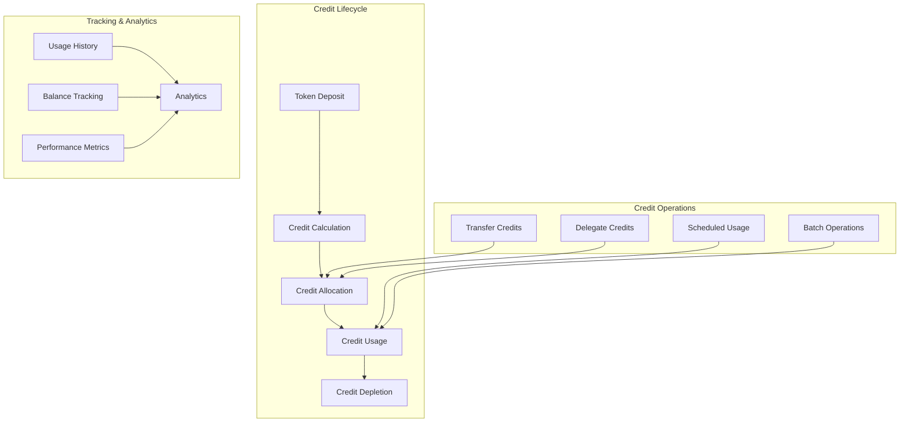

# Credit Management

The GasCreditVault implements a comprehensive credit management system that handles the entire lifecycle of gas credits - from deposit and allocation to usage and withdrawal. This system provides flexible credit operations while maintaining strict accounting and security controls.

## Overview

Credit management in GasCreditVault encompasses:
- **Credit lifecycle management** from creation to consumption
- **Flexible transfer mechanisms** between users
- **Usage tracking and analytics** for optimization
- **Credit allocation strategies** for different use cases
- **Advanced features** like delegation and scheduled operations

## Architecture



## Core Data Structures

### Credit Account Structure

```solidity
mapping(address => uint256) public credits;
```

## Credit Operations


```solidity
function deposit(address token, uint256 amount) external;
function withdraw(address token, uint256 creditAmount) external;
function consumeCredit(address user, uint256 usdValue) external;
function transferCredit(address receiver, uint256 credit) external;
```

### Credit Usage

```solidity
function consumeCredit(address user, uint256 usdValue) external onlyRelayer;
```

## Advanced Credit Features

### Credit Allowances

```solidity
function approve(address spender, uint256 amount) external {
    require(spender != address(0), "Invalid spender");
    
    creditAccounts[msg.sender].allowances[spender] = amount;
    
    emit CreditApproval(msg.sender, spender, amount);
}

function increaseAllowance(address spender, uint256 addedValue) 
    external 
    returns (bool) {
    
    uint256 currentAllowance = creditAccounts[msg.sender].allowances[spender];
    approve(spender, currentAllowance + addedValue);
    
    return true;
}

function decreaseAllowance(address spender, uint256 subtractedValue) 
    external 
    returns (bool) {
    
    uint256 currentAllowance = creditAccounts[msg.sender].allowances[spender];
    require(currentAllowance >= subtractedValue, "Decreased allowance below zero");
    
    approve(spender, currentAllowance - subtractedValue);
    
    return true;
}

function allowance(address owner, address spender) 
    external view 
    returns (uint256) {
    
    return creditAccounts[owner].allowances[spender];
}
```
## Best Practices

### For Users

1. **Monitor credit usage** regularly to optimize spending
2. **Use delegation wisely** for automated services
3. **Plan transfers** to avoid insufficient balance issues
4. **Keep track of reserved** credits for pending operations
5. **Understand the fee structure** for different operations

### For Developers

1. **Implement proper access controls** for credit operations
2. **Use events extensively** for tracking and debugging
3. **Handle edge cases** like zero balances and overflows
4. **Optimize gas usage** in batch operations
5. **Provide clear error messages** for failed operations

### For System Operators

1. **Monitor system health** through analytics
2. **Set up alerts** for unusual usage patterns
3. **Regular audits** of credit accounting
4. **Performance optimization** for large user bases
5. **Emergency procedures** for system issues

---

**Related Topics**:
- [Multi-Token Support](multi-token-support.md) - Token deposits for credits
- [Chainlink Integration](chainlink-integration.md) - Price feeds for conversions
- [GasCreditVault Overview](../gascreditvault.md) - Main contract documentation
