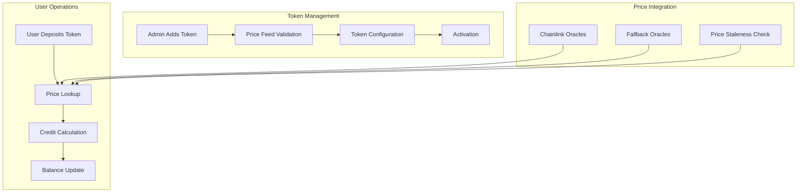

# Multi-Token Support

The GasCreditVault contract supports multiple ERC-20 tokens as collateral for gas credits, enabling users to pay for transaction fees using their preferred tokens. This flexible system integrates with Chainlink price feeds to ensure fair and accurate conversion rates across different tokens.

## Overview

Multi-token support in GasCreditVault provides:
- **Flexible token options** for gas credit deposits
- **Real-time price conversion** using Chainlink oracles
- **Secure token management** with proper validation
- **Dynamic token addition/removal** by administrators
- **Per-token configuration** for limits and parameters

## Architecture



## Token Configuration

### Supported Token Structure

```solidity
struct SupportedToken {
    address token;              // ERC-20 token contract address
    address priceFeed;          // Chainlink price feed address
    address fallbackFeed;       // Backup price feed (optional)
    uint8 decimals;            // Token decimals for calculations
    bool active;               // Whether deposits are currently active
    uint256 maxDeposit;        // Maximum single deposit amount
    uint256 minDeposit;        // Minimum single deposit amount
    uint256 dailyLimit;        // Maximum deposits per day
    uint256 totalDeposited;    // Total amount deposited to date
    uint256 conversionFee;     // Fee percentage (basis points)
    uint256 lastPriceUpdate;   // Timestamp of last price update
}

// Storage mapping
mapping(address => SupportedToken) public supportedTokens;
address[] public tokenList; // For enumeration
```

### Token Registration

```solidity
function addSupportedToken(
    address token,
    address priceFeed,
    address fallbackFeed,
    uint256 maxDeposit,
    uint256 minDeposit,
    uint256 dailyLimit,
    uint256 conversionFee
) external onlyRole(ADMIN_ROLE) {
    
    require(token != address(0), "Invalid token address");
    require(priceFeed != address(0), "Invalid price feed");
    require(!supportedTokens[token].active, "Token already supported");
    require(conversionFee <= MAX_CONVERSION_FEE, "Fee too high");
    
    // Validate token contract
    require(_isValidERC20(token), "Invalid ERC-20 token");
    
    // Validate price feed
    require(_isValidPriceFeed(priceFeed), "Invalid price feed");
    
    // Get token decimals
    uint8 decimals = IERC20Metadata(token).decimals();
    require(decimals <= 18, "Too many decimals");
    
    supportedTokens[token] = SupportedToken({
        token: token,
        priceFeed: priceFeed,
        fallbackFeed: fallbackFeed,
        decimals: decimals,
        active: true,
        maxDeposit: maxDeposit,
        minDeposit: minDeposit,
        dailyLimit: dailyLimit,
        totalDeposited: 0,
        conversionFee: conversionFee,
        lastPriceUpdate: 0
    });
    
    tokenList.push(token);
    
    emit TokenAdded(token, priceFeed, maxDeposit, minDeposit);
}
```

### Token Validation

```solidity
function _isValidERC20(address token) internal view returns (bool) {
    try IERC20Metadata(token).decimals() returns (uint8) {
        try IERC20Metadata(token).symbol() returns (string memory) {
            try IERC20(token).totalSupply() returns (uint256) {
                return true;
            } catch {
                return false;
            }
        } catch {
            return false;
        }
    } catch {
        return false;
    }
}

function _isValidPriceFeed(address feed) internal view returns (bool) {
    try AggregatorV3Interface(feed).latestRoundData() returns (
        uint80,
        int256 price,
        uint256,
        uint256 updatedAt,
        uint80
    ) {
        return price > 0 && updatedAt > 0;
    } catch {
        return false;
    }
}
```

## Price Management

### Multi-Source Price Feeds

```solidity
function getTokenPrice(address token) 
    public view 
    returns (uint256 price, uint256 updatedAt) {
    
    SupportedToken memory tokenInfo = supportedTokens[token];
    require(tokenInfo.active, "Token not supported");
    
    // Try primary price feed first
    (price, updatedAt) = _getPriceFromFeed(tokenInfo.priceFeed);
    
    // Check if price is stale
    if (block.timestamp - updatedAt > PRICE_STALE_THRESHOLD) {
        // Try fallback feed if available
        if (tokenInfo.fallbackFeed != address(0)) {
            (uint256 fallbackPrice, uint256 fallbackUpdatedAt) = 
                _getPriceFromFeed(tokenInfo.fallbackFeed);
            
            if (block.timestamp - fallbackUpdatedAt <= PRICE_STALE_THRESHOLD) {
                return (fallbackPrice, fallbackUpdatedAt);
            }
        }
        
        revert("Price feed stale");
    }
    
    return (price, updatedAt);
}

function _getPriceFromFeed(address feed) 
    internal view 
    returns (uint256 price, uint256 updatedAt) {
    
    try AggregatorV3Interface(feed).latestRoundData() returns (
        uint80,
        int256 answer,
        uint256,
        uint256 timestamp,
        uint80
    ) {
        require(answer > 0, "Invalid price");
        return (uint256(answer), timestamp);
    } catch {
        return (0, 0);
    }
}
```

### Price Conversion Logic

```solidity
function calculateCredits(address token, uint256 amount) 
    public view 
    returns (uint256 credits) {
    
    SupportedToken memory tokenInfo = supportedTokens[token];
    require(tokenInfo.active, "Token not supported");
    
    // Get current price
    (uint256 price, ) = getTokenPrice(token);
    
    // Calculate USD value
    // price is in 8 decimals (Chainlink standard)
    // amount is in token decimals
    // We want result in 18 decimals (credit decimals)
    uint256 usdValue = (amount * price * 1e18) / 
        (10 ** (tokenInfo.decimals + 8));
    
    // Apply conversion fee
    uint256 fee = (usdValue * tokenInfo.conversionFee) / 10000; // basis points
    credits = usdValue - fee;
    
    return credits;
}

function calculateTokenAmount(address token, uint256 credits) 
    public view 
    returns (uint256 amount) {
    
    SupportedToken memory tokenInfo = supportedTokens[token];
    require(tokenInfo.active, "Token not supported");
    
    // Get current price
    (uint256 price, ) = getTokenPrice(token);
    
    // Add conversion fee to credits needed
    uint256 creditsWithFee = (credits * 10000) / (10000 - tokenInfo.conversionFee);
    
    // Calculate token amount
    amount = (creditsWithFee * 10 ** (tokenInfo.decimals + 8)) / 
        (price * 1e18);
    
    return amount;
}
```

## Deposit Management

### Multi-Token Deposits

```solidity
function depositCredits(address token, uint256 amount) 
    external 
    nonReentrant 
    whenNotPaused {
    
    _validateDeposit(token, amount);
    
    // Transfer tokens to vault
    IERC20(token).safeTransferFrom(msg.sender, address(this), amount);
    
    // Calculate credits
    uint256 credits = calculateCredits(token, amount);
    
    // Update balances
    _updateBalances(msg.sender, token, amount, credits);
    
    // Update daily limits
    _updateDailyLimit(token, amount);
    
    emit CreditsDeposited(msg.sender, token, amount, credits);
}

function _validateDeposit(address token, uint256 amount) internal view {
    SupportedToken memory tokenInfo = supportedTokens[token];
    
    require(tokenInfo.active, "Token not supported");
    require(amount > 0, "Amount must be positive");
    require(amount >= tokenInfo.minDeposit, "Below minimum deposit");
    require(amount <= tokenInfo.maxDeposit, "Exceeds maximum deposit");
    
    // Check daily limit
    uint256 today = block.timestamp / 1 days;
    uint256 dailyDeposited = dailyTokenDeposits[token][today];
    require(
        dailyDeposited + amount <= tokenInfo.dailyLimit,
        "Exceeds daily limit"
    );
}

function _updateBalances(
    address user,
    address token,
    uint256 amount,
    uint256 credits
) internal {
    
    userCredits[user] += credits;
    userTokenBalances[user][token] += amount;
    totalCredits += credits;
    
    // Update token totals
    supportedTokens[token].totalDeposited += amount;
}
```

### Batch Multi-Token Deposits

```solidity
struct TokenDeposit {
    address token;
    uint256 amount;
}

function batchDepositCredits(TokenDeposit[] calldata deposits) 
    external 
    nonReentrant 
    whenNotPaused {
    
    require(deposits.length > 0, "Empty deposits array");
    require(deposits.length <= MAX_BATCH_SIZE, "Too many deposits");
    
    uint256 totalCredits = 0;
    
    for (uint256 i = 0; i < deposits.length; i++) {
        TokenDeposit memory deposit = deposits[i];
        
        _validateDeposit(deposit.token, deposit.amount);
        
        // Transfer tokens
        IERC20(deposit.token).safeTransferFrom(
            msg.sender, 
            address(this), 
            deposit.amount
        );
        
        // Calculate credits
        uint256 credits = calculateCredits(deposit.token, deposit.amount);
        totalCredits += credits;
        
        // Update individual token balance
        userTokenBalances[msg.sender][deposit.token] += deposit.amount;
        supportedTokens[deposit.token].totalDeposited += deposit.amount;
        
        // Update daily limit
        _updateDailyLimit(deposit.token, deposit.amount);
        
        emit CreditsDeposited(msg.sender, deposit.token, deposit.amount, credits);
    }
    
    // Update total credits once
    userCredits[msg.sender] += totalCredits;
    totalCredits += totalCredits;
    
    emit BatchCreditsDeposited(msg.sender, deposits.length, totalCredits);
}
```

## Withdrawal Management

### Token-Specific Withdrawals

```solidity
function withdrawTokens(address token, uint256 amount) 
    external 
    nonReentrant 
    whenNotPaused {
    
    require(amount > 0, "Amount must be positive");
    require(
        userTokenBalances[msg.sender][token] >= amount,
        "Insufficient token balance"
    );
    
    // Calculate credits to deduct
    uint256 creditsToDeduct = calculateCredits(token, amount);
    require(
        userCredits[msg.sender] >= creditsToDeduct,
        "Insufficient credits"
    );
    
    // Update balances
    userTokenBalances[msg.sender][token] -= amount;
    userCredits[msg.sender] -= creditsToDeduct;
    totalCredits -= creditsToDeduct;
    
    // Transfer tokens
    IERC20(token).safeTransfer(msg.sender, amount);
    
    emit TokensWithdrawn(msg.sender, token, amount, creditsToDeduct);
}

function withdrawAllTokens(address token) external nonReentrant {
    uint256 balance = userTokenBalances[msg.sender][token];
    require(balance > 0, "No tokens to withdraw");
    
    withdrawTokens(token, balance);
}
```

### Cross-Token Withdrawals

```solidity
function withdrawAsToken(address token, uint256 credits) 
    external 
    nonReentrant 
    whenNotPaused {
    
    require(credits > 0, "Credits must be positive");
    require(userCredits[msg.sender] >= credits, "Insufficient credits");
    
    SupportedToken memory tokenInfo = supportedTokens[token];
    require(tokenInfo.active, "Token not supported");
    
    // Calculate token amount needed
    uint256 tokenAmount = calculateTokenAmount(token, credits);
    
    // Check vault has sufficient tokens
    require(
        IERC20(token).balanceOf(address(this)) >= tokenAmount,
        "Insufficient vault balance"
    );
    
    // Update credits
    userCredits[msg.sender] -= credits;
    totalCredits -= credits;
    
    // Transfer tokens
    IERC20(token).safeTransfer(msg.sender, tokenAmount);
    
    emit CrossTokenWithdrawal(msg.sender, token, tokenAmount, credits);
}
```

## Administrative Functions

### Token Management

```solidity
function updateTokenConfig(
    address token,
    uint256 maxDeposit,
    uint256 minDeposit,
    uint256 dailyLimit,
    uint256 conversionFee
) external onlyRole(ADMIN_ROLE) {
    
    require(supportedTokens[token].active, "Token not supported");
    require(conversionFee <= MAX_CONVERSION_FEE, "Fee too high");
    
    SupportedToken storage tokenInfo = supportedTokens[token];
    tokenInfo.maxDeposit = maxDeposit;
    tokenInfo.minDeposit = minDeposit;
    tokenInfo.dailyLimit = dailyLimit;
    tokenInfo.conversionFee = conversionFee;
    
    emit TokenConfigUpdated(token, maxDeposit, minDeposit, dailyLimit, conversionFee);
}

function toggleTokenStatus(address token) external onlyRole(ADMIN_ROLE) {
    require(supportedTokens[token].token != address(0), "Token not found");
    
    supportedTokens[token].active = !supportedTokens[token].active;
    
    emit TokenStatusToggled(token, supportedTokens[token].active);
}

function updatePriceFeed(address token, address newPriceFeed) 
    external onlyRole(ADMIN_ROLE) {
    
    require(supportedTokens[token].active, "Token not supported");
    require(_isValidPriceFeed(newPriceFeed), "Invalid price feed");
    
    address oldFeed = supportedTokens[token].priceFeed;
    supportedTokens[token].priceFeed = newPriceFeed;
    
    emit PriceFeedUpdated(token, oldFeed, newPriceFeed);
}
```

### Emergency Functions

```solidity
function emergencyWithdrawToken(address token, address to, uint256 amount) 
    external onlyRole(EMERGENCY_ROLE) {
    
    require(paused(), "Only during emergency pause");
    require(to != address(0), "Invalid recipient");
    
    uint256 balance = IERC20(token).balanceOf(address(this));
    require(balance >= amount, "Insufficient balance");
    
    IERC20(token).safeTransfer(to, amount);
    
    emit EmergencyTokenWithdrawal(token, to, amount);
}

function pauseToken(address token) external onlyRole(OPERATOR_ROLE) {
    supportedTokens[token].active = false;
    emit TokenPaused(token);
}

function unpauseToken(address token) external onlyRole(ADMIN_ROLE) {
    require(_isValidPriceFeed(supportedTokens[token].priceFeed), "Invalid price feed");
    supportedTokens[token].active = true;
    emit TokenUnpaused(token);
}
```

## View Functions

### Token Information

```solidity
function getSupportedTokens() external view returns (address[] memory) {
    return tokenList;
}

function getActiveTokens() external view returns (address[] memory) {
    uint256 activeCount = 0;
    
    // Count active tokens
    for (uint256 i = 0; i < tokenList.length; i++) {
        if (supportedTokens[tokenList[i]].active) {
            activeCount++;
        }
    }
    
    // Build array
    address[] memory activeTokens = new address[](activeCount);
    uint256 index = 0;
    
    for (uint256 i = 0; i < tokenList.length; i++) {
        if (supportedTokens[tokenList[i]].active) {
            activeTokens[index] = tokenList[i];
            index++;
        }
    }
    
    return activeTokens;
}

function getTokenInfo(address token) 
    external view 
    returns (SupportedToken memory) {
    
    return supportedTokens[token];
}

function getTokenStats(address token) 
    external view 
    returns (
        uint256 totalDeposited,
        uint256 vaultBalance,
        uint256 dailyDeposited,
        uint256 currentPrice
    ) {
    
    SupportedToken memory tokenInfo = supportedTokens[token];
    require(tokenInfo.token != address(0), "Token not found");
    
    totalDeposited = tokenInfo.totalDeposited;
    vaultBalance = IERC20(token).balanceOf(address(this));
    
    uint256 today = block.timestamp / 1 days;
    dailyDeposited = dailyTokenDeposits[token][today];
    
    (currentPrice, ) = getTokenPrice(token);
}
```

### User Balances

```solidity
function getUserTokenBalance(address user, address token) 
    external view 
    returns (uint256) {
    
    return userTokenBalances[user][token];
}

function getUserTokenBalances(address user) 
    external view 
    returns (address[] memory tokens, uint256[] memory balances) {
    
    tokens = new address[](tokenList.length);
    balances = new uint256[](tokenList.length);
    
    for (uint256 i = 0; i < tokenList.length; i++) {
        tokens[i] = tokenList[i];
        balances[i] = userTokenBalances[user][tokenList[i]];
    }
}

function getUserCreditsByToken(address user) 
    external view 
    returns (address[] memory tokens, uint256[] memory credits) {
    
    tokens = new address[](tokenList.length);
    credits = new uint256[](tokenList.length);
    
    for (uint256 i = 0; i < tokenList.length; i++) {
        address token = tokenList[i];
        tokens[i] = token;
        
        uint256 tokenBalance = userTokenBalances[user][token];
        if (tokenBalance > 0) {
            credits[i] = calculateCredits(token, tokenBalance);
        }
    }
}
```

## Events

```solidity
event TokenAdded(
    address indexed token,
    address indexed priceFeed,
    uint256 maxDeposit,
    uint256 minDeposit
);

event TokenRemoved(address indexed token);

event TokenConfigUpdated(
    address indexed token,
    uint256 maxDeposit,
    uint256 minDeposit,
    uint256 dailyLimit,
    uint256 conversionFee
);

event TokenStatusToggled(address indexed token, bool active);

event PriceFeedUpdated(
    address indexed token,
    address indexed oldFeed,
    address indexed newFeed
);

event BatchCreditsDeposited(
    address indexed user,
    uint256 tokenCount,
    uint256 totalCredits
);

event CrossTokenWithdrawal(
    address indexed user,
    address indexed token,
    uint256 amount,
    uint256 credits
);

event TokenPaused(address indexed token);

event TokenUnpaused(address indexed token);

event EmergencyTokenWithdrawal(
    address indexed token,
    address indexed to,
    uint256 amount
);
```

## Integration Examples

### Frontend Token Selection

```javascript
class TokenManager {
    constructor(vaultContract) {
        this.vault = vaultContract;
        this.supportedTokens = new Map();
    }
    
    async loadSupportedTokens() {
        const tokenAddresses = await this.vault.getSupportedTokens();
        
        for (const address of tokenAddresses) {
            const tokenInfo = await this.vault.getTokenInfo(address);
            const tokenContract = new ethers.Contract(address, ERC20_ABI, this.provider);
            
            this.supportedTokens.set(address, {
                ...tokenInfo,
                contract: tokenContract,
                symbol: await tokenContract.symbol(),
                name: await tokenContract.name()
            });
        }
    }
    
    async getTokenPrice(tokenAddress) {
        try {
            const [price, updatedAt] = await this.vault.getTokenPrice(tokenAddress);
            return {
                price: ethers.utils.formatUnits(price, 8),
                updatedAt: new Date(updatedAt.toNumber() * 1000),
                isStale: Date.now() - (updatedAt.toNumber() * 1000) > 3600000 // 1 hour
            };
        } catch (error) {
            console.error('Error getting token price:', error);
            return null;
        }
    }
    
    async estimateCredits(tokenAddress, amount) {
        try {
            const credits = await this.vault.calculateCredits(
                tokenAddress,
                ethers.utils.parseUnits(amount.toString(), 
                    this.supportedTokens.get(tokenAddress).decimals)
            );
            return ethers.utils.formatEther(credits);
        } catch (error) {
            console.error('Error estimating credits:', error);
            return '0';
        }
    }
}

// React component for token selection
function TokenSelector({ onTokenSelect, selectedToken }) {
    const [tokens, setTokens] = useState([]);
    const [prices, setPrices] = useState({});
    
    useEffect(() => {
        loadTokens();
    }, []);
    
    const loadTokens = async () => {
        const tokenManager = new TokenManager(vaultContract);
        await tokenManager.loadSupportedTokens();
        
        const tokenList = Array.from(tokenManager.supportedTokens.values())
            .filter(token => token.active);
        
        setTokens(tokenList);
        
        // Load prices
        const priceMap = {};
        for (const token of tokenList) {
            priceMap[token.token] = await tokenManager.getTokenPrice(token.token);
        }
        setPrices(priceMap);
    };
    
    return (
        <div className="token-selector">
            {tokens.map(token => (
                <div
                    key={token.token}
                    className={`token-option ${selectedToken === token.token ? 'selected' : ''}`}
                    onClick={() => onTokenSelect(token.token)}
                >
                    <div className="token-info">
                        <span className="symbol">{token.symbol}</span>
                        <span className="name">{token.name}</span>
                    </div>
                    <div className="price-info">
                        {prices[token.token] && (
                            <span className={`price ${prices[token.token].isStale ? 'stale' : ''}`}>
                                ${prices[token.token].price}
                            </span>
                        )}
                    </div>
                </div>
            ))}
        </div>
    );
}
```

## Testing Multi-Token Support

```javascript
describe('Multi-Token Support', function() {
    let vault, tokens, oracles, admin, user;
    
    beforeEach(async function() {
        [admin, user] = await ethers.getSigners();
        
        vault = await deployVault();
        tokens = await deployTestTokens(['USDC', 'DAI', 'USDT']);
        oracles = await deployMockOracles(['USDC/USD', 'DAI/USD', 'USDT/USD']);
        
        // Add tokens to vault
        for (let i = 0; i < tokens.length; i++) {
            await vault.addSupportedToken(
                tokens[i].address,
                oracles[i].address,
                ethers.constants.AddressZero, // no fallback
                ethers.utils.parseUnits('10000', await tokens[i].decimals()),
                ethers.utils.parseUnits('1', await tokens[i].decimals()),
                ethers.utils.parseUnits('100000', await tokens[i].decimals()),
                100 // 1% fee
            );
        }
    });
    
    it('Should support multiple token deposits', async function() {
        const usdcAmount = ethers.utils.parseUnits('100', 6);
        const daiAmount = ethers.utils.parseEther('100');
        
        // Mint and approve tokens
        await tokens[0].mint(user.address, usdcAmount);
        await tokens[1].mint(user.address, daiAmount);
        await tokens[0].connect(user).approve(vault.address, usdcAmount);
        await tokens[1].connect(user).approve(vault.address, daiAmount);
        
        // Deposit USDC
        await vault.connect(user).depositCredits(tokens[0].address, usdcAmount);
        
        // Deposit DAI
        await vault.connect(user).depositCredits(tokens[1].address, daiAmount);
        
        // Check total credits
        const totalCredits = await vault.getCreditBalance(user.address);
        expect(totalCredits).to.be.gt(ethers.utils.parseEther('190')); // ~$198 after fees
    });
    
    it('Should handle batch deposits correctly', async function() {
        const deposits = [
            { token: tokens[0].address, amount: ethers.utils.parseUnits('50', 6) },
            { token: tokens[1].address, amount: ethers.utils.parseEther('50') }
        ];
        
        // Setup tokens
        for (const deposit of deposits) {
            const token = tokens.find(t => t.address === deposit.token);
            await token.mint(user.address, deposit.amount);
            await token.connect(user).approve(vault.address, deposit.amount);
        }
        
        // Batch deposit
        await vault.connect(user).batchDepositCredits(deposits);
        
        // Verify balances
        const usdcBalance = await vault.getUserTokenBalance(user.address, tokens[0].address);
        const daiBalance = await vault.getUserTokenBalance(user.address, tokens[1].address);
        
        expect(usdcBalance).to.equal(deposits[0].amount);
        expect(daiBalance).to.equal(deposits[1].amount);
    });
    
    it('Should handle cross-token withdrawals', async function() {
        // Deposit USDC
        const usdcAmount = ethers.utils.parseUnits('100', 6);
        await tokens[0].mint(user.address, usdcAmount);
        await tokens[0].connect(user).approve(vault.address, usdcAmount);
        await vault.connect(user).depositCredits(tokens[0].address, usdcAmount);
        
        // Ensure vault has DAI for withdrawal
        const daiAmount = ethers.utils.parseEther('50');
        await tokens[1].mint(vault.address, daiAmount);
        
        // Withdraw as DAI
        const creditsToWithdraw = ethers.utils.parseEther('50');
        await vault.connect(user).withdrawAsToken(tokens[1].address, creditsToWithdraw);
        
        // Check DAI balance
        const daiBalance = await tokens[1].balanceOf(user.address);
        expect(daiBalance).to.be.gt(0);
    });
});
```

## Best Practices

### For Administrators

1. **Validate price feeds** thoroughly before adding tokens
2. **Set appropriate limits** based on token volatility
3. **Monitor daily deposits** for unusual activity
4. **Keep fallback oracles** for critical tokens
5. **Regular security audits** of token contracts

### For Users

1. **Check token prices** before large deposits
2. **Understand conversion fees** for each token
3. **Monitor price staleness** indicators
4. **Use batch deposits** for multiple tokens
5. **Keep diversified** token holdings for flexibility

### For Developers

1. **Handle price feed failures** gracefully
2. **Implement proper slippage** protection
3. **Cache token information** for better UX
4. **Monitor gas costs** for multi-token operations
5. **Test with various** token configurations

---

**Related Topics**:
- [Chainlink Integration](chainlink-integration.md) - Price feed implementation
- [Credit Management](credit-management.md) - Credit lifecycle management
- [GasCreditVault Overview](../gascreditvault.md) - Main contract documentation
