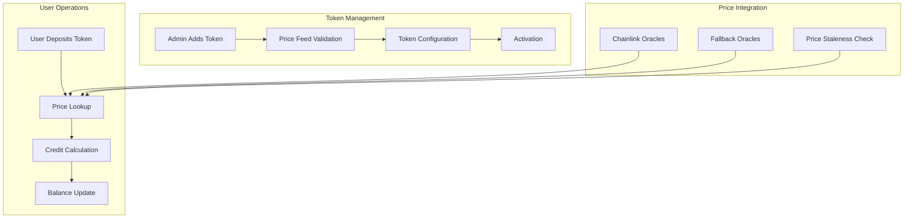

# Multi-Token Support

The GasCreditVault contract supports multiple ERC-20 tokens as collateral for gas credits, enabling users to pay for transaction fees using their preferred tokens. This flexible system integrates with Chainlink price feeds to ensure fair and accurate conversion rates across different tokens.

## Overview

Multi-token support in GasCreditVault provides:
- **Flexible token options** for gas credit deposits
- **Real-time price conversion** using Chainlink oracles
- **Secure token management** with proper validation
- **Dynamic token addition/removal** by administrators
- **Per-token configuration** for limits and parameters

## Architecture



## Token Configuration

### Supported Token Structure

```solidity
struct TokenInfo {
    AggregatorV3Interface priceFeed;
    bool isStablecoin;
}

// Storage mapping
mapping(address => TokenInfo) public tokenInfo;
mapping(address => uint256) public credits;

function isTokenWhitelisted(address token) external view returns (bool);
```

### Price Conversion Logic

```solidity
function getCreditValue(address token, uint256 amount) external view returns (uint256);

function getTokenValue(address token, uint256 creditAmount) external view returns (uint256); 
```

## Deposit Management

### Multi-Token Deposits

```solidity
function deposit(address token, uint256 amount) external;
```

## Withdrawal Management

### Token-Specific Withdrawals

```solidity
function withdraw(address token, uint256 creditAmount) external;
```

## Transfer Credits

```solidity
function transferCredit(address receiver, uint256 credit) external
```

## Administrative Functions

### Token Management

```solidity
function whitelistToken(address token, address priceFeed, bool isStablecoin) external onlyOwner;
function removeToken(address token) external onlyOwner;
```

### Emergency Functions

```solidity
function emergencyWithdraw() external onlyOwner;
```

## View Functions

### Token Information

```solidity
function getWhitelistedTokens() external view returns (address[] memory);
function getWhitelistedRelayers() external view returns (address[] memory);
function isTokenWhitelisted(address token) external view returns (bool);
function isRelayerWhitelisted(address relayer) external view returns (bool);
```

### User Balances

```solidity
mapping(address => uint256) public credits;
```

## Events

```solidity
event TokenWhitelisted(address indexed token, address priceFeed);
event TokenRemoved(address indexed token);
event Deposited(address indexed user, address indexed token, uint256 amount, uint256 credited);
event Withdrawn(address indexed user, address indexed token, uint256 amount, uint256 credited);
event CreditsConsumed(address indexed user, uint256 usdValue, uint256 creditCost);
event CreditTransfer(address indexed sender, address indexed receiver, uint256 creditAmount);
event OwnerWithdrawn(address indexed token, uint256 amount, uint256 creditedConsumed);
event RelayerAdded(address indexed relayer);
event RelayerRemoved(address indexed relayer);
event EmergencyWithdrawn(address indexed to, uint256 amount);
event Paused();
event Unpaused();
```

## Best Practices

### For Administrators

1. **Validate price feeds** thoroughly before adding tokens
2. **Set appropriate limits** based on token volatility
3. **Monitor daily deposits** for unusual activity
4. **Keep fallback oracles** for critical tokens
5. **Regular security audits** of token contracts

### For Users

1. **Check token prices** before large deposits
2. **Understand conversion fees** for each token
3. **Monitor price staleness** indicators
4. **Use batch deposits** for multiple tokens
5. **Keep diversified** token holdings for flexibility

### For Developers

1. **Handle price feed failures** gracefully
2. **Implement proper slippage** protection
3. **Cache token information** for better UX
4. **Monitor gas costs** for multi-token operations
5. **Test with various** token configurations

---

**Related Topics**:
- [Chainlink Integration](chainlink-integration.md) - Price feed implementation
- [Credit Management](credit-management.md) - Credit lifecycle management
- [GasCreditVault Overview](../gascreditvault.md) - Main contract documentation
