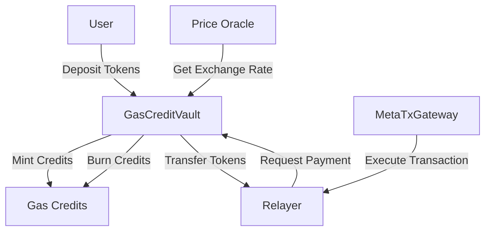
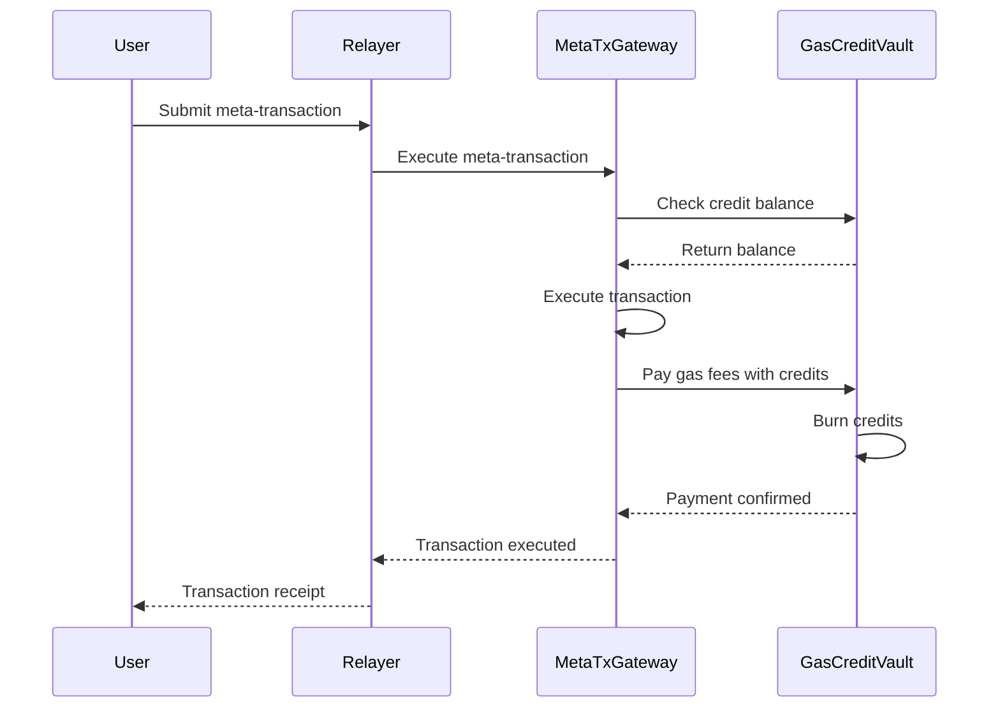

# GasCreditVault Contract

The `GasCreditVault` contract manages gas credits for meta-transaction processing, providing a decentralized system for funding and managing transaction fees.

## Overview

GasCreditVault enables users to pre-fund gas credits that can be used by relayers to pay for meta-transaction execution. It supports multiple tokens, automatic fee calculations, and secure credit management.

## Architecture



## Key Features

### 🔄 Multi-Token Support
- Support for multiple ERC-20 tokens
- Configurable exchange rates via price oracles
- Automatic rate updates from Chainlink feeds

### 💰 Credit Management
- Mint credits when tokens are deposited
- Burn credits when gas fees are paid
- Transfer credits between accounts

### 🛡️ Security Features
- Ownable access control
- Emergency pause functionality
- Reentrancy protection
- Overflow/underflow protection

### 📊 Price Oracle Integration
- Chainlink price feed integration
- Fallback pricing mechanisms
- Rate staleness checks

## Contract Interface

### Core Functions

#### Deposit Credits

```solidity
function depositCredits(
    address token,
    uint256 amount
) external;
```

Deposits tokens and mints equivalent gas credits.

**Parameters:**
- `token`: Address of the ERC-20 token to deposit
- `amount`: Amount of tokens to deposit

**Events Emitted:**
- `CreditsDeposited(user, token, amount, credits)`

#### Use Credits

```solidity
function useCredits(
    address user,
    uint256 gasUsed,
    uint256 gasPrice
) external returns (bool);
```

Burns credits to pay for gas fees. Only callable by authorized contracts.

**Parameters:**
- `user`: Address of the user whose credits will be used
- `gasUsed`: Amount of gas consumed
- `gasPrice`: Price per unit of gas

**Returns:**
- `bool`: Whether the payment was successful

**Events Emitted:**
- `CreditsUsed(user, gasUsed, gasPrice, totalCost)`

#### Transfer Credits

```solidity
function transferCredits(
    address to,
    uint256 amount
) external;
```

Transfers credits between accounts.

**Parameters:**
- `to`: Recipient address
- `amount`: Amount of credits to transfer

**Events Emitted:**
- `CreditsTransferred(from, to, amount)`

### View Functions

#### Get Credit Balance

```solidity
function getCreditBalance(address user) external view returns (uint256);
```

Returns the credit balance for a specific user.

#### Get Token Price

```solidity
function getTokenPrice(address token) external view returns (uint256);
```

Returns the current price of a token in USD (with 8 decimals).

#### Calculate Credits

```solidity
function calculateCredits(
    address token,
    uint256 tokenAmount
) external view returns (uint256);
```

Calculates how many credits would be minted for a token deposit.

## Price Oracle System

### Chainlink Integration

The vault integrates with Chainlink price feeds for accurate token pricing:

```solidity
interface AggregatorV3Interface {
    function latestRoundData() external view returns (
        uint80 roundId,
        int256 price,
        uint256 startedAt,
        uint256 updatedAt,
        uint80 answeredInRound
    );
}
```

### Supported Price Feeds

| Token | Network | Feed Address | Decimals |
|-------|---------|--------------|----------|
| USDT | BSC | `0xB97Ad0E74fa7d920791E90258A6E2085088b4320` | 8 |
| USDC | BSC | `0x51597f405303C4377E36123cBc172b13269EA163` | 8 |
| BUSD | BSC | `0xcBb98864Ef56E9042e7d2efef76141f15731B82f` | 8 |
| BNB | BSC | `0x0567F2323251f0Aab15c8dFb1967E4e8A7D42aeE` | 8 |

### Rate Calculation

Credits are calculated using the formula:

```
credits = (tokenAmount * tokenPrice * 10^18) / (gasPrice * 10^tokenDecimals)
```

Where:
- `tokenAmount`: Amount of tokens deposited
- `tokenPrice`: USD price from oracle (8 decimals)
- `gasPrice`: Current gas price in wei
- `tokenDecimals`: Token decimals (e.g., 18 for most ERC-20)

## Events

### CreditsDeposited

```solidity
event CreditsDeposited(
    address indexed user,
    address indexed token,
    uint256 tokenAmount,
    uint256 credits
);
```

Emitted when a user deposits tokens and receives credits.

### CreditsUsed

```solidity
event CreditsUsed(
    address indexed user,
    uint256 gasUsed,
    uint256 gasPrice,
    uint256 totalCost
);
```

Emitted when credits are burned to pay for gas fees.

### CreditsTransferred

```solidity
event CreditsTransferred(
    address indexed from,
    address indexed to,
    uint256 amount
);
```

Emitted when credits are transferred between accounts.

### TokenAdded

```solidity
event TokenAdded(
    address indexed token,
    address indexed priceFeed
);
```

Emitted when a new token is added to the vault.

### TokenRemoved

```solidity
event TokenRemoved(address indexed token);
```

Emitted when a token is removed from the vault.

## Access Control

### Owner Functions

Only the contract owner can:
- Add new supported tokens
- Remove supported tokens
- Update price feed addresses
- Pause/unpause the contract
- Update authorized callers

### Authorized Callers

Contracts authorized to use credits:
- `MetaTxGateway`: For meta-transaction fee payments
- Other approved relayer contracts

## Error Handling

### Custom Errors

```solidity
error InsufficientCredits(uint256 required, uint256 available);
error UnsupportedToken(address token);
error InvalidPriceFeed(address feed);
error StalePrice(uint256 updatedAt, uint256 staleness);
error Unauthorized(address caller);
error InvalidAmount(uint256 amount);
error TransferFailed(address token, address to, uint256 amount);
```

### Error Scenarios

#### Insufficient Credits
```javascript
// User tries to pay for gas but doesn't have enough credits
await expect(
  vault.useCredits(user.address, 50000, ethers.parseUnits("5", "gwei"))
).to.be.revertedWithCustomError(vault, "InsufficientCredits");
```

#### Unsupported Token
```javascript
// User tries to deposit an unsupported token
await expect(
  vault.depositCredits(unsupportedToken.address, ethers.parseEther("100"))
).to.be.revertedWithCustomError(vault, "UnsupportedToken");
```

## Usage Examples

### Depositing Credits

```javascript
const { ethers } = require("hardhat");

async function depositCredits() {
  const [user] = await ethers.getSigners();
  const vault = await ethers.getContractAt("GasCreditVault", vaultAddress);
  const usdt = await ethers.getContractAt("IERC20", usdtAddress);
  
  // Approve vault to spend USDT
  await usdt.connect(user).approve(vaultAddress, ethers.parseUnits("100", 6));
  
  // Deposit 100 USDT for credits
  await vault.connect(user).depositCredits(
    usdtAddress,
    ethers.parseUnits("100", 6)
  );
  
  // Check credit balance
  const balance = await vault.getCreditBalance(user.address);
  console.log(`Credit balance: ${ethers.formatEther(balance)} credits`);
}
```

### Using Credits for Gas Payment

```javascript
async function payWithCredits() {
  const [relayer] = await ethers.getSigners();
  const vault = await ethers.getContractAt("GasCreditVault", vaultAddress);
  
  // Simulate gas usage (called by MetaTxGateway)
  const gasUsed = 50000;
  const gasPrice = ethers.parseUnits("5", "gwei");
  
  const success = await vault.connect(relayer).useCredits(
    userAddress,
    gasUsed,
    gasPrice
  );
  
  if (success) {
    console.log("Gas payment successful");
  } else {
    console.log("Insufficient credits");
  }
}
```

### Transferring Credits

```javascript
async function transferCredits() {
  const [from] = await ethers.getSigners();
  const vault = await ethers.getContractAt("GasCreditVault", vaultAddress);
  
  // Transfer 10 credits to another user
  await vault.connect(from).transferCredits(
    toAddress,
    ethers.parseEther("10")
  );
  
  console.log("Credits transferred successfully");
}
```

## Integration with MetaTxGateway

The GasCreditVault integrates seamlessly with MetaTxGateway:



## Security Considerations

### Reentrancy Protection

All external calls use reentrancy guards:

```solidity
modifier nonReentrant() {
    require(_status != _ENTERED, "ReentrancyGuard: reentrant call");
    _status = _ENTERED;
    _;
    _status = _NOT_ENTERED;
}
```

### Price Feed Security

- Validate price feed responses
- Check for stale prices
- Implement circuit breakers for extreme price movements
- Use multiple oracle sources where possible

### Access Control

- Use OpenZeppelin's `Ownable` for admin functions
- Implement role-based access control for different operations
- Regularly audit authorized callers

## Testing

### Unit Tests

```javascript
describe("GasCreditVault", function () {
  it("Should deposit tokens and mint credits", async function () {
    // Test token deposit and credit minting
  });
  
  it("Should use credits for gas payment", async function () {
    // Test credit burning for gas fees
  });
  
  it("Should transfer credits between accounts", async function () {
    // Test credit transfers
  });
});
```

### Integration Tests

```javascript
describe("Integration Tests", function () {
  it("Should work with MetaTxGateway", async function () {
    // Test end-to-end meta-transaction with credit payment
  });
});
```

## Deployment

### Deployment Script

```javascript
const { ethers, upgrades } = require("hardhat");

async function main() {
  const GasCreditVault = await ethers.getContractFactory("GasCreditVault");
  
  const vault = await upgrades.deployProxy(GasCreditVault, [
    owner.address, // Owner
    gateway.address // Authorized caller
  ], {
    kind: "uups",
    initializer: "initialize"
  });
  
  await vault.waitForDeployment();
  console.log("GasCreditVault deployed to:", await vault.getAddress());
}
```

### Verification

```bash
# Verify on BSCScan
npx hardhat verify --network bsc <vault-address>
```

## Best Practices

### For Users

1. **Monitor Credit Balance**: Keep track of your credit balance
2. **Deposit Sufficient Credits**: Ensure adequate credits for planned transactions
3. **Use Stable Tokens**: Prefer stablecoins for predictable credit values
4. **Regular Top-ups**: Set up monitoring for low balances

### For Developers

1. **Handle Errors Gracefully**: Implement proper error handling
2. **Monitor Price Feeds**: Check for oracle failures
3. **Gas Optimization**: Minimize gas usage in credit operations
4. **Security Audits**: Regular security reviews

### For Relayers

1. **Credit Verification**: Always verify sufficient credits before execution
2. **Gas Estimation**: Accurate gas estimation for fair charging
3. **Fallback Mechanisms**: Alternative payment methods if credits fail
4. **Rate Limiting**: Prevent abuse of the credit system


**Pro Tip**: Use events to monitor credit usage patterns and optimize your meta-transaction strategy.


## API Reference

For detailed API documentation, see [GasCreditVault API](../api/gascreditvault.md).

## Troubleshooting

For common issues and solutions, see [Troubleshooting Guide](../guides/troubleshooting.md).
