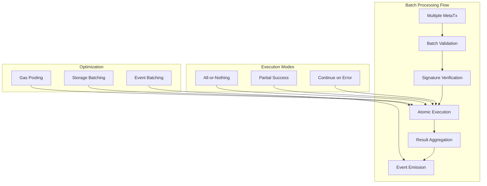

# Batch Processing

The MetaTxGateway contract supports sophisticated batch processing capabilities that allow multiple meta-transactions to be executed atomically in a single blockchain transaction. This feature significantly reduces gas costs, improves user experience, and enables complex multi-step operations.

## Overview

Batch processing in MetaTxGateway enables:
- **Atomic execution** of multiple operations
- **Gas cost optimization** through batching overhead reduction
- **Complex workflows** in a single transaction
- **All-or-nothing semantics** with partial failure handling
- **Cross-user operations** within the same batch

## Architecture



## Core Data Structures

### Batch Meta-Transaction

```solidity
struct BatchMetaTransaction {
    MetaTransaction[] transactions;     // Array of meta-transactions
    bytes[] signatures;                // Corresponding signatures
    ExecutionMode mode;                // Execution behavior
    uint256 deadline;                  // Batch-level deadline
    bytes32 salt;                     // Unique batch identifier
}

enum ExecutionMode {
    ALL_OR_NOTHING,     // Revert if any transaction fails
    PARTIAL_SUCCESS,    // Continue execution, track failures
    BEST_EFFORT        // Ignore failures, execute what's possible
}

struct MetaTransaction {
    address to;         // Target contract
    uint256 value;      // Native token amount
    bytes data;         // Call data
    uint256 nonce;      // User nonce
    uint256 deadline;   // Individual deadline
}
```

### Batch Execution Results

```solidity
struct BatchResult {
    bool[] successes;           // Success status for each transaction
    bytes[] returnDatas;        // Return data from each call
    uint256[] gasUsed;          // Gas consumed by each transaction
    uint256 totalGasUsed;       // Total gas for the batch
    uint256 failureCount;       // Number of failed transactions
}
```

## Core Implementation

### Main Batch Execution Function

```solidity
function executeBatchMetaTransactions(
    BatchMetaTransaction calldata batch
) external payable nonReentrant returns (BatchResult memory result) {
    
    // Validate batch parameters
    _validateBatch(batch);
    
    // Initialize result structure
    result = BatchResult({
        successes: new bool[](batch.transactions.length),
        returnDatas: new bytes[](batch.transactions.length),
        gasUsed: new uint256[](batch.transactions.length),
        totalGasUsed: 0,
        failureCount: 0
    });
    
    // Track initial gas
    uint256 initialGas = gasleft();
    
    // Execute each transaction in the batch
    for (uint256 i = 0; i < batch.transactions.length; i++) {
        _executeBatchTransaction(batch, i, result);
    }
    
    // Calculate total gas used
    result.totalGasUsed = initialGas - gasleft();
    
    // Handle execution mode logic
    _handleExecutionMode(batch.mode, result);
    
    // Emit batch completion event
    emit BatchMetaTransactionExecuted(
        _getBatchHash(batch),
        batch.transactions.length,
        result.failureCount,
        result.totalGasUsed
    );
    
    return result;
}
```

### Individual Transaction Execution

```solidity
function _executeBatchTransaction(
    BatchMetaTransaction calldata batch,
    uint256 index,
    BatchResult memory result
) internal {
    MetaTransaction memory metaTx = batch.transactions[index];
    bytes memory signature = batch.signatures[index];
    
    uint256 gasStart = gasleft();
    
    try this._validateAndExecute(metaTx, signature) returns (
        bool success,
        bytes memory returnData
    ) {
        result.successes[index] = success;
        result.returnDatas[index] = returnData;
        
        if (!success) {
            result.failureCount++;
        }
        
    } catch (bytes memory reason) {
        result.successes[index] = false;
        result.returnDatas[index] = reason;
        result.failureCount++;
    }
    
    result.gasUsed[index] = gasStart - gasleft();
}
```

### Validation and Execution Helper

```solidity
function _validateAndExecute(
    MetaTransaction memory metaTx,
    bytes memory signature
) external returns (bool success, bytes memory returnData) {
    
    // Only allow self-calls to prevent external exploitation
    require(msg.sender == address(this), "Unauthorized");
    
    // Validate the meta-transaction
    _validateMetaTransaction(metaTx, signature);
    
    // Execute the transaction
    (success, returnData) = metaTx.to.call{
        value: metaTx.value,
        gas: gasleft() - 10000 // Reserve gas for cleanup
    }(metaTx.data);
    
    // Update user nonce regardless of success
    address user = _recoverSigner(metaTx, signature);
    userNonces[user]++;
    
    return (success, returnData);
}
```

## Execution Modes

### All-or-Nothing Mode

```solidity
function _handleAllOrNothingMode(BatchResult memory result) internal pure {
    if (result.failureCount > 0) {
        revert BatchExecutionFailed(
            result.failureCount,
            result.successes.length
        );
    }
}
```

### Partial Success Mode

```solidity
function _handlePartialSuccessMode(BatchResult memory result) internal pure {
    // Allow partial failures, just track them
    // This mode continues execution regardless of individual failures
    return; // No special handling needed
}
```

### Best Effort Mode

```solidity
function _handleBestEffortMode(BatchResult memory result) internal pure {
    // Similar to partial success, but might have different gas handling
    // Could implement retry logic or alternative execution paths
    return;
}
```

## Optimization Strategies

### Gas Optimization

```solidity
contract OptimizedBatchExecution {
    // Pack multiple boolean results into a single uint256
    function _packResults(bool[] memory results) internal pure returns (uint256 packed) {
        require(results.length <= 256, "Too many results");
        
        for (uint256 i = 0; i < results.length; i++) {
            if (results[i]) {
                packed |= (1 << i);
            }
        }
    }
    
    // Batch storage updates
    mapping(address => uint256) private _pendingNonceUpdates;
    
    function _batchUpdateNonces() internal {
        // Update all nonces in a single storage operation where possible
        for (uint256 i = 0; i < userList.length; i++) {
            address user = userList[i];
            if (_pendingNonceUpdates[user] > 0) {
                userNonces[user] += _pendingNonceUpdates[user];
                _pendingNonceUpdates[user] = 0;
            }
        }
    }
}
```

### Memory Optimization

```solidity
// Use assembly for efficient memory management
function _efficientBatchExecution(
    MetaTransaction[] calldata transactions,
    bytes[] calldata signatures
) internal {
    assembly {
        // Direct memory manipulation for better performance
        let resultsPtr := mload(0x40)
        let dataSize := mul(transactions.length, 0x20)
        
        // Update free memory pointer
        mstore(0x40, add(resultsPtr, dataSize))
        
        // Process transactions directly in assembly
        for { let i := 0 } lt(i, transactions.length) { i := add(i, 1) } {
            // Custom execution logic
        }
    }
}
```

## Advanced Batch Features

### Cross-User Batching

```solidity
function executeCrossUserBatch(
    address[] calldata users,
    MetaTransaction[] calldata transactions,
    bytes[] calldata signatures
) external payable nonReentrant returns (BatchResult memory) {
    
    require(users.length == transactions.length, "Length mismatch");
    require(transactions.length == signatures.length, "Signature mismatch");
    
    // Validate all signatures before execution
    for (uint256 i = 0; i < transactions.length; i++) {
        address expectedUser = _recoverSigner(transactions[i], signatures[i]);
        require(expectedUser == users[i], "Signature mismatch");
    }
    
    // Execute the batch normally
    BatchMetaTransaction memory batch = BatchMetaTransaction({
        transactions: transactions,
        signatures: signatures,
        mode: ExecutionMode.PARTIAL_SUCCESS,
        deadline: block.timestamp + 300, // 5 minutes
        salt: keccak256(abi.encode(users, block.timestamp))
    });
    
    return _executeBatchInternal(batch);
}
```

### Conditional Execution

```solidity
struct ConditionalBatch {
    MetaTransaction[] transactions;
    bytes[] signatures;
    bytes[] conditions;          // ABI-encoded condition data
    address[] conditionCheckers; // Contracts to check conditions
}

function executeConditionalBatch(
    ConditionalBatch calldata batch
) external payable returns (BatchResult memory) {
    
    BatchResult memory result = _initializeBatchResult(batch.transactions.length);
    
    for (uint256 i = 0; i < batch.transactions.length; i++) {
        // Check condition before execution
        bool conditionMet = _checkCondition(
            batch.conditionCheckers[i],
            batch.conditions[i]
        );
        
        if (conditionMet) {
            _executeBatchTransaction(batch, i, result);
        } else {
            result.successes[i] = false;
            result.returnDatas[i] = "Condition not met";
            result.failureCount++;
        }
    }
    
    return result;
}

function _checkCondition(
    address checker,
    bytes memory condition
) internal view returns (bool) {
    (bool success, bytes memory result) = checker.staticcall(condition);
    return success && abi.decode(result, (bool));
}
```

### Scheduled Batches

```solidity
struct ScheduledBatch {
    BatchMetaTransaction batch;
    uint256 executeAfter;       // Earliest execution time
    uint256 executeBefore;      // Latest execution time
    bool executed;              // Execution status
}

mapping(bytes32 => ScheduledBatch) public scheduledBatches;

function scheduleBatch(
    BatchMetaTransaction calldata batch,
    uint256 executeAfter,
    uint256 executeBefore
) external returns (bytes32 batchId) {
    
    require(executeAfter > block.timestamp, "Must be future time");
    require(executeBefore > executeAfter, "Invalid time range");
    
    batchId = _getBatchHash(batch);
    
    scheduledBatches[batchId] = ScheduledBatch({
        batch: batch,
        executeAfter: executeAfter,
        executeBefore: executeBefore,
        executed: false
    });
    
    emit BatchScheduled(batchId, executeAfter, executeBefore);
}

function executeScheduledBatch(bytes32 batchId) 
    external 
    returns (BatchResult memory) {
    
    ScheduledBatch storage scheduled = scheduledBatches[batchId];
    require(!scheduled.executed, "Already executed");
    require(block.timestamp >= scheduled.executeAfter, "Too early");
    require(block.timestamp <= scheduled.executeBefore, "Too late");
    
    scheduled.executed = true;
    
    return executeBatchMetaTransactions(scheduled.batch);
}
```

## Error Handling and Recovery

### Detailed Error Reporting

```solidity
struct BatchError {
    uint256 transactionIndex;
    string errorType;
    bytes errorData;
    uint256 gasUsed;
}

event BatchExecutionError(
    bytes32 indexed batchHash,
    BatchError[] errors
);

function _handleBatchErrors(
    BatchResult memory result,
    BatchMetaTransaction calldata batch
) internal {
    
    if (result.failureCount > 0) {
        BatchError[] memory errors = new BatchError[](result.failureCount);
        uint256 errorIndex = 0;
        
        for (uint256 i = 0; i < result.successes.length; i++) {
            if (!result.successes[i]) {
                errors[errorIndex] = BatchError({
                    transactionIndex: i,
                    errorType: _categorizeError(result.returnDatas[i]),
                    errorData: result.returnDatas[i],
                    gasUsed: result.gasUsed[i]
                });
                errorIndex++;
            }
        }
        
        emit BatchExecutionError(_getBatchHash(batch), errors);
    }
}
```

### Retry Mechanisms

```solidity
struct RetryableBatch {
    BatchMetaTransaction originalBatch;
    uint256[] failedIndices;
    uint256 maxRetries;
    uint256 currentRetries;
}

mapping(bytes32 => RetryableBatch) public retryableBatches;

function createRetryableBatch(
    BatchMetaTransaction calldata batch,
    uint256 maxRetries
) external returns (bytes32 batchId) {
    
    // Execute the original batch
    BatchResult memory result = executeBatchMetaTransactions(batch);
    
    if (result.failureCount > 0) {
        batchId = _getBatchHash(batch);
        
        // Collect failed transaction indices
        uint256[] memory failedIndices = new uint256[](result.failureCount);
        uint256 failedCount = 0;
        
        for (uint256 i = 0; i < result.successes.length; i++) {
            if (!result.successes[i]) {
                failedIndices[failedCount] = i;
                failedCount++;
            }
        }
        
        retryableBatches[batchId] = RetryableBatch({
            originalBatch: batch,
            failedIndices: failedIndices,
            maxRetries: maxRetries,
            currentRetries: 0
        });
    }
    
    return batchId;
}

function retryFailedTransactions(bytes32 batchId) 
    external 
    returns (BatchResult memory) {
    
    RetryableBatch storage retryable = retryableBatches[batchId];
    require(retryable.currentRetries < retryable.maxRetries, "Max retries reached");
    
    retryable.currentRetries++;
    
    // Create a new batch with only failed transactions
    BatchMetaTransaction memory retryBatch = _createRetryBatch(retryable);
    
    return executeBatchMetaTransactions(retryBatch);
}
```

## Integration Examples

### Frontend Batch Builder

```javascript
class BatchBuilder {
    constructor() {
        this.transactions = [];
        this.signatures = [];
    }
    
    addTransaction(to, value, data, deadline, signer) {
        const user = signer.getAddress();
        const nonce = this.getNonce(user);
        
        const metaTx = {
            to,
            value: ethers.utils.parseEther(value.toString()),
            data: data || '0x',
            nonce,
            deadline
        };
        
        this.transactions.push(metaTx);
        
        // Sign the transaction
        const signature = this.signMetaTransaction(metaTx, signer);
        this.signatures.push(signature);
        
        return this;
    }
    
    addTokenTransfer(token, to, amount, signer) {
        const data = token.interface.encodeFunctionData('transfer', [to, amount]);
        return this.addTransaction(
            token.address,
            0,
            data,
            Math.floor(Date.now() / 1000) + 3600,
            signer
        );
    }
    
    addApproval(token, spender, amount, signer) {
        const data = token.interface.encodeFunctionData('approve', [spender, amount]);
        return this.addTransaction(
            token.address,
            0,
            data,
            Math.floor(Date.now() / 1000) + 3600,
            signer
        );
    }
    
    build(mode = 'PARTIAL_SUCCESS') {
        return {
            transactions: this.transactions,
            signatures: this.signatures,
            mode: this.getModeEnum(mode),
            deadline: Math.floor(Date.now() / 1000) + 3600,
            salt: ethers.utils.randomBytes(32)
        };
    }
    
    getModeEnum(mode) {
        const modes = {
            'ALL_OR_NOTHING': 0,
            'PARTIAL_SUCCESS': 1,
            'BEST_EFFORT': 2
        };
        return modes[mode] || 1;
    }
}

// Usage example
const batchBuilder = new BatchBuilder();

// Build a DeFi operation batch
const batch = batchBuilder
    .addApproval(usdcToken, dexRouter.address, '1000', user)
    .addTransaction(
        dexRouter.address,
        0,
        dexRouter.interface.encodeFunctionData('swapExactTokensForTokens', [
            ethers.utils.parseUnits('1000', 6), // USDC
            0, // min out
            [usdc.address, weth.address],
            user.address,
            Math.floor(Date.now() / 1000) + 1800
        ]),
        Math.floor(Date.now() / 1000) + 3600,
        user
    )
    .build('ALL_OR_NOTHING');

// Execute the batch
const result = await gateway.executeBatchMetaTransactions(batch);
```

### Backend Batch Processor

```javascript
class BatchProcessor {
    constructor(gateway, wallet) {
        this.gateway = gateway.connect(wallet);
        this.wallet = wallet;
        this.pendingBatches = new Map();
    }
    
    async processBatch(batchRequest) {
        try {
            // Validate batch request
            this.validateBatchRequest(batchRequest);
            
            // Calculate gas requirements
            const gasEstimate = await this.estimateBatchGas(batchRequest);
            
            // Execute with appropriate gas limit
            const tx = await this.gateway.executeBatchMetaTransactions(
                batchRequest.batch,
                { gasLimit: gasEstimate.mul(120).div(100) } // 20% buffer
            );
            
            const receipt = await tx.wait();
            
            // Parse results from events
            const results = this.parseBatchResults(receipt);
            
            return {
                success: true,
                transactionHash: receipt.transactionHash,
                results,
                gasUsed: receipt.gasUsed
            };
            
        } catch (error) {
            console.error('Batch execution failed:', error);
            return {
                success: false,
                error: error.message,
                results: null
            };
        }
    }
    
    async estimateBatchGas(batchRequest) {
        try {
            return await this.gateway.estimateGas.executeBatchMetaTransactions(
                batchRequest.batch
            );
        } catch (error) {
            // Fallback estimation
            return ethers.BigNumber.from(21000)
                .mul(batchRequest.batch.transactions.length)
                .mul(5); // Conservative estimate
        }
    }
    
    parseBatchResults(receipt) {
        const events = receipt.events?.filter(
            e => e.event === 'BatchMetaTransactionExecuted'
        ) || [];
        
        return events.map(event => ({
            batchHash: event.args.batchHash,
            transactionCount: event.args.transactionCount.toNumber(),
            failureCount: event.args.failureCount.toNumber(),
            gasUsed: event.args.gasUsed.toNumber()
        }));
    }
}
```

## Testing Batch Operations

```javascript
describe('Batch Processing', function() {
    let gateway, users, tokens;
    
    beforeEach(async function() {
        [owner, ...users] = await ethers.getSigners();
        
        // Deploy gateway and tokens
        gateway = await deployGateway();
        tokens = await deployTestTokens();
    });
    
    it('Should execute simple batch successfully', async function() {
        const batch = {
            transactions: [
                createTokenTransfer(tokens.usdc, users[1].address, '100'),
                createTokenTransfer(tokens.dai, users[1].address, '100')
            ],
            signatures: [
                await signMetaTx(transactions[0], users[0]),
                await signMetaTx(transactions[1], users[0])
            ],
            mode: 1, // PARTIAL_SUCCESS
            deadline: Math.floor(Date.now() / 1000) + 3600,
            salt: ethers.utils.randomBytes(32)
        };
        
        const result = await gateway.executeBatchMetaTransactions(batch);
        
        expect(result.successes).to.have.lengthOf(2);
        expect(result.successes[0]).to.be.true;
        expect(result.successes[1]).to.be.true;
        expect(result.failureCount).to.equal(0);
    });
    
    it('Should handle partial failures correctly', async function() {
        const batch = {
            transactions: [
                createTokenTransfer(tokens.usdc, users[1].address, '100'), // Valid
                createTokenTransfer(tokens.usdc, users[1].address, '999999999') // Invalid (insufficient balance)
            ],
            signatures: [
                await signMetaTx(transactions[0], users[0]),
                await signMetaTx(transactions[1], users[0])
            ],
            mode: 1, // PARTIAL_SUCCESS
            deadline: Math.floor(Date.now() / 1000) + 3600,
            salt: ethers.utils.randomBytes(32)
        };
        
        const result = await gateway.executeBatchMetaTransactions(batch);
        
        expect(result.successes[0]).to.be.true;
        expect(result.successes[1]).to.be.false;
        expect(result.failureCount).to.equal(1);
    });
    
    it('Should revert in ALL_OR_NOTHING mode with failures', async function() {
        const batch = {
            transactions: [
                createTokenTransfer(tokens.usdc, users[1].address, '100'),
                createTokenTransfer(tokens.usdc, users[1].address, '999999999') // Will fail
            ],
            signatures: [/* signatures */],
            mode: 0, // ALL_OR_NOTHING
            deadline: Math.floor(Date.now() / 1000) + 3600,
            salt: ethers.utils.randomBytes(32)
        };
        
        await expect(
            gateway.executeBatchMetaTransactions(batch)
        ).to.be.revertedWith('BatchExecutionFailed');
    });
});
```

## Performance Considerations

### Gas Efficiency

- **Batch overhead**: ~21,000 gas per batch + ~2,000 per transaction
- **Storage optimization**: Pack results when possible
- **Event batching**: Emit summary events rather than individual ones
- **Memory management**: Use assembly for large batches

### Batch Size Limits

```solidity
uint256 public constant MAX_BATCH_SIZE = 20;
uint256 public constant MAX_BATCH_GAS = 10_000_000; // 10M gas limit

modifier validBatchSize(uint256 size) {
    require(size > 0 && size <= MAX_BATCH_SIZE, "Invalid batch size");
    _;
}
```

### Memory Constraints

For large batches, consider pagination:

```solidity
struct PaginatedBatch {
    BatchMetaTransaction batch;
    uint256 startIndex;
    uint256 endIndex;
    bytes32 parentBatchHash;
}

function executePaginatedBatch(PaginatedBatch calldata paginated) 
    external 
    returns (BatchResult memory) {
    
    // Execute only the specified range
    BatchMetaTransaction memory subBatch = _createSubBatch(
        paginated.batch,
        paginated.startIndex,
        paginated.endIndex
    );
    
    return executeBatchMetaTransactions(subBatch);
}
```

## Best Practices

### For Developers

1. **Use appropriate execution modes** based on your use case
2. **Implement proper error handling** for partial failures
3. **Consider gas limits** when building large batches
4. **Validate all transactions** before batch submission
5. **Monitor batch execution** for optimization opportunities

### For Users

1. **Group related operations** into single batches
2. **Use smaller batches** for complex operations
3. **Consider transaction dependencies** when ordering
4. **Monitor gas costs** vs individual transactions
5. **Test batches** thoroughly before mainnet deployment

### For Relayers

1. **Estimate gas accurately** for batches
2. **Implement retry logic** for failed batches
3. **Monitor batch sizes** for optimization
4. **Use appropriate execution modes** based on user preferences
5. **Implement batch queuing** for high-throughput scenarios

---

**Related Topics**:
- [Native Token Handling](native-token-handling.md) - Handling value in batches
- [EIP-712 Signatures](eip-712-signatures.md) - Signing batch transactions
- [MetaTxGateway Overview](../metatxgateway.md) - Main contract documentation
