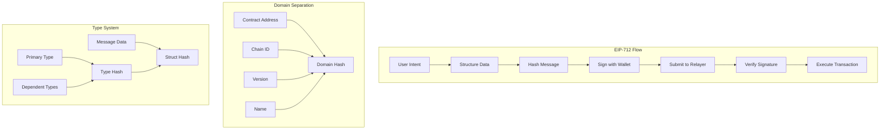

# EIP-712 Signatures

EIP-712 is a standard for hashing and signing structured data in Ethereum. The MetaTxGateway contract uses EIP-712 signatures to ensure secure, user-friendly, and replay-resistant meta-transactions. This implementation provides superior security compared to traditional message signing while offering excellent wallet integration.

## Overview

EIP-712 signatures in MetaTxGateway provide:
- **Structured data signing** with human-readable format
- **Domain separation** to prevent cross-contract replay attacks
- **Type safety** with strongly-typed message structures
- **Wallet integration** with native support in MetaMask and other wallets
- **Replay protection** through nonces and domain separators

## Architecture



## Domain Separator

### Domain Definition

```solidity
// EIP-712 Domain
struct EIP712Domain {
    string name;                // Contract name
    string version;             // Contract version
    uint256 chainId;           // Network chain ID
    address verifyingContract; // Contract address
}

// Domain type hash
bytes32 public constant DOMAIN_TYPEHASH = keccak256(
    "EIP712Domain(string name,string version,uint256 chainId,address verifyingContract)"
);

// Contract-specific domain separator
bytes32 public DOMAIN_SEPARATOR;
```

### Domain Separator Calculation

```solidity
function _calculateDomainSeparator() internal view returns (bytes32) {
    return keccak256(
        abi.encode(
            DOMAIN_TYPEHASH,
            keccak256(bytes("MetaTxGateway")),  // name
            keccak256(bytes("2.0.0")),         // version
            block.chainid,                      // chainId
            address(this)                       // verifyingContract
        )
    );
}

// Initialize domain separator (called in constructor/initializer)
function _initializeDomainSeparator() internal {
    DOMAIN_SEPARATOR = _calculateDomainSeparator();
}

// Handle chain forks (EIP-2612 style)
function _domainSeparatorV4() internal view returns (bytes32) {
    if (address(this) == _CACHED_THIS && block.chainid == _CACHED_CHAIN_ID) {
        return _CACHED_DOMAIN_SEPARATOR;
    } else {
        return _calculateDomainSeparator();
    }
}
```

## Message Types

### MetaTransaction Type

```solidity
// Primary message type for single transactions
struct MetaTransaction {
    address to;         // Target contract
    uint256 value;      // Native token amount
    bytes data;         // Call data
    uint256 nonce;      // User nonce
    uint256 deadline;   // Expiration timestamp
}

// Type hash for MetaTransaction
bytes32 public constant METATRANSACTION_TYPEHASH = keccak256(
    "MetaTransaction(address to,uint256 value,bytes data,uint256 nonce,uint256 deadline)"
);
```

### Batch Transaction Type

```solidity
// Batch transaction type
struct BatchMetaTransaction {
    MetaTransaction[] transactions;
    ExecutionMode mode;
    uint256 deadline;
    bytes32 salt;
}

// Type hash for batch transactions
bytes32 public constant BATCH_METATRANSACTION_TYPEHASH = keccak256(
    "BatchMetaTransaction(MetaTransaction[] transactions,uint8 mode,uint256 deadline,bytes32 salt)MetaTransaction(address to,uint256 value,bytes data,uint256 nonce,uint256 deadline)"
);
```

### Permit Type (for token approvals)

```solidity
// ERC-2612 style permit for gasless approvals
struct Permit {
    address owner;
    address spender;
    uint256 value;
    uint256 nonce;
    uint256 deadline;
}

bytes32 public constant PERMIT_TYPEHASH = keccak256(
    "Permit(address owner,address spender,uint256 value,uint256 nonce,uint256 deadline)"
);
```

## Signature Generation

### Hash Calculation

```solidity
function _hashMetaTransaction(MetaTransaction memory metaTx) 
    internal 
    pure 
    returns (bytes32) {
    
    return keccak256(
        abi.encode(
            METATRANSACTION_TYPEHASH,
            metaTx.to,
            metaTx.value,
            keccak256(metaTx.data),  // Hash dynamic data
            metaTx.nonce,
            metaTx.deadline
        )
    );
}

function _hashBatchMetaTransaction(BatchMetaTransaction memory batch) 
    internal 
    pure 
    returns (bytes32) {
    
    // Hash each transaction in the batch
    bytes32[] memory txHashes = new bytes32[](batch.transactions.length);
    for (uint256 i = 0; i < batch.transactions.length; i++) {
        txHashes[i] = _hashMetaTransaction(batch.transactions[i]);
    }
    
    return keccak256(
        abi.encode(
            BATCH_METATRANSACTION_TYPEHASH,
            keccak256(abi.encodePacked(txHashes)), // Hash array
            uint8(batch.mode),
            batch.deadline,
            batch.salt
        )
    );
}
```

### EIP-712 Message Hash

```solidity
function _toTypedDataHash(bytes32 structHash) internal view returns (bytes32) {
    return keccak256(
        abi.encodePacked(
            "\x19\x01",                    // EIP-712 prefix
            _domainSeparatorV4(),         // Domain separator
            structHash                     // Struct hash
        )
    );
}

function getMetaTransactionHash(MetaTransaction memory metaTx) 
    public 
    view 
    returns (bytes32) {
    
    return _toTypedDataHash(_hashMetaTransaction(metaTx));
}
```

## Signature Verification

### ECDSA Recovery

```solidity
import "@openzeppelin/contracts/utils/cryptography/ECDSA.sol";

function _recoverSigner(
    MetaTransaction memory metaTx,
    bytes memory signature
) internal view returns (address) {
    
    bytes32 hash = getMetaTransactionHash(metaTx);
    address signer = ECDSA.recover(hash, signature);
    
    require(signer != address(0), "Invalid signature");
    return signer;
}

function _recoverBatchSigner(
    BatchMetaTransaction memory batch,
    bytes memory signature
) internal view returns (address) {
    
    bytes32 hash = _toTypedDataHash(_hashBatchMetaTransaction(batch));
    address signer = ECDSA.recover(hash, signature);
    
    require(signer != address(0), "Invalid batch signature");
    return signer;
}
```

### Signature Validation

```solidity
function _validateSignature(
    MetaTransaction memory metaTx,
    bytes memory signature
) internal view returns (address signer) {
    
    signer = _recoverSigner(metaTx, signature);
    
    // Additional validation can be added here
    require(signer != address(0), "Invalid signer");
    require(!isBlacklisted[signer], "Signer blacklisted");
    
    return signer;
}

function isValidSignature(
    MetaTransaction memory metaTx,
    bytes memory signature
) external view returns (bool) {
    
    try this._validateSignature(metaTx, signature) returns (address) {
        return true;
    } catch {
        return false;
    }
}
```

## Frontend Integration

### JavaScript/TypeScript Implementation

```javascript
import { ethers } from 'ethers';

class EIP712Signer {
    constructor(provider, contractAddress) {
        this.provider = provider;
        this.contractAddress = contractAddress;
        this.domain = {
            name: 'MetaTxGateway',
            version: '2.0.0',
            chainId: null, // Will be set dynamically
            verifyingContract: contractAddress
        };
    }
    
    async initializeDomain() {
        const network = await this.provider.getNetwork();
        this.domain.chainId = network.chainId;
    }
    
    async signMetaTransaction(metaTx, signer) {
        await this.initializeDomain();
        
        const types = {
            MetaTransaction: [
                { name: 'to', type: 'address' },
                { name: 'value', type: 'uint256' },
                { name: 'data', type: 'bytes' },
                { name: 'nonce', type: 'uint256' },
                { name: 'deadline', type: 'uint256' }
            ]
        };
        
        return await signer._signTypedData(this.domain, types, metaTx);
    }
    
    async signBatchMetaTransaction(batch, signer) {
        await this.initializeDomain();
        
        const types = {
            BatchMetaTransaction: [
                { name: 'transactions', type: 'MetaTransaction[]' },
                { name: 'mode', type: 'uint8' },
                { name: 'deadline', type: 'uint256' },
                { name: 'salt', type: 'bytes32' }
            ],
            MetaTransaction: [
                { name: 'to', type: 'address' },
                { name: 'value', type: 'uint256' },
                { name: 'data', type: 'bytes' },
                { name: 'nonce', type: 'uint256' },
                { name: 'deadline', type: 'uint256' }
            ]
        };
        
        return await signer._signTypedData(this.domain, types, batch);
    }
    
    verifySignature(metaTx, signature) {
        const hash = this.getMetaTransactionHash(metaTx);
        const signer = ethers.utils.verifyMessage(hash, signature);
        return signer;
    }
    
    getMetaTransactionHash(metaTx) {
        const types = {
            MetaTransaction: [
                { name: 'to', type: 'address' },
                { name: 'value', type: 'uint256' },
                { name: 'data', type: 'bytes' },
                { name: 'nonce', type: 'uint256' },
                { name: 'deadline', type: 'uint256' }
            ]
        };
        
        return ethers.utils._TypedDataEncoder.hash(this.domain, types, metaTx);
    }
}
```

### React Hook Implementation

```javascript
import { useState, useCallback } from 'react';
import { useWallet } from './useWallet';

export function useEIP712Signing(gatewayAddress) {
    const { signer, chainId } = useWallet();
    const [isSigning, setIsSigning] = useState(false);
    
    const signMetaTransaction = useCallback(async (metaTx) => {
        if (!signer) throw new Error('No signer available');
        
        setIsSigning(true);
        
        try {
            const domain = {
                name: 'MetaTxGateway',
                version: '2.0.0',
                chainId: chainId,
                verifyingContract: gatewayAddress
            };
            
            const types = {
                MetaTransaction: [
                    { name: 'to', type: 'address' },
                    { name: 'value', type: 'uint256' },
                    { name: 'data', type: 'bytes' },
                    { name: 'nonce', type: 'uint256' },
                    { name: 'deadline', type: 'uint256' }
                ]
            };
            
            const signature = await signer._signTypedData(domain, types, metaTx);
            return signature;
            
        } finally {
            setIsSigning(false);
        }
    }, [signer, chainId, gatewayAddress]);
    
    return { signMetaTransaction, isSigning };
}
```

## Advanced EIP-712 Features

### Multi-Domain Support

```solidity
contract MultiDomainGateway {
    mapping(string => bytes32) public domainSeparators;
    
    function addDomain(
        string memory name,
        string memory version
    ) external onlyOwner {
        bytes32 domainSeparator = keccak256(
            abi.encode(
                DOMAIN_TYPEHASH,
                keccak256(bytes(name)),
                keccak256(bytes(version)),
                block.chainid,
                address(this)
            )
        );
        
        domainSeparators[name] = domainSeparator;
    }
    
    function _recoverSignerWithDomain(
        MetaTransaction memory metaTx,
        bytes memory signature,
        string memory domainName
    ) internal view returns (address) {
        
        bytes32 domainSeparator = domainSeparators[domainName];
        require(domainSeparator != bytes32(0), "Domain not supported");
        
        bytes32 structHash = _hashMetaTransaction(metaTx);
        bytes32 hash = keccak256(
            abi.encodePacked("\x19\x01", domainSeparator, structHash)
        );
        
        return ECDSA.recover(hash, signature);
    }
}
```

### Signature with Additional Data

```solidity
struct ExtendedMetaTransaction {
    address to;
    uint256 value;
    bytes data;
    uint256 nonce;
    uint256 deadline;
    bytes32 metadata;      // Additional application data
    address beneficiary;   // Fee recipient
    uint256 maxFee;       // Maximum fee willing to pay
}

bytes32 public constant EXTENDED_METATRANSACTION_TYPEHASH = keccak256(
    "ExtendedMetaTransaction(address to,uint256 value,bytes data,uint256 nonce,uint256 deadline,bytes32 metadata,address beneficiary,uint256 maxFee)"
);
```

### Gasless Token Approvals

```solidity
function permitAndExecute(
    address token,
    Permit memory permit,
    bytes memory permitSignature,
    MetaTransaction memory metaTx,
    bytes memory metaTxSignature
) external {
    
    // Execute the permit first
    IERC20Permit(token).permit(
        permit.owner,
        permit.spender,
        permit.value,
        permit.deadline,
        v, r, s // Extract from permitSignature
    );
    
    // Then execute the meta-transaction
    executeMetaTransaction(metaTx, metaTxSignature);
}
```

## Security Considerations

### Replay Attack Prevention

```solidity
// Per-user nonces
mapping(address => uint256) public userNonces;

function _validateNonce(address user, uint256 nonce) internal {
    require(nonce == userNonces[user], "Invalid nonce");
    userNonces[user] = nonce + 1;
}

// Deadline validation
function _validateDeadline(uint256 deadline) internal view {
    require(block.timestamp <= deadline, "Transaction expired");
}
```

### Signature Malleability Protection

```solidity
function _validateSignature(bytes memory signature) internal pure {
    require(signature.length == 65, "Invalid signature length");
    
    bytes32 r;
    bytes32 s;
    uint8 v;
    
    assembly {
        r := mload(add(signature, 0x20))
        s := mload(add(signature, 0x40))
        v := byte(0, mload(add(signature, 0x60)))
    }
    
    // Prevent signature malleability
    require(
        uint256(s) <= 0x7FFFFFFFFFFFFFFFFFFFFFFFFFFFFFFF5D576E7357A4501DDFE92F46681B20A0,
        "Invalid signature 's' value"
    );
    
    require(v == 27 || v == 28, "Invalid signature 'v' value");
}
```

### Domain Separator Validation

```solidity
function _validateDomainSeparator() internal view {
    // Ensure we're on the correct chain
    require(block.chainid == _CACHED_CHAIN_ID, "Wrong chain");
    
    // Ensure contract address hasn't changed (for upgradeable contracts)
    require(address(this) == _CACHED_THIS, "Contract address mismatch");
}
```

## Testing EIP-712 Signatures

```javascript
describe('EIP-712 Signatures', function() {
    let gateway, signer, user;
    
    beforeEach(async function() {
        [user] = await ethers.getSigners();
        gateway = await deployGateway();
        
        signer = new EIP712Signer(ethers.provider, gateway.address);
    });
    
    it('Should verify valid signatures', async function() {
        const metaTx = {
            to: user.address,
            value: 0,
            data: '0x',
            nonce: 0,
            deadline: Math.floor(Date.now() / 1000) + 3600
        };
        
        const signature = await signer.signMetaTransaction(metaTx, user);
        
        const isValid = await gateway.isValidSignature(metaTx, signature);
        expect(isValid).to.be.true;
        
        const recoveredSigner = await gateway.recoverSigner(metaTx, signature);
        expect(recoveredSigner).to.equal(user.address);
    });
    
    it('Should reject invalid signatures', async function() {
        const metaTx = {
            to: user.address,
            value: 0,
            data: '0x',
            nonce: 0,
            deadline: Math.floor(Date.now() / 1000) + 3600
        };
        
        // Sign with wrong data
        const wrongMetaTx = { ...metaTx, value: 1000 };
        const signature = await signer.signMetaTransaction(wrongMetaTx, user);
        
        const isValid = await gateway.isValidSignature(metaTx, signature);
        expect(isValid).to.be.false;
    });
    
    it('Should reject expired signatures', async function() {
        const metaTx = {
            to: user.address,
            value: 0,
            data: '0x',
            nonce: 0,
            deadline: Math.floor(Date.now() / 1000) - 3600 // 1 hour ago
        };
        
        const signature = await signer.signMetaTransaction(metaTx, user);
        
        await expect(
            gateway.executeMetaTransaction(metaTx, signature)
        ).to.be.revertedWith('Transaction expired');
    });
    
    it('Should handle chain forks correctly', async function() {
        // This would require network forking to test properly
        // Verify domain separator changes with chain ID
        const originalDomain = await gateway.DOMAIN_SEPARATOR();
        
        // After fork (simulated)
        const newDomain = await gateway._domainSeparatorV4();
        
        // Should be different if chain ID changed
        expect(newDomain).to.not.equal(originalDomain);
    });
});
```

## Best Practices

### For Developers

1. **Always validate deadlines** to prevent stale transaction execution
2. **Use proper nonce management** to prevent replay attacks
3. **Implement signature validation** on both frontend and backend
4. **Handle chain forks** with dynamic domain separators
5. **Test signature verification** thoroughly across different scenarios

### For Frontend Applications

1. **Provide clear UX** for signature requests
2. **Show structured data** to users before signing
3. **Handle signature rejection** gracefully
4. **Cache domain separators** when possible
5. **Validate signatures** before submission

### For Relayers

1. **Verify signatures** before gas estimation
2. **Check nonces** to prevent wasted transactions
3. **Validate deadlines** before submission
4. **Handle signature failures** appropriately
5. **Monitor for replay attacks**

## Common Issues and Solutions

### Issue: Signature Verification Fails

```javascript
// Common causes and solutions
if (!isValidSignature) {
    // 1. Check domain separator
    const expectedDomain = await gateway.DOMAIN_SEPARATOR();
    
    // 2. Verify message structure
    console.log('Message hash:', getMessageHash(metaTx));
    
    // 3. Check nonce
    const currentNonce = await gateway.userNonces(userAddress);
    
    // 4. Validate deadline
    const now = Math.floor(Date.now() / 1000);
    if (metaTx.deadline < now) {
        throw new Error('Transaction expired');
    }
}
```

### Issue: Wrong Chain ID

```javascript
// Handle chain changes
window.ethereum.on('chainChanged', (chainId) => {
    // Reinitialize domain separator
    signer.domain.chainId = parseInt(chainId, 16);
});
```

### Issue: MetaMask Compatibility

```javascript
// Ensure compatibility with different wallet versions
async function signTypedDataSafe(signer, domain, types, message) {
    try {
        // Try eth_signTypedData_v4 first
        return await signer._signTypedData(domain, types, message);
    } catch (error) {
        if (error.code === -32602) {
            // Fallback for older wallets
            return await signTypedDataLegacy(signer, domain, types, message);
        }
        throw error;
    }
}
```

---

**Related Topics**:
- [Native Token Handling](native-token-handling.md) - Signing value transactions
- [Batch Processing](batch-processing.md) - Signing batch transactions
- [MetaTxGateway Overview](../metatxgateway.md) - Main contract documentation
