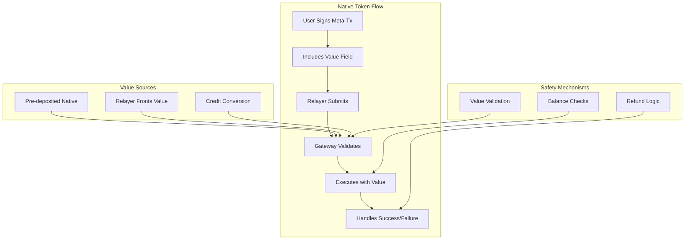

# Native Token Handling

The MetaTxGateway contract includes sophisticated native token handling capabilities that allow meta-transactions to include ETH/BNB transfers alongside regular contract calls. This feature enables gasless transactions that can still transfer value, making it possible to build complex DeFi applications with superior user experience.

## Overview

Native token handling in MetaTxGateway allows users to:
- Transfer ETH/BNB as part of meta-transactions
- Combine value transfers with contract interactions
- Handle native token refunds for failed transactions
- Manage native token accounting across batch operations

## Architecture



## Core Implementation

### Meta-Transaction Structure

```solidity
struct MetaTransaction {
    address to;              // Target contract
    uint256 value;          // Native token amount (ETH/BNB)
    bytes data;             // Call data
    uint256 nonce;          // User nonce
    uint256 deadline;       // Expiration timestamp
}
```

### Native Token Execution

```solidity
function executeMetaTransaction(
    MetaTransaction calldata metaTx,
    bytes calldata signature
) external payable nonReentrant returns (bool success, bytes memory returnData) {
    
    // Validate signature and nonce
    _validateMetaTransaction(metaTx, signature);
    
    // Check native token requirements
    if (metaTx.value > 0) {
        _handleNativeTokenRequirements(metaTx);
    }
    
    // Execute the transaction
    (success, returnData) = _executeWithValue(metaTx);
    
    // Handle native token refunds if needed
    if (!success && metaTx.value > 0) {
        _handleNativeTokenRefund(metaTx);
    }
    
    emit MetaTransactionExecuted(
        _extractUser(metaTx, signature),
        metaTx.to,
        metaTx.value,
        success,
        metaTx.nonce
    );
}
```

## Value Handling Mechanisms

### 1. Pre-deposited Native Tokens

Users can deposit native tokens to the gateway for later use:

```solidity
// User balance tracking
mapping(address => uint256) public nativeBalances;

function depositNative() external payable {
    require(msg.value > 0, "Must send native tokens");
    nativeBalances[msg.sender] += msg.value;
    emit NativeTokenDeposited(msg.sender, msg.value);
}

function withdrawNative(uint256 amount) external nonReentrant {
    require(nativeBalances[msg.sender] >= amount, "Insufficient balance");
    nativeBalances[msg.sender] -= amount;
    
    (bool success, ) = msg.sender.call{value: amount}("");
    require(success, "Transfer failed");
    
    emit NativeTokenWithdrawn(msg.sender, amount);
}
```

### 2. Relayer-Fronted Value

Relayers can front native tokens for meta-transactions:

```solidity
function _handleNativeTokenRequirements(MetaTransaction memory metaTx) internal {
    address user = _recoverSigner(metaTx);
    
    if (nativeBalances[user] >= metaTx.value) {
        // Use user's pre-deposited balance
        nativeBalances[user] -= metaTx.value;
    } else {
        // Relayer must front the value
        require(msg.value >= metaTx.value, "Insufficient native tokens provided");
        
        // Track relayer contribution for potential reimbursement
        relayerAdvances[msg.sender][user] += metaTx.value;
    }
}
```

### 3. Credit-to-Native Conversion

Convert gas credits to native tokens:

```solidity
function convertCreditsToNative(uint256 credits) 
    external 
    nonReentrant 
    returns (uint256 nativeAmount) {
    
    require(credits > 0, "Invalid credit amount");
    
    // Get current native token price from oracle
    uint256 nativePrice = _getNativeTokenPrice();
    
    // Calculate equivalent native tokens
    nativeAmount = (credits * 1e18) / nativePrice;
    
    // Deduct credits from vault
    gasCreditVault.useCredits(msg.sender, credits);
    
    // Add to user's native balance
    nativeBalances[msg.sender] += nativeAmount;
    
    emit CreditsConvertedToNative(msg.sender, credits, nativeAmount);
}
```

## Execution with Value

### Safe Value Transfer

```solidity
function _executeWithValue(MetaTransaction memory metaTx) 
    internal 
    returns (bool success, bytes memory returnData) {
    
    // Save initial balance
    uint256 initialBalance = address(this).balance;
    
    // Execute call with value
    (success, returnData) = metaTx.to.call{
        value: metaTx.value,
        gas: gasleft() - 10000 // Reserve gas for post-execution
    }(metaTx.data);
    
    // Verify balance consistency
    if (success) {
        uint256 expectedBalance = initialBalance - metaTx.value;
        require(
            address(this).balance >= expectedBalance,
            "Unexpected balance change"
        );
    }
}
```

### Batch Execution with Values

```solidity
struct BatchMetaTransaction {
    MetaTransaction[] transactions;
    uint256 totalValue;      // Sum of all values
    bytes[] signatures;      // Corresponding signatures
}

function executeBatchMetaTransactions(
    BatchMetaTransaction calldata batch
) external payable nonReentrant returns (
    bool[] memory successes,
    bytes[] memory returnDatas
) {
    require(batch.transactions.length <= MAX_BATCH_SIZE, "Batch too large");
    require(batch.transactions.length == batch.signatures.length, "Length mismatch");
    
    // Validate total value
    uint256 calculatedTotal = 0;
    for (uint256 i = 0; i < batch.transactions.length; i++) {
        calculatedTotal += batch.transactions[i].value;
    }
    require(calculatedTotal == batch.totalValue, "Value mismatch");
    
    // Ensure sufficient value is available
    _ensureSufficientValue(batch.totalValue);
    
    // Execute transactions
    successes = new bool[](batch.transactions.length);
    returnDatas = new bytes[](batch.transactions.length);
    
    uint256 valueUsed = 0;
    
    for (uint256 i = 0; i < batch.transactions.length; i++) {
        MetaTransaction memory metaTx = batch.transactions[i];
        
        // Validate individual transaction
        _validateMetaTransaction(metaTx, batch.signatures[i]);
        
        // Execute with accumulated value tracking
        (successes[i], returnDatas[i]) = _executeWithValueTracking(
            metaTx, 
            valueUsed
        );
        
        if (successes[i]) {
            valueUsed += metaTx.value;
        }
    }
    
    // Handle any remaining value
    _handleRemainingValue(batch.totalValue, valueUsed);
}
```

## Refund Mechanisms

### Failed Transaction Refunds

```solidity
function _handleNativeTokenRefund(MetaTransaction memory metaTx) internal {
    address user = _recoverSigner(metaTx);
    
    // Check if value was fronted by relayer
    if (relayerAdvances[msg.sender][user] >= metaTx.value) {
        // Refund to relayer
        relayerAdvances[msg.sender][user] -= metaTx.value;
        (bool success, ) = msg.sender.call{value: metaTx.value}("");
        require(success, "Relayer refund failed");
        
        emit RelayerRefunded(msg.sender, user, metaTx.value);
    } else {
        // Refund to user's balance
        nativeBalances[user] += metaTx.value;
        emit UserRefunded(user, metaTx.value);
    }
}
```

### Partial Execution Refunds

```solidity
function _handlePartialBatchRefund(
    address user,
    uint256 totalValue,
    uint256 usedValue
) internal {
    if (totalValue > usedValue) {
        uint256 refundAmount = totalValue - usedValue;
        
        // Determine refund destination
        if (msg.value >= refundAmount) {
            // Refund to relayer
            (bool success, ) = msg.sender.call{value: refundAmount}("");
            require(success, "Relayer refund failed");
        } else {
            // Refund to user balance
            nativeBalances[user] += refundAmount;
        }
        
        emit PartialRefund(user, refundAmount);
    }
}
```

## Security Considerations

### Value Validation

```solidity
modifier validValue(MetaTransaction memory metaTx) {
    // Check for reasonable value limits
    require(metaTx.value <= MAX_TRANSACTION_VALUE, "Value too high");
    
    // Ensure non-zero value is intended
    if (metaTx.value > 0) {
        require(metaTx.to != address(0), "Cannot send value to zero address");
        require(metaTx.data.length > 0 || _isPayableAddress(metaTx.to), "Invalid value transfer");
    }
    _;
}

function _isPayableAddress(address target) internal view returns (bool) {
    // Check if target can receive native tokens
    uint256 size;
    assembly { size := extcodesize(target) }
    
    if (size == 0) {
        return true; // EOA can receive native tokens
    }
    
    // For contracts, we need to be more careful
    // This is a simplified check - in practice, you might want more sophisticated logic
    return target != address(this); // Don't send to self
}
```

### Reentrancy Protection

```solidity
uint256 private constant _NOT_ENTERED = 1;
uint256 private constant _ENTERED = 2;
uint256 private _status;

modifier nonReentrant() {
    require(_status != _ENTERED, "ReentrancyGuard: reentrant call");
    _status = _ENTERED;
    _;
    _status = _NOT_ENTERED;
}

// All value-handling functions use nonReentrant
```

### Balance Consistency Checks

```solidity
function _enforceBalanceConsistency() internal view {
    uint256 contractBalance = address(this).balance;
    uint256 accountedBalance = 0;
    
    // Sum all user balances
    // Note: In practice, you'd need to track this more efficiently
    for (uint256 i = 0; i < userList.length; i++) {
        accountedBalance += nativeBalances[userList[i]];
    }
    
    // Add relayer advances
    // Implementation would sum all advances
    
    require(
        contractBalance >= accountedBalance,
        "Balance inconsistency detected"
    );
}
```

## Advanced Features

### Native Token Swaps

```solidity
function swapNativeForCredits(uint256 nativeAmount) 
    external 
    payable 
    nonReentrant {
    
    require(msg.value >= nativeAmount, "Insufficient native tokens");
    
    // Get current native token price
    uint256 nativePrice = _getNativeTokenPrice();
    
    // Calculate credits to mint
    uint256 credits = (nativeAmount * nativePrice) / 1e18;
    
    // Mint credits to user
    gasCreditVault.mintCredits(msg.sender, credits);
    
    emit NativeSwappedForCredits(msg.sender, nativeAmount, credits);
}
```

### Auto-refill Mechanism

```solidity
struct AutoRefillConfig {
    uint256 threshold;       // Minimum balance to trigger refill
    uint256 refillAmount;    // Amount to refill
    bool enabled;            // Whether auto-refill is active
}

mapping(address => AutoRefillConfig) public autoRefillConfigs;

function _checkAutoRefill(address user) internal {
    AutoRefillConfig memory config = autoRefillConfigs[user];
    
    if (config.enabled && nativeBalances[user] < config.threshold) {
        // Try to convert credits to native
        uint256 userCredits = gasCreditVault.getCreditBalance(user);
        uint256 creditsNeeded = _calculateCreditsForNative(config.refillAmount);
        
        if (userCredits >= creditsNeeded) {
            gasCreditVault.useCredits(user, creditsNeeded);
            nativeBalances[user] += config.refillAmount;
            
            emit AutoRefillExecuted(user, config.refillAmount);
        }
    }
}
```

## Integration Examples

### Frontend Integration

```javascript
class NativeTokenHandler {
    constructor(gateway, provider) {
        this.gateway = gateway;
        this.provider = provider;
    }
    
    async sendValueMetaTransaction(to, value, data, signer) {
        const user = await signer.getAddress();
        const nonce = await this.gateway.getNonce(user);
        
        const metaTx = {
            to,
            value: ethers.utils.parseEther(value.toString()),
            data: data || '0x',
            nonce,
            deadline: Math.floor(Date.now() / 1000) + 3600 // 1 hour
        };
        
        // Check if user has sufficient native balance
        const userBalance = await this.gateway.nativeBalances(user);
        if (userBalance.lt(metaTx.value)) {
            throw new Error('Insufficient native token balance');
        }
        
        // Sign the meta-transaction
        const signature = await this.signMetaTransaction(metaTx, signer);
        
        // Submit to relayer
        return await this.submitToRelayer(metaTx, signature);
    }
    
    async depositNativeTokens(amount, signer) {
        const tx = await this.gateway.connect(signer).depositNative({
            value: ethers.utils.parseEther(amount.toString())
        });
        return await tx.wait();
    }
    
    async convertCreditsToNative(credits, signer) {
        const tx = await this.gateway.connect(signer).convertCreditsToNative(
            ethers.utils.parseEther(credits.toString())
        );
        return await tx.wait();
    }
}
```

### Relayer Implementation

```javascript
class RelayerNativeHandler {
    constructor(gateway, wallet) {
        this.gateway = gateway.connect(wallet);
        this.wallet = wallet;
    }
    
    async executeWithValue(metaTx, signature) {
        try {
            // Check if we need to front value
            const user = this.recoverSigner(metaTx, signature);
            const userBalance = await this.gateway.nativeBalances(user);
            
            const valueToFront = metaTx.value.gt(userBalance) 
                ? metaTx.value.sub(userBalance) 
                : ethers.BigNumber.from(0);
            
            // Execute the meta-transaction
            const tx = await this.gateway.executeMetaTransaction(
                metaTx, 
                signature,
                { value: valueToFront }
            );
            
            return await tx.wait();
            
        } catch (error) {
            console.error('Native token execution failed:', error);
            throw error;
        }
    }
    
    async executeBatchWithValues(batchMetaTx) {
        // Calculate total value needed
        let totalValue = ethers.BigNumber.from(0);
        for (const metaTx of batchMetaTx.transactions) {
            const user = this.recoverSigner(metaTx, batchMetaTx.signatures[metaTx.index]);
            const userBalance = await this.gateway.nativeBalances(user);
            
            if (metaTx.value.gt(userBalance)) {
                totalValue = totalValue.add(metaTx.value.sub(userBalance));
            }
        }
        
        // Execute batch
        const tx = await this.gateway.executeBatchMetaTransactions(
            batchMetaTx,
            { value: totalValue }
        );
        
        return await tx.wait();
    }
}
```

## Testing Native Token Handling

```javascript
describe('Native Token Handling', function() {
    let gateway, user, relayer;
    
    beforeEach(async function() {
        [user, relayer] = await ethers.getSigners();
        
        const MetaTxGateway = await ethers.getContractFactory('MetaTxGateway');
        gateway = await MetaTxGateway.deploy();
        await gateway.initialize();
    });
    
    it('Should handle native token deposits', async function() {
        const depositAmount = ethers.utils.parseEther('1');
        
        await gateway.connect(user).depositNative({ value: depositAmount });
        
        const balance = await gateway.nativeBalances(user.address);
        expect(balance).to.equal(depositAmount);
    });
    
    it('Should execute meta-transaction with value', async function() {
        const value = ethers.utils.parseEther('0.1');
        
        // Deposit native tokens first
        await gateway.connect(user).depositNative({ value });
        
        // Create meta-transaction
        const metaTx = {
            to: relayer.address,
            value: value,
            data: '0x',
            nonce: 0,
            deadline: Math.floor(Date.now() / 1000) + 3600
        };
        
        const signature = await signMetaTransaction(metaTx, user);
        
        // Execute
        await gateway.connect(relayer).executeMetaTransaction(metaTx, signature);
        
        // Check balances
        const userBalance = await gateway.nativeBalances(user.address);
        expect(userBalance).to.equal(0);
    });
    
    it('Should handle failed transaction refunds', async function() {
        const value = ethers.utils.parseEther('0.1');
        
        // Deposit native tokens
        await gateway.connect(user).depositNative({ value });
        
        // Create failing meta-transaction (to non-existent contract)
        const metaTx = {
            to: '0x0000000000000000000000000000000000000001',
            value: value,
            data: '0x12345678', // Invalid function call
            nonce: 0,
            deadline: Math.floor(Date.now() / 1000) + 3600
        };
        
        const signature = await signMetaTransaction(metaTx, user);
        
        // Execute (should fail but not revert)
        const tx = await gateway.connect(relayer).executeMetaTransaction(metaTx, signature);
        const receipt = await tx.wait();
        
        // Check that value was refunded
        const userBalance = await gateway.nativeBalances(user.address);
        expect(userBalance).to.equal(value);
    });
});
```

## Best Practices

### For Developers

1. **Always validate value amounts** before execution
2. **Implement proper refund logic** for failed transactions
3. **Use reentrancy guards** on all value-handling functions
4. **Check contract balance consistency** regularly
5. **Handle edge cases** like zero values and failed transfers

### For Users

1. **Pre-deposit native tokens** for better execution guarantees
2. **Monitor your native balance** in the gateway
3. **Be aware of gas costs** when using native token features
4. **Test with small amounts** before large transactions
5. **Keep backup funds** for emergency withdrawals

### For Relayers

1. **Calculate value requirements** accurately before execution
2. **Implement retry logic** for failed value transfers
3. **Monitor contract balance** for anomalies
4. **Use batch operations** to optimize gas costs
5. **Implement proper accounting** for fronted values

## Gas Considerations

Native token handling adds gas overhead:

- **Simple value transfer**: +2,100 gas (native send)
- **Contract call with value**: +2,100 + call overhead
- **Refund operations**: +21,000 gas per refund
- **Balance checks**: +2,100 gas per check

Plan your gas limits accordingly when using native token features.

## Error Handling

```solidity
error InsufficientNativeBalance(uint256 required, uint256 available);
error ValueTransferFailed(address to, uint256 amount);
error InvalidValueAmount(uint256 amount);
error NativeTokenNotSupported();
error RefundFailed(address recipient, uint256 amount);
```

---

**Related Topics**:
- [Batch Processing](batch-processing.md) - Combining multiple value transfers
- [EIP-712 Signatures](eip-712-signatures.md) - Signing value transactions
- [MetaTxGateway Overview](../metatxgateway.md) - Main contract documentation
