# Smart Contracts Overview

MetaTx-Contracts consists of two main smart contracts designed to work together to provide a comprehensive gasless transaction system.

## Architecture Diagram

```mermaid
flowchart TB
    User[👤 User] --> Frontend[🖥️ Frontend dApp]
    Frontend --> Relayer[🤖 Relayer Service]
    Relayer --> Gateway[🔄 MetaTxGateway]
    Relayer --> Vault[💰 GasCreditVault]
    
    Gateway --> Target[🎯 Target Contract]
    Vault --> PriceFeed[📊 Chainlink Price Feed]
    
    subgraph "Core Contracts"
        Gateway
        Vault
    end
    
    subgraph "External Systems"
        Target
        PriceFeed
    end
```



## Core Contracts

### 🔄 MetaTxGateway v1.0.0

**Purpose**: Execute meta-transactions on behalf of users with native token support

**Key Features**:
- **Native Token Validation**: Ensures exact native token amounts for transactions
- **Automatic Refunds**: Returns unused tokens when transactions fail
- **Batch Processing**: Execute multiple transactions in a single call
- **EIP-712 Signatures**: Cryptographically secure meta-transaction authorization
- **UUPS Upgradeable**: Safe upgrade patterns for future enhancements

**Use Cases**:
- Gasless ERC20 token transfers
- Gasless DeFi interactions (swaps, lending, etc.)
- Gasless NFT minting and trading
- Gasless governance voting
- Any contract interaction without gas fees

### 💰 GasCreditVault

**Purpose**: Manage gas credits using various ERC20 tokens with real-time pricing

**Key Features**:
- **Multi-Token Support**: Accept USDT, USDC, BUSD, and custom tokens
- **Chainlink Integration**: Real-time price feeds for accurate conversions
- **Credit Management**: Deposit, withdraw, transfer, and consume credits
- **Owner Controls**: Automated fee collection and emergency controls
- **Price Protection**: Staleness validation and manipulation resistance

**Use Cases**:
- Accept stablecoin payments for gas fees
- Token-based subscription models
- Enterprise gas fee management
- Multi-currency gas payment systems

## Contract Relationships

### Transaction Flow

1. **User** creates and signs a meta-transaction using EIP-712
2. **Frontend** calculates required native token value (if any)
3. **Relayer** validates signature and available gas credits
4. **MetaTxGateway** executes the transaction with value validation
5. **GasCreditVault** deducts appropriate credits from user's balance
6. **Target Contract** receives the function call as if from the original user

### Security Model


## Technical Specifications

### Solidity Version
- **Version**: 0.8.20
- **Optimization**: 200 runs with Via IR
- **License**: MIT

### Dependencies
- **OpenZeppelin**: v5.3.0 (Upgradeable contracts)
- **Chainlink**: AggregatorV3Interface for price feeds
- **EIP-712**: Typed structured data hashing and signing

### Gas Optimization
- Batch processing reduces per-transaction overhead
- Efficient storage layout minimizes SSTORE operations
- Optimized loops and conditional logic
- Event-driven architecture for off-chain indexing

## Security Features

### MetaTxGateway Security
- ✅ **Signature Verification**: EIP-712 with replay protection
- ✅ **Value Validation**: Exact native token amount requirements
- ✅ **Automatic Refunds**: Protection against fund loss
- ✅ **Access Controls**: Owner and relayer management
- ✅ **Reentrancy Protection**: OpenZeppelin ReentrancyGuard

### GasCreditVault Security
- ✅ **Price Feed Validation**: Chainlink oracle integration
- ✅ **Staleness Protection**: Time-based price validation
- ✅ **Emergency Controls**: Pause and withdrawal mechanisms
- ✅ **Multi-Token Validation**: Comprehensive token support checks
- ✅ **Owner Controls**: Secure fee collection and management

## Upgrade Strategy

Both contracts use the **UUPS (Universal Upgradeable Proxy Standard)** pattern:

- **Proxy Contract**: Stores state and delegates calls to implementation
- **Implementation Contract**: Contains the business logic
- **Upgrade Authorization**: Only contract owner can authorize upgrades
- **Storage Safety**: Careful storage layout management prevents collisions

### Storage Layout

```solidity
// MetaTxGateway Storage Layout
mapping(address => bool) public authorizedRelayers;           // Slot 0
mapping(address => uint256) public nonces;                    // Slot 1
mapping(uint256 => BatchTransactionLog) public batchTransactionLogs; // Slot 2
uint256 public nextBatchId;                                   // Slot 3
mapping(uint256 => MetaTransaction[]) public batchTransactions; // Slot 4
```

## Network Support

### Mainnet Deployments
- **BSC Mainnet**: Production ready
- **Ethereum Mainnet**: Production ready
- **Polygon Mainnet**: Production ready

### Testnet Deployments
- **BSC Testnet**: Development and testing
- **Ethereum Sepolia**: Development and testing
- **Polygon Mumbai**: Development and testing

## Performance Metrics

### Gas Costs (Approximate)
- **Single Meta-Transaction**: ~150,000 gas
- **Batch (5 transactions)**: ~400,000 gas (80,000 per tx)
- **Credit Deposit**: ~80,000 gas
- **Credit Withdrawal**: ~60,000 gas

### Throughput
- **Transactions per second**: Limited by block gas limit
- **Batch efficiency**: 30-40% gas savings for multiple transactions
- **Scalability**: Horizontal scaling through multiple relayers

## Next Steps

- **[MetaTxGateway Details](metatxgateway.md)** - Deep dive into the gateway contract
- **[GasCreditVault Details](gascreditvault.md)** - Explore the credit system
- **[Deployment Guide](../deployment/deployment-guide.md)** - Deploy your own instance
- **[Integration Guide](../integration/frontend-integration.md)** - Add to your dApp
