```mermaid
graph TB
    User[👤 User] --> Frontend[🖥️ Frontend]
    Frontend --> Relayer[🤖 Relayer]
    Relayer --> Gateway[🔄 MetaTxGateway]
```

# GitBook Configuration

This document provides the configuration and setup instructions for creating a GitBook documentation website for MetaTx-Contracts.

## GitBook Structure

The documentation follows GitBook's standard structure:

```
docs/
├── SUMMARY.md                 # Navigation table of contents
├── README.md                  # Introduction page
├── getting-started/
│   ├── quick-start.md
│   └── installation.md
├── contracts/
│   ├── overview.md
│   ├── metatxgateway.md
│   ├── gascreditvault.md
│   └── metatxgateway/
│       ├── native-token-handling.md
│       ├── batch-processing.md
│       └── eip-712-signatures.md
├── deployment/
├── integration/
├── api/
├── guides/
├── advanced/
└── resources/
```

## GitBook Setup Options

### Option 1: GitBook.com (Recommended)

1. **Create Account**: Go to [gitbook.com](https://gitbook.com) and create an account
2. **Import GitHub Repo**: Connect your GitHub repository
3. **Configure Root**: Set documentation root to `/docs`
4. **Auto-sync**: Enable automatic syncing with GitHub

### Option 2: GitBook CLI (Local Development)

Install GitBook CLI:
```bash
npm install -g gitbook-cli
```

Initialize in docs directory:
```bash
cd docs
gitbook init
gitbook serve
```

### Option 3: Honkit (Open Source Alternative)

Install Honkit:
```bash
npm install -g honkit
```

Serve documentation:
```bash
cd docs
honkit serve
```

## Configuration Files

### book.json (Optional)

Create `docs/book.json` for advanced configuration:

```json
{
  "title": "MetaTx-Contracts Documentation",
  "description": "Comprehensive guide for gasless meta-transaction system",
  "author": "DINetworks",
  "language": "en",
  "root": ".",
  "structure": {
    "readme": "README.md",
    "summary": "SUMMARY.md"
  },
  "plugins": [
    "mermaid-gb3",
    "hints",
    "code",
    "katex",
    "github",
    "copy-code-button"
  ],
  "pluginsConfig": {
    "github": {
      "url": "https://github.com/DINetworks/MetaTx-Contracts"
    },
    "hints": {
      "info": "💡",
      "tip": "✅",
      "danger": "⚠️",
      "working": "🔧"
    }
  },
  "variables": {
    "version": "v2.0.0",
    "repository": "https://github.com/DINetworks/MetaTx-Contracts"
  }
}
```

### .gitbook.yaml (GitBook.com)

Create `.gitbook.yaml` in repository root:

```yaml
root: ./docs

structure:
  readme: README.md
  summary: SUMMARY.md

redirects:
  previous/page: new-folder/page.md
```

## GitBook Features Used

### Hints and Callouts

```markdown

This is an informational hint with useful context.



This is a warning about potential issues.



This is a critical warning about security or breaking changes.



This indicates successful completion or positive outcomes.

```

### Code Blocks with Language

```markdown
```solidity
contract MetaTxGateway {
    function executeMetaTransactions() external payable {
        // Contract code here
    }
}
```

```javascript
const contract = await ethers.getContractAt("MetaTxGateway", address);
```

```bash
npx hardhat compile
```
```

### Mermaid Diagrams

```markdown

```

### Cross-References

```markdown
- [Contract Overview](contracts/overview.md)
- [Quick Start Guide](getting-started/quick-start.md)
- [API Reference](api/metatxgateway-api.md)
```

## Content Guidelines

### File Naming
- Use lowercase with hyphens: `native-token-handling.md`
- Keep names descriptive and concise
- Match the structure in `SUMMARY.md`

### Markdown Standards
- Use H1 (`#`) for page titles
- Use H2 (`##`) for main sections  
- Use H3 (`###`) for subsections
- Include intro paragraph for each page
- Add "Next Steps" section with related links

### Code Examples
- Include working, tested code examples
- Add comments explaining key concepts
- Show both success and error cases
- Provide complete context, not just snippets

### Visual Elements
- Use emojis sparingly for section headers
- Include diagrams for complex flows
- Add callout boxes for important information
- Use tables for structured data

## Deployment Options

### GitBook.com Hosting
- **Pros**: Easy setup, professional appearance, built-in search
- **Cons**: Requires account, potential cost for advanced features
- **URL**: `https://yourorganization.gitbook.io/metatx-contracts`

### GitHub Pages
- **Pros**: Free, integrated with repository
- **Cons**: Requires custom domain for professional look
- **Setup**: Enable GitHub Pages, point to `/docs` folder

### Custom Hosting
- **Pros**: Full control, custom domain
- **Cons**: Requires server management
- **Tools**: Honkit, GitBook CLI, or static site generators

## Maintenance

### Regular Updates
- Keep code examples current with latest contract versions
- Update network addresses and configuration
- Refresh screenshots and diagrams
- Validate all external links

### Community Contributions
- Accept pull requests for documentation improvements
- Maintain style guide consistency
- Review technical accuracy
- Update contributor acknowledgments

## Next Steps

1. **Complete Remaining Pages**: Finish all sections outlined in `SUMMARY.md`
2. **Review and Polish**: Ensure consistent style and accurate information
3. **Set Up GitBook**: Choose hosting option and configure
4. **Community Review**: Get feedback from developers and users
5. **Launch and Promote**: Announce documentation availability

## Available Sections

The following sections are ready for content creation:

- ✅ Introduction (README.md)
- ✅ Quick Start Guide
- ✅ Contract Overview
- ✅ MetaTxGateway Details
- 🔧 GasCreditVault Details
- 🔧 Deployment Guide
- 🔧 Integration Guides
- 🔧 API Reference
- 🔧 Security Best Practices
- 🔧 Troubleshooting
- 🔧 Advanced Topics

This GitBook structure provides a comprehensive, professional documentation website for your MetaTx-Contracts project!
