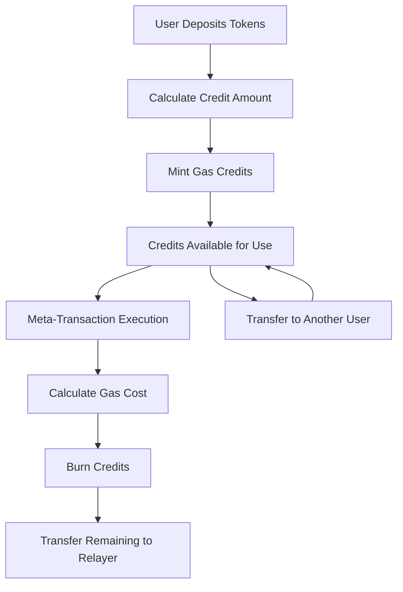

# Gas Credit Management

Complete guide for managing gas credits in the MetaTx-Contracts system.

## Overview

Gas Credit Management is a core feature that allows users to pre-fund transaction fees using various ERC-20 tokens. This system provides a seamless experience where users can pay for meta-transaction execution without holding native tokens (ETH/BNB).

## Core Concepts

### Gas Credits

Gas credits are internal accounting units that represent prepaid gas fees:

- **Unit**: Wei-equivalent (18 decimals)
- **Backing**: Real tokens deposited by users
- **Exchange Rate**: Determined by Chainlink price oracles
- **Transferable**: Between user accounts
- **Consumable**: Burned when paying for gas

### Credit Lifecycle



## Deposit Management

### Supported Tokens

The system supports multiple ERC-20 tokens with Chainlink price feeds:

```javascript
// Supported tokens on BSC Mainnet
const SUPPORTED_TOKENS = {
  USDT: {
    address: "0x55d398326f99059fF775485246999027B3197955",
    decimals: 18,
    priceFeed: "0xB97Ad0E74fa7d920791E90258A6E2085088b4320"
  },
  USDC: {
    address: "0x8AC76a51cc950d9822D68b83fE1Ad97B32Cd580d", 
    decimals: 18,
    priceFeed: "0x51597f405303C4377E36123cBc172b13269EA163"
  },
  BUSD: {
    address: "0xe9e7CEA3DedcA5984780Bafc599bD69ADd087D56",
    decimals: 18,
    priceFeed: "0xcBb98864Ef56E9042e7d2efef76141f15731B82f"
  }
};
```

### Deposit Process

#### 1. Token Approval

Before depositing, users must approve the GasCreditVault contract:

```javascript
async function approveToken(tokenAddress, amount) {
  const token = await ethers.getContractAt("IERC20", tokenAddress);
  const vault = await ethers.getContractAt("GasCreditVault", vaultAddress);
  
  // Check current allowance
  const currentAllowance = await token.allowance(
    userAddress, 
    await vault.getAddress()
  );
  
  if (currentAllowance < amount) {
    const approveTx = await token.approve(
      await vault.getAddress(),
      amount
    );
    await approveTx.wait();
    console.log("Token approval confirmed");
  }
}
```

#### 2. Calculate Credits

Preview how many credits will be received:

```javascript
async function calculateCreditsPreview(tokenAddress, tokenAmount) {
  const vault = await ethers.getContractAt("GasCreditVault", vaultAddress);
  
  try {
    const credits = await vault.calculateCredits(tokenAddress, tokenAmount);
    return credits;
  } catch (error) {
    if (error.message.includes("UnsupportedToken")) {
      throw new Error(`Token ${tokenAddress} is not supported`);
    }
    throw error;
  }
}

// Example usage
const usdtAmount = ethers.parseUnits("100", 18); // 100 USDT
const expectedCredits = await calculateCreditsPreview(USDT_ADDRESS, usdtAmount);
console.log(`Expected credits: ${ethers.formatEther(expectedCredits)} ETH worth`);
```

#### 3. Execute Deposit

Deposit tokens and receive credits:

```javascript
async function depositCredits(tokenAddress, amount) {
  const vault = await ethers.getContractAt("GasCreditVault", vaultAddress);
  
  // Ensure approval first
  await approveToken(tokenAddress, amount);
  
  // Execute deposit
  const depositTx = await vault.depositCredits(tokenAddress, amount);
  const receipt = await depositTx.wait();
  
  // Parse events to get credit amount
  const depositEvent = receipt.logs.find(log => 
    log.topics[0] === vault.interface.getEvent("CreditsDeposited").topicHash
  );
  
  if (depositEvent) {
    const decoded = vault.interface.decodeEventLog(
      "CreditsDeposited",
      depositEvent.data,
      depositEvent.topics
    );
    
    console.log(`Deposited ${ethers.formatUnits(decoded.tokenAmount, 18)} tokens`);
    console.log(`Received ${ethers.formatEther(decoded.credits)} credits`);
    return decoded.credits;
  }
}
```

### Deposit Best Practices

#### 1. Optimal Deposit Amounts

```javascript
class DepositOptimizer {
  constructor(vault, priceFeeds) {
    this.vault = vault;
    this.priceFeeds = priceFeeds;
  }

  async calculateOptimalDeposit(expectedTransactions, gasEstimate) {
    // Calculate total gas needed
    const totalGasNeeded = expectedTransactions * gasEstimate;
    
    // Get current gas price
    const gasPrice = await this.vault.provider.getGasPrice();
    
    // Calculate total cost in wei
    const totalCostWei = totalGasNeeded * gasPrice;
    
    // Add 20% buffer for price fluctuations
    const bufferedCost = totalCostWei * 120n / 100n;
    
    return bufferedCost;
  }

  async findBestToken(requiredCredits) {
    const tokens = Object.keys(SUPPORTED_TOKENS);
    let bestOption = null;
    let lowestSlippage = Infinity;

    for (const tokenSymbol of tokens) {
      try {
        const tokenInfo = SUPPORTED_TOKENS[tokenSymbol];
        const price = await this.getTokenPrice(tokenInfo.priceFeed);
        
        // Calculate token amount needed
        const tokenAmount = requiredCredits * ethers.parseUnits("1", tokenInfo.decimals) / price;
        
        // Check user balance
        const userBalance = await this.getUserTokenBalance(tokenInfo.address);
        
        if (userBalance >= tokenAmount) {
          const slippage = this.calculateSlippage(tokenAmount, userBalance);
          if (slippage < lowestSlippage) {
            lowestSlippage = slippage;
            bestOption = { tokenSymbol, tokenAmount, slippage };
          }
        }
      } catch (error) {
        console.warn(`Failed to evaluate ${tokenSymbol}:`, error.message);
      }
    }

    return bestOption;
  }
}
```

#### 2. Batch Deposits

For multiple tokens or amounts:

```javascript
async function batchDeposit(deposits) {
  const results = [];
  
  for (const { tokenAddress, amount } of deposits) {
    try {
      const credits = await depositCredits(tokenAddress, amount);
      results.push({ tokenAddress, amount, credits, success: true });
    } catch (error) {
      results.push({ tokenAddress, amount, error: error.message, success: false });
    }
  }
  
  return results;
}

// Example usage
const deposits = [
  { tokenAddress: USDT_ADDRESS, amount: ethers.parseUnits("50", 18) },
  { tokenAddress: USDC_ADDRESS, amount: ethers.parseUnits("50", 6) }
];

const results = await batchDeposit(deposits);
```

## Credit Usage

### Automatic Usage

Credits are automatically consumed during meta-transaction execution:

```javascript
// During meta-transaction execution, the system:
// 1. Estimates gas for the transaction
// 2. Calculates total gas cost (gasUsed * gasPrice)
// 3. Burns equivalent credits from user's balance
// 4. Transfers any remaining ETH to relayer

async function executeWithCreditTracking(userAddress, transactions) {
  const vault = await ethers.getContractAt("GasCreditVault", vaultAddress);
  
  // Check credits before execution
  const initialCredits = await vault.getCreditBalance(userAddress);
  console.log(`Initial credits: ${ethers.formatEther(initialCredits)}`);
  
  // Execute meta-transaction
  const gateway = await ethers.getContractAt("MetaTxGateway", gatewayAddress);
  const tx = await gateway.executeMetaTransactions(transactions);
  const receipt = await tx.wait();
  
  // Check credits after execution
  const finalCredits = await vault.getCreditBalance(userAddress);
  const usedCredits = initialCredits - finalCredits;
  
  console.log(`Credits used: ${ethers.formatEther(usedCredits)}`);
  console.log(`Remaining credits: ${ethers.formatEther(finalCredits)}`);
  
  return { receipt, usedCredits, remainingCredits: finalCredits };
}
```

### Manual Credit Checks

Monitor credit balance and usage:

```javascript
class CreditMonitor {
  constructor(vaultContract, userAddress) {
    this.vault = vaultContract;
    this.userAddress = userAddress;
    this.listeners = [];
  }

  async getCurrentBalance() {
    return await this.vault.getCreditBalance(this.userAddress);
  }

  async estimateTransactionCost(gasEstimate, gasPrice) {
    return gasEstimate * gasPrice;
  }

  async canAffordTransaction(gasEstimate, gasPrice) {
    const currentBalance = await this.getCurrentBalance();
    const estimatedCost = await this.estimateTransactionCost(gasEstimate, gasPrice);
    
    return {
      canAfford: currentBalance >= estimatedCost,
      currentBalance,
      estimatedCost,
      shortage: currentBalance < estimatedCost ? estimatedCost - currentBalance : 0n
    };
  }

  // Set up event listeners for credit changes
  setupEventListeners() {
    // Listen for credit usage
    this.vault.on("CreditsUsed", (user, gasUsed, gasPrice, totalCost) => {
      if (user.toLowerCase() === this.userAddress.toLowerCase()) {
        this.notifyListeners('used', { gasUsed, gasPrice, totalCost });
      }
    });

    // Listen for credit deposits
    this.vault.on("CreditsDeposited", (user, token, tokenAmount, credits) => {
      if (user.toLowerCase() === this.userAddress.toLowerCase()) {
        this.notifyListeners('deposited', { token, tokenAmount, credits });
      }
    });

    // Listen for credit transfers
    this.vault.on("CreditsTransferred", (from, to, amount) => {
      if (from.toLowerCase() === this.userAddress.toLowerCase()) {
        this.notifyListeners('transferred_out', { to, amount });
      }
      if (to.toLowerCase() === this.userAddress.toLowerCase()) {
        this.notifyListeners('transferred_in', { from, amount });
      }
    });
  }

  addListener(callback) {
    this.listeners.push(callback);
  }

  notifyListeners(event, data) {
    this.listeners.forEach(callback => callback(event, data));
  }
}
```

## Credit Transfers

### Direct Transfers

Transfer credits between accounts:

```javascript
async function transferCredits(fromSigner, toAddress, amount) {
  const vault = await ethers.getContractAt("GasCreditVault", vaultAddress, fromSigner);
  
  // Validate transfer
  const senderBalance = await vault.getCreditBalance(await fromSigner.getAddress());
  if (senderBalance < amount) {
    throw new Error(`Insufficient credits. Available: ${ethers.formatEther(senderBalance)}, Required: ${ethers.formatEther(amount)}`);
  }
  
  // Execute transfer
  const transferTx = await vault.transferCredits(toAddress, amount);
  const receipt = await transferTx.wait();
  
  console.log(`Transferred ${ethers.formatEther(amount)} credits to ${toAddress}`);
  return receipt;
}
```

### Bulk Transfers

Transfer to multiple recipients:

```javascript
async function bulkTransferCredits(fromSigner, transfers) {
  const vault = await ethers.getContractAt("GasCreditVault", vaultAddress, fromSigner);
  const results = [];
  
  // Calculate total amount needed
  const totalAmount = transfers.reduce((sum, { amount }) => sum + amount, 0n);
  
  // Check sender balance
  const senderBalance = await vault.getCreditBalance(await fromSigner.getAddress());
  if (senderBalance < totalAmount) {
    throw new Error(`Insufficient credits for bulk transfer`);
  }
  
  // Execute transfers
  for (const { toAddress, amount } of transfers) {
    try {
      const receipt = await transferCredits(fromSigner, toAddress, amount);
      results.push({ toAddress, amount, receipt, success: true });
    } catch (error) {
      results.push({ toAddress, amount, error: error.message, success: false });
    }
  }
  
  return results;
}
```

### Corporate Credit Management

For business use cases:

```javascript
class CorporateCreditManager {
  constructor(vaultContract, adminSigner) {
    this.vault = vaultContract;
    this.admin = adminSigner;
    this.employees = new Map();
    this.budgets = new Map();
  }

  async addEmployee(employeeAddress, monthlyBudget) {
    this.employees.set(employeeAddress, {
      address: employeeAddress,
      monthlyBudget,
      currentPeriodUsage: 0n,
      lastReset: new Date()
    });
    
    this.budgets.set(employeeAddress, monthlyBudget);
  }

  async allocateMonthlyBudgets() {
    const currentTime = new Date();
    const allocations = [];

    for (const [address, employee] of this.employees) {
      const monthsPassed = this.getMonthsDiff(employee.lastReset, currentTime);
      
      if (monthsPassed >= 1) {
        // Allocate new budget
        await this.transferCredits(address, employee.monthlyBudget);
        
        // Reset usage tracking
        employee.currentPeriodUsage = 0n;
        employee.lastReset = currentTime;
        
        allocations.push({
          employee: address,
          amount: employee.monthlyBudget,
          timestamp: currentTime
        });
      }
    }

    return allocations;
  }

  async getEmployeeUsage(employeeAddress) {
    const employee = this.employees.get(employeeAddress);
    if (!employee) throw new Error("Employee not found");

    const currentBalance = await this.vault.getCreditBalance(employeeAddress);
    const allocated = employee.monthlyBudget;
    const used = allocated - currentBalance;

    return {
      allocated,
      used,
      remaining: currentBalance,
      utilizationRate: Number(used * 100n / allocated)
    };
  }

  async generateUsageReport() {
    const report = {
      reportDate: new Date(),
      employees: [],
      totalAllocated: 0n,
      totalUsed: 0n
    };

    for (const [address] of this.employees) {
      const usage = await this.getEmployeeUsage(address);
      report.employees.push({ address, ...usage });
      report.totalAllocated += usage.allocated;
      report.totalUsed += usage.used;
    }

    return report;
  }
}
```

## Price Management

### Oracle Integration

Monitor and validate price feeds:

```javascript
class PriceManager {
  constructor(priceFeeds) {
    this.priceFeeds = priceFeeds;
    this.staleness_threshold = 3600; // 1 hour
  }

  async getTokenPrice(tokenAddress) {
    const feedAddress = this.priceFeeds[tokenAddress];
    if (!feedAddress) throw new Error("Price feed not found");

    const priceFeed = await ethers.getContractAt("AggregatorV3Interface", feedAddress);
    const [roundId, price, startedAt, updatedAt, answeredInRound] = await priceFeed.latestRoundData();

    // Validate price data
    this.validatePriceData(price, updatedAt);

    return {
      price: price,
      updatedAt: Number(updatedAt),
      roundId: Number(roundId),
      isStale: this.isPriceStale(updatedAt)
    };
  }

  validatePriceData(price, updatedAt) {
    if (price <= 0) {
      throw new Error("Invalid price: must be positive");
    }

    if (this.isPriceStale(updatedAt)) {
      throw new Error(`Price data is stale: ${this.getAge(updatedAt)} seconds old`);
    }
  }

  isPriceStale(updatedAt) {
    const age = this.getAge(updatedAt);
    return age > this.staleness_threshold;
  }

  getAge(updatedAt) {
    return Math.floor(Date.now() / 1000) - Number(updatedAt);
  }

  async monitorPriceFeeds() {
    const results = {};

    for (const [token, feedAddress] of Object.entries(this.priceFeeds)) {
      try {
        const priceData = await this.getTokenPrice(token);
        results[token] = { ...priceData, status: 'healthy' };
      } catch (error) {
        results[token] = { error: error.message, status: 'error' };
      }
    }

    return results;
  }
}
```

### Rate Calculation

Understand how exchange rates work:

```javascript
function calculateCreditExchangeRate(tokenPrice, gasPrice, tokenDecimals = 18) {
  // Formula: credits = (tokenAmount * tokenPrice * 10^18) / (gasPrice * 10^tokenDecimals)
  
  const priceScaled = tokenPrice; // Already 8 decimals from Chainlink
  const gasPriceWei = gasPrice;
  const tokenDecimalsFactor = 10n ** BigInt(tokenDecimals);
  const creditDecimals = 10n ** 18n;
  
  // Calculate how many credits 1 token unit provides
  const creditsPerToken = (priceScaled * creditDecimals) / (gasPriceWei * tokenDecimalsFactor);
  
  return creditsPerToken;
}

// Example calculation
async function showExchangeRates() {
  const gasPrice = await provider.getGasPrice();
  
  for (const [symbol, tokenInfo] of Object.entries(SUPPORTED_TOKENS)) {
    const priceManager = new PriceManager({ [symbol]: tokenInfo.priceFeed });
    const priceData = await priceManager.getTokenPrice(symbol);
    
    const rate = calculateCreditExchangeRate(
      priceData.price,
      gasPrice,
      tokenInfo.decimals
    );
    
    console.log(`${symbol}: 1 token = ${ethers.formatEther(rate)} ETH worth of credits`);
  }
}
```

## Advanced Features

### Credit Pooling

Shared credit pools for organizations:

```javascript
class CreditPool {
  constructor(vaultContract, poolId, adminAddress) {
    this.vault = vaultContract;
    this.poolId = poolId;
    this.admin = adminAddress;
    this.members = new Set();
    this.allowances = new Map();
  }

  async addMember(memberAddress, allowance) {
    this.members.add(memberAddress);
    this.allowances.set(memberAddress, allowance);
  }

  async allocateCredits(memberAddress, amount) {
    if (!this.members.has(memberAddress)) {
      throw new Error("Address is not a pool member");
    }

    const allowance = this.allowances.get(memberAddress);
    if (amount > allowance) {
      throw new Error("Allocation exceeds member allowance");
    }

    // Transfer from pool to member
    await this.vault.transferCredits(memberAddress, amount);
    
    // Update allowance
    this.allowances.set(memberAddress, allowance - amount);
  }

  async getPoolBalance() {
    return await this.vault.getCreditBalance(this.admin);
  }

  async getMemberAllowance(memberAddress) {
    return this.allowances.get(memberAddress) || 0n;
  }
}
```

### Auto-Refill

Automatic credit top-ups:

```javascript
class AutoRefillManager {
  constructor(vaultContract, tokenContract, userSigner) {
    this.vault = vaultContract;
    this.token = tokenContract;
    this.user = userSigner;
    this.thresholds = new Map();
    this.isMonitoring = false;
  }

  setRefillThreshold(threshold, refillAmount, tokenAddress) {
    this.thresholds.set('default', {
      threshold,
      refillAmount,
      tokenAddress
    });
  }

  async startMonitoring() {
    if (this.isMonitoring) return;
    
    this.isMonitoring = true;
    this.monitorLoop();
  }

  async monitorLoop() {
    while (this.isMonitoring) {
      try {
        await this.checkAndRefill();
        await this.sleep(30000); // Check every 30 seconds
      } catch (error) {
        console.error("Auto-refill error:", error);
        await this.sleep(60000); // Wait longer on error
      }
    }
  }

  async checkAndRefill() {
    const userAddress = await this.user.getAddress();
    const currentBalance = await this.vault.getCreditBalance(userAddress);
    
    const config = this.thresholds.get('default');
    if (!config) return;

    if (currentBalance < config.threshold) {
      console.log(`Balance ${ethers.formatEther(currentBalance)} below threshold ${ethers.formatEther(config.threshold)}`);
      
      // Check token balance
      const tokenBalance = await this.token.balanceOf(userAddress);
      if (tokenBalance >= config.refillAmount) {
        await this.executeRefill(config);
      } else {
        console.warn("Insufficient token balance for auto-refill");
      }
    }
  }

  async executeRefill(config) {
    const userAddress = await this.user.getAddress();
    
    // Approve tokens
    const approveTx = await this.token.connect(this.user).approve(
      await this.vault.getAddress(),
      config.refillAmount
    );
    await approveTx.wait();

    // Deposit credits
    const depositTx = await this.vault.connect(this.user).depositCredits(
      config.tokenAddress,
      config.refillAmount
    );
    await depositTx.wait();

    console.log(`Auto-refilled ${ethers.formatEther(config.refillAmount)} credits`);
  }

  sleep(ms) {
    return new Promise(resolve => setTimeout(resolve, ms));
  }

  stopMonitoring() {
    this.isMonitoring = false;
  }
}
```

## Integration Examples

### React Hook for Credit Management

```javascript
import { useState, useEffect } from 'react';
import { ethers } from 'ethers';

export function useGasCredits(vaultContract, userAddress) {
  const [balance, setBalance] = useState(0n);
  const [isLoading, setIsLoading] = useState(false);
  const [error, setError] = useState(null);

  const fetchBalance = async () => {
    if (!userAddress || !vaultContract) return;
    
    try {
      setIsLoading(true);
      const currentBalance = await vaultContract.getCreditBalance(userAddress);
      setBalance(currentBalance);
      setError(null);
    } catch (err) {
      setError(err.message);
    } finally {
      setIsLoading(false);
    }
  };

  const depositCredits = async (tokenAddress, amount) => {
    try {
      setIsLoading(true);
      const tx = await vaultContract.depositCredits(tokenAddress, amount);
      await tx.wait();
      await fetchBalance(); // Refresh balance
      return tx.hash;
    } catch (err) {
      setError(err.message);
      throw err;
    } finally {
      setIsLoading(false);
    }
  };

  const transferCredits = async (toAddress, amount) => {
    try {
      setIsLoading(true);
      const tx = await vaultContract.transferCredits(toAddress, amount);
      await tx.wait();
      await fetchBalance(); // Refresh balance
      return tx.hash;
    } catch (err) {
      setError(err.message);
      throw err;
    } finally {
      setIsLoading(false);
    }
  };

  useEffect(() => {
    fetchBalance();
  }, [userAddress, vaultContract]);

  return {
    balance,
    isLoading,
    error,
    depositCredits,
    transferCredits,
    refreshBalance: fetchBalance
  };
}
```

### Command Line Interface

```javascript
// CLI tool for credit management
class CreditCLI {
  constructor(provider, vaultAddress, privateKey) {
    this.provider = provider;
    this.wallet = new ethers.Wallet(privateKey, provider);
    this.vault = new ethers.Contract(vaultAddress, VAULT_ABI, this.wallet);
  }

  async balance() {
    const balance = await this.vault.getCreditBalance(this.wallet.address);
    console.log(`Credit Balance: ${ethers.formatEther(balance)} ETH worth`);
    return balance;
  }

  async deposit(tokenSymbol, amount) {
    const tokenInfo = SUPPORTED_TOKENS[tokenSymbol];
    if (!tokenInfo) throw new Error(`Unsupported token: ${tokenSymbol}`);

    const tokenAmount = ethers.parseUnits(amount, tokenInfo.decimals);
    
    // Approve and deposit
    const token = new ethers.Contract(tokenInfo.address, ERC20_ABI, this.wallet);
    
    console.log(`Approving ${amount} ${tokenSymbol}...`);
    const approveTx = await token.approve(await this.vault.getAddress(), tokenAmount);
    await approveTx.wait();

    console.log(`Depositing ${amount} ${tokenSymbol}...`);
    const depositTx = await this.vault.depositCredits(tokenInfo.address, tokenAmount);
    const receipt = await depositTx.wait();

    console.log(`Deposit successful! Tx: ${receipt.transactionHash}`);
    await this.balance();
  }

  async transfer(toAddress, amount) {
    const creditAmount = ethers.parseEther(amount);
    
    console.log(`Transferring ${amount} credits to ${toAddress}...`);
    const transferTx = await this.vault.transferCredits(toAddress, creditAmount);
    const receipt = await transferTx.wait();

    console.log(`Transfer successful! Tx: ${receipt.transactionHash}`);
    await this.balance();
  }
}

// Usage
// const cli = new CreditCLI(provider, vaultAddress, privateKey);
// await cli.deposit('USDT', '100');
// await cli.transfer('0x...', '10');
```

## Best Practices

### Security

1. **Validate Addresses**: Always validate recipient addresses
2. **Check Balances**: Verify sufficient balance before operations
3. **Monitor Price Feeds**: Watch for stale or invalid price data
4. **Rate Limiting**: Implement reasonable rate limits
5. **Error Handling**: Graceful error handling and recovery

### Gas Efficiency

1. **Batch Operations**: Combine multiple deposits/transfers
2. **Optimal Timing**: Deposit during low gas price periods
3. **Token Selection**: Use tokens with lower fees when possible
4. **Amount Optimization**: Avoid dust amounts that waste gas

### User Experience

1. **Balance Monitoring**: Show real-time credit balances
2. **Cost Estimation**: Preview costs before transactions
3. **Auto-Refill**: Implement automatic top-ups
4. **Transaction History**: Provide detailed transaction logs
5. **Multi-Token Support**: Allow users to choose preferred tokens


**Pro Tip**: Set up balance alerts to notify users when credits are running low, and consider implementing auto-refill functionality for seamless user experience.


## Next Steps

- **[Frontend Integration](frontend-integration.md)** - Integrate credit management in your UI
- **[API Reference](../api/gascreditvault-api.md)** - Detailed API documentation
- **[Troubleshooting](../guides/troubleshooting.md)** - Common issues and solutions
