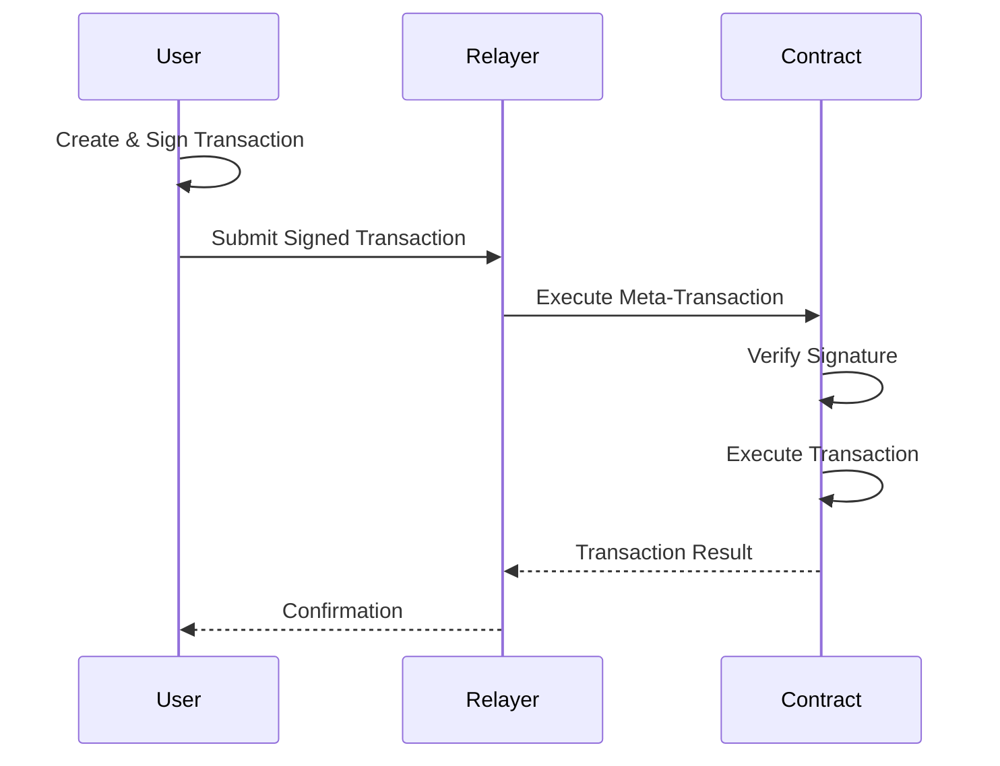

# FAQ

Frequently asked questions about MetaTx-Contracts.

## General Questions

### What are Meta-Transactions?

Meta-transactions are a design pattern that allows users to interact with smart contracts without directly paying gas fees. Instead, a third party (relayer) pays the gas fees and executes the transaction on behalf of the user, while the user's signature proves their intent to perform the transaction.

**Benefits:**
- **Better UX**: Users don't need ETH/BNB for gas
- **Lower Barriers**: Easier onboarding for new users
- **Flexible Payment**: Pay fees with any supported token
- **Batch Processing**: Multiple operations in one transaction

### How do Meta-Transactions Work?

1. **User Signs**: User creates and signs a meta-transaction offline
2. **Relayer Submits**: Relayer submits the signed transaction to the blockchain
3. **Contract Verifies**: Smart contract verifies the signature and executes
4. **Payment**: Gas fees are paid from user's gas credits or by relayer



### What Makes MetaTx-Contracts Different?

**Unique Features:**
- **Gas Credit System**: Pre-fund gas with any supported token
- **Native Token Support**: Handle ETH/BNB in meta-transactions
- **Batch Processing**: Execute multiple transactions atomically
- **UUPS Upgradeable**: Future-proof contract upgrades
- **EIP-712 Signatures**: Secure and standardized signing

## Technical Questions

### Which Networks Are Supported?

**Currently Supported:**
- **BSC Mainnet** (Chain ID: 56)
- **BSC Testnet** (Chain ID: 97)

**Planned Support:**
- Ethereum Mainnet
- Polygon
- Arbitrum
- Avalanche

### What Tokens Can I Use for Gas Credits?

**BSC Mainnet:**
- USDT (Tether)
- USDC (USD Coin)
- BUSD (Binance USD)
- More tokens can be added by governance

**BSC Testnet:**
- Test versions of the above tokens

### How Are Gas Credits Calculated?

Gas credits are calculated using real-time token prices from Chainlink oracles:

```
credits = (tokenAmount × tokenPrice × 10^18) / (gasPrice × 10^tokenDecimals)
```

**Example:**
- Deposit: 100 USDT (6 decimals)
- USDT Price: $1.00 (from Chainlink)
- Gas Price: 5 gwei
- Credits: (100 × 1.00 × 10^18) / (5 × 10^9 × 10^6) = 20 ETH worth of credits

### What Is the Maximum Transaction Size?

**Limits:**
- **Transactions per batch**: 10
- **Gas limit per transaction**: 500,000
- **Total gas per batch**: 5,000,000
- **Signature deadline**: 1 hour maximum

### How Long Do Signatures Last?

Signatures include a deadline timestamp. Once this deadline passes, the signature becomes invalid and cannot be executed.

**Recommended Deadlines:**
- **Interactive Transactions**: 5-10 minutes
- **Automated Systems**: 1-5 minutes
- **Critical Operations**: 1-2 minutes

## Security Questions

### Is My Private Key Safe?

**Yes, your private key remains secure:**
- Private keys never leave your wallet
- Only transaction signatures are shared
- EIP-712 standard prevents signature replay attacks
- Domain-specific signing prevents cross-contract exploits

### Can Someone Replay My Signature?

**No, replay attacks are prevented by:**
- **Unique Nonces**: Each transaction has an incrementing nonce
- **Deadlines**: Signatures expire after a set time
- **Domain Separation**: Signatures are bound to specific contract and network
- **Chain ID**: Prevents cross-chain signature reuse

### What If the Relayer Is Malicious?

**Protection Mechanisms:**
- Relayers cannot modify transaction content
- Signatures are cryptographically bound to specific parameters
- Users can run their own relayers
- Multiple relayer options available

### How Are Gas Credits Protected?

**Security Features:**
- **Access Control**: Only authorized contracts can spend credits
- **Reentrancy Guards**: Prevent reentrancy attacks
- **Overflow Protection**: SafeMath prevents numerical overflows
- **Price Oracle Validation**: Chainlink feeds prevent price manipulation

## Usage Questions

### How Do I Get Started?

1. **Connect Wallet**: Connect MetaMask to BSC network
2. **Deposit Credits**: Deposit USDT/USDC for gas credits
3. **Create Transaction**: Sign your transaction offline
4. **Submit to Relayer**: Send signed transaction to relayer
5. **Monitor Execution**: Track transaction status

See our [Quick Start Guide](../quick-start.md) for detailed steps.

### Do I Need ETH/BNB in My Wallet?

**For Meta-Transactions**: No, gas credits handle the fees

**For Direct Transactions**: Yes, you still need native tokens for:
- Depositing gas credits initially
- Direct contract interactions (non-meta)
- Emergency transactions

### Can I Transfer Gas Credits?

**Yes, gas credits are transferable:**
```javascript
await vault.transferCredits(recipientAddress, ethers.parseEther("10"));
```

**Use Cases:**
- Gift credits to friends
- Corporate expense management
- Cross-account credit management

### What Happens If I Run Out of Credits?

**Options:**
1. **Deposit More**: Add tokens to get more credits
2. **Receive Transfer**: Someone can transfer credits to you
3. **Direct Payment**: Pay gas fees directly with ETH/BNB
4. **Wait**: Credits may be gifted by community programs

### Can I Get a Refund of Credits?

**Current Status**: No direct refund mechanism

**Alternatives:**
- Transfer credits to another account you control
- Use credits for future transactions
- Consider credits as prepaid gas for convenience

*Note: Refund functionality may be added in future versions*

## Development Questions

### Which Programming Languages Are Supported?

**Smart Contracts:**
- Solidity 0.8.20+

**Frontend Integration:**
- JavaScript/TypeScript
- Python (SDK planned)
- Go (SDK planned)

**Frameworks:**
- React/Next.js
- Vue.js
- Angular
- Express.js/Node.js

### How Do I Integrate with My DApp?

See our comprehensive [Frontend Integration Guide](../integration/frontend-integration.md) for:
- Wallet connection
- Transaction signing
- Relayer communication
- Error handling

### Can I Run My Own Relayer?

**Yes, you can run your own relayer:**
- Full relayer source code available
- Docker deployment support
- Configurable for your needs
- Can charge custom fees

See [Relayer Integration Guide](../integration/relayer-integration.md) for setup instructions.

### How Do I Test Meta-Transactions?

**Testing Options:**
1. **Local Development**: Use Hardhat for local testing
2. **Testnet**: Deploy to BSC testnet for integration testing
3. **Mainnet**: Start with small amounts for production testing

**Test Tools:**
- Unit test examples provided
- Integration test suites
- Mock contracts for testing
- Testnet faucets for test tokens

### What About Gas Optimization?

**Built-in Optimizations:**
- Batch transaction processing
- Efficient signature verification
- Optimized storage layouts
- Via IR compilation

**Best Practices:**
- Batch multiple operations
- Use minimal transaction data
- Optimize target contract calls
- Monitor gas usage patterns

## Business Questions

### What Are the Use Cases?

**Consumer Applications:**
- Gaming: Pay for in-game transactions
- DeFi: Trade without holding ETH
- NFTs: Mint and trade gas-free
- Social: Tip creators without gas

**Enterprise Applications:**
- Corporate expense management
- Employee payment systems
- Customer onboarding
- Subscription services

### How Much Does It Cost?

**For Users:**
- Gas credits at market rates (via Chainlink oracles)
- No additional platform fees
- Optional relayer fees (set by relayer)

**For Developers:**
- Free to integrate
- No licensing fees
- Optional premium relayer services

### Is There a Token?

**Current Status**: No native token

**Gas Credits**: Internal accounting units, not transferable tokens

**Future Plans**: Community governance token may be introduced

### How Do I Contact Support?

**Support Channels:**
- **GitHub Issues**: Bug reports and feature requests
- **Discord**: Community support and discussions
- **Email**: support@metatx-contracts.com
- **Documentation**: This GitBook
- **Stack Overflow**: Technical questions (tag: metatx-contracts)

## Troubleshooting Questions

### Why Is My Transaction Failing?

**Common Causes:**
1. **Insufficient Credits**: Check your gas credit balance
2. **Expired Signature**: Create a new signature with fresh deadline
3. **Wrong Network**: Ensure you're on the correct network
4. **Invalid Signature**: Verify EIP-712 signing parameters
5. **Target Contract Error**: The transaction itself is invalid

See [Troubleshooting Guide](../guides/troubleshooting.md) for detailed solutions.

### Why Can't I Connect My Wallet?

**Solutions:**
1. **Install MetaMask**: Ensure browser extension is installed
2. **Unlock Wallet**: Make sure MetaMask is unlocked
3. **Correct Network**: Switch to BSC mainnet or testnet
4. **Refresh Page**: Sometimes a simple refresh helps
5. **Clear Cache**: Clear browser cache and try again

### Why Are My Credits Not Showing?

**Check:**
1. **Network**: Ensure you're on the correct network
2. **Contract Address**: Verify you're using the right contract
3. **Transaction Status**: Confirm deposit transaction was successful
4. **Cache**: Refresh the page or clear browser cache

### How Do I Report a Bug?

**Steps:**
1. **Check Existing Issues**: Search GitHub issues first
2. **Gather Information**: 
   - Error messages
   - Transaction hashes
   - Browser/wallet versions
   - Steps to reproduce
3. **Create Issue**: Use our issue template on GitHub
4. **Provide Details**: The more details, the faster we can help

### What If the Website Is Down?

**Alternatives:**
- Use backup frontend deployments
- Interact directly with contracts via Etherscan
- Run local frontend from GitHub repository
- Contact support for assistance

## Future Development

### What Features Are Coming?

**Roadmap:**
- Multi-chain support (Ethereum, Polygon, etc.)
- Mobile SDK for React Native
- Gasless token approvals
- Advanced batch operations
- Governance token launch

### How Can I Contribute?

**Ways to Contribute:**
- Report bugs and issues
- Suggest new features
- Submit pull requests
- Write documentation
- Help in community support
- Test new features

### Will There Be Breaking Changes?

**Commitment**: We strive to maintain backward compatibility

**Process for Breaking Changes:**
1. Advance notice (minimum 30 days)
2. Migration guides provided
3. Support for old versions during transition
4. Community input on major changes

### How Do I Stay Updated?

**Stay Informed:**
- **GitHub**: Watch the repository for updates
- **Discord**: Join community announcements
- **Twitter**: Follow official accounts
- **Email**: Subscribe to newsletter
- **Blog**: Read development updates

---

## Still Have Questions?

Can't find what you're looking for? Here's how to get help:

1. **Search this documentation** - Use the search function
2. **Check GitHub issues** - Someone might have asked already  
3. **Join our Discord** - Get help from the community
4. **Create an issue** - Report bugs or request features
5. **Contact support** - Email us at support@metatx-contracts.com


**We're here to help!** The MetaTx-Contracts community is friendly and supportive. Don't hesitate to ask questions! 🤝

